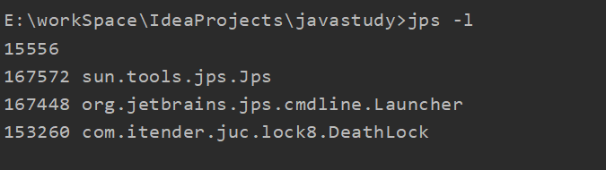

# JUC学习笔记

## 1. Synchronized 和 Lock的区别

1. Synchronized 是内置的关键字，Lock 是一个java类。
2. Synchronized 无法判断锁的状态，Lock可以判断是否获得了锁。boolean tryLock()返回 true表示已获取到锁，返回 false表示不能获取到锁，此方法不会阻塞执行线程。
3. Synchronized 会自动释放锁，Lock 必须要手动释放锁，如果不释放锁，会造成死锁。
4. Synchronized 线程1（获得锁，阻塞），线程2（等待...），Lock锁就不一定会等待下去。
5. Synchronized 可重入锁，不可以中断，非公平。Lock 可重入锁，可中断，可以实现公平锁（自己设定）。

## 2. 生产者消费者问题

**传统的生产者消费者**

```java
package com.itender.juc.pc;

/**
 * @Author: ITender
 * @Description: 线程之间的通信： 生产者，消费者问题！ 等待唤醒，通知唤醒
 * 线程交替执行 A B 操作同一个变量 num num = 0
 * A num + 1
 * B nun - 1
 * @CreateTime: 2022-02-18 20:18
 */
public class ProduceAndConsumer {
    public static void main(String[] args) {
        Data data = new Data();
        new Thread(() -> {
            for (int i = 0; i < 10; i++) {
                try {
                    data.increment();
                } catch (Exception e) {
                    e.printStackTrace();
                }
            }
        }, "A").start();

        new Thread(() -> {
            for (int i = 0; i < 10; i++) {
                try {
                    data.decrement();
                } catch (Exception e) {
                    e.printStackTrace();
                }
            }
        }, "B").start();

        new Thread(() -> {
            for (int i = 0; i < 10; i++) {
                try {
                    data.increment();
                } catch (Exception e) {
                    e.printStackTrace();
                }
            }
        }, "C").start();

        new Thread(() -> {
            for (int i = 0; i < 10; i++) {
                try {
                    data.decrement();
                } catch (Exception e) {
                    e.printStackTrace();
                }
            }
        }, "D").start();
    }
}

/**
 * 数字资源
 * 实现生产者 消费者：判断等待，业务处理，通知
 */
class Data {
    private int number = 0;

    /**
     * +1操作
     */
    public synchronized void increment() throws Exception {

        while (number != 0) {
            // 等待
            this.wait();
        }
        number++;
        System.out.println(Thread.currentThread().getName() + "=>" + number);
        // 通知其他线程我+1完毕
        this.notifyAll();
    }

    /**
     * -1 操作
     */
    public synchronized void decrement() throws Exception {
        while (number == 0) {
            // 等待
            this.wait();
        }
        number--;
        System.out.println(Thread.currentThread().getName() + "=>" + number);
        // 通知其他线程我-1完毕
        this.notifyAll();
    }

}

```

**JUC版生产者消费者**

**condition**

```java
package com.itender.juc.pc;

import java.util.concurrent.locks.Condition;
import java.util.concurrent.locks.Lock;
import java.util.concurrent.locks.ReentrantLock;

/**
 * @Author: ITender
 * @Description: 线程之间的通信： 生产者，消费者问题！ 等待唤醒，通知唤醒
 * 线程交替执行 A B 操作同一个变量 num num = 0
 * A num + 1
 * B nun - 1
 * @CreateTime: 2022-02-18 20:18
 */
public class JUCProduceAndConsumer {
    public static void main(String[] args) {
        Data2 data = new Data2();
        new Thread(() -> {
            for (int i = 0; i < 10; i++) {
                try {
                    data.increment();
                } catch (Exception e) {
                    e.printStackTrace();
                }
            }
        }, "A").start();

        new Thread(() -> {
            for (int i = 0; i < 10; i++) {
                try {
                    data.decrement();
                } catch (Exception e) {
                    e.printStackTrace();
                }
            }
        }, "B").start();

        new Thread(() -> {
            for (int i = 0; i < 10; i++) {
                try {
                    data.increment();
                } catch (Exception e) {
                    e.printStackTrace();
                }
            }
        }, "C").start();

        new Thread(() -> {
            for (int i = 0; i < 10; i++) {
                try {
                    data.decrement();
                } catch (Exception e) {
                    e.printStackTrace();
                }
            }
        }, "D").start();
    }
}

/**
 * 数字资源
 * 实现生产者 消费者：判断等待，业务处理，通知
 */
class Data2 {
    private int number = 0;
    Lock lock = new ReentrantLock(false);
    Condition condition = lock.newCondition();
    // 等待
    // condition.await();
    // 唤醒
    // condition.signal();

    /**
     * +1操作
     */
    public void increment() {
        lock.lock();
        try {
            while (number != 0) {
                // 等待
                condition.await();
            }
            number++;
            System.out.println(Thread.currentThread().getName() + "=>" + number);
            // 通知其他线程我+1完毕
            condition.signalAll();
        } catch (InterruptedException e) {
            e.printStackTrace();
        } finally {
            lock.unlock();
        }
    }

    /**
     * -1 操作
     */
    public void decrement() {
        lock.lock();
        try {
            while (number == 0) {
                // 等待
                condition.await();
            }
            number--;
            System.out.println(Thread.currentThread().getName() + "=>" + number);
            // 通知其他线程我-1完毕
            condition.signalAll();
        } catch (InterruptedException e) {
            e.printStackTrace();
        } finally {
            lock.unlock();
        }
    }
}

```

**顺序执行**


```java
package com.itender.juc.pc;

import java.util.concurrent.locks.Condition;
import java.util.concurrent.locks.Lock;
import java.util.concurrent.locks.ReentrantLock;

/**
 * @Author: ITender
 * @Description:
 * @CreateTime: 2022-02-19 19:23
 */
public class SortedExecute {
    public static void main(String[] args) {
        Data3 data3 = new Data3();
        new Thread(() -> {
            for (int i = 0; i < 10; i++) {
                data3.printA();
            }
        }, "A").start();

        new Thread(() -> {
            for (int i = 0; i < 10; i++) {
                data3.printB();
            }
        }, "B").start();

        new Thread(() -> {
            for (int i = 0; i < 10; i++) {
                data3.printC();
            }
        }, "C").start();
    }
}

class Data3{
    private Lock lock = new ReentrantLock(false);
    private Condition condition1 = lock.newCondition();
    private Condition condition2 = lock.newCondition();
    private Condition condition3 = lock.newCondition();
    private int number = 1;

    /**
     * 判断-> 执行业务（等待） -> 通知
     */
    public void printA() {
        lock.lock();
        try {
            // 判断-> 执行业务（等待） -> 通知
            while (number != 1) {
                condition1.await();
            }
            System.out.println(Thread.currentThread().getName() + "=> AAAAAAAA");
            number = 2;
            condition2.signal();
        } catch (InterruptedException e) {
            e.printStackTrace();
        } finally {
            lock.unlock();
        }
    }

    public void printB() {
        lock.lock();
        try {
            // 判断-> 执行业务（等待） -> 通知
            while (number != 2) {
                condition2.await();
            }
            System.out.println(Thread.currentThread().getName() + "=> BBBBBBBB");
            number = 3;
            condition3.signal();
        } catch (InterruptedException e) {
            e.printStackTrace();
        } finally {
            lock.unlock();
        }
    }

    public void printC() {
        lock.lock();
        try {
            // 判断-> 执行业务（等待） -> 通知
            while (number != 3) {
                condition3.await();
            }
            System.out.println(Thread.currentThread().getName() + "=> CCCCCCCC");
            number = 1;
            condition1.signal();
        } catch (InterruptedException e) {
            e.printStackTrace();
        } finally {
            lock.unlock();
        }
    }
}

```

## 3. 8锁问题

```java
package com.itender.juc.lock8;

import java.util.concurrent.TimeUnit;

/**
 * @Author: ITender
 * @Description: 8锁问题，就是锁的八个问题
 *               1.先输出发短信，在输出打电话
 * @CreateTime: 2022-02-19 19:40
 */
public class Test01 {
    public static void main(String[] args) {
        Phone phone = new Phone();
        new Thread(() -> {
            phone.sendSms();
        }, "A").start();
        try {
            TimeUnit.SECONDS.sleep(1);
        } catch (InterruptedException e) {
            e.printStackTrace();
        }
        new Thread(() -> {
            phone.call();
        }, "B").start();

    }
}

class Phone{

    /**
     * synchronized 锁的对象是方法的调用者！phone
     * 两个方法用的是同一把锁，谁先拿到谁先执行
     */
    public synchronized void sendSms() {
        System.out.println("发短息");
    }

    public synchronized void call() {
        System.out.println("打电话");
    }

}
```

```java
package com.itender.juc.lock8;

import java.util.concurrent.TimeUnit;

/**
 * @Author: ITender
 * @Description: 8锁问题，就是锁的八个问题
 *               3.hello非同步方法，先输出hello,在输出发短信
 *               4.两个对象，两个同步方法，先输出打电话，在输出发短信
 * @CreateTime: 2022-02-19 19:40
 */
public class Test02 {
    public static void main(String[] args) {
        // 两个对象
        Phone2 phone1 = new Phone2();
        Phone2 phone2 = new Phone2();
        new Thread(() -> {
            phone1.sendSms();
        }, "A").start();
        try {
            TimeUnit.SECONDS.sleep(1);
        } catch (InterruptedException e) {
            e.printStackTrace();
        }
        new Thread(() -> {
            phone2.call();
        }, "B").start();

    }
}

class Phone2{

    /**
     * synchronized 锁的对象是方法的调用者！phone
     * 两个方法用的是同一把锁，谁先拿到谁先执行
     */
    public synchronized void sendSms() {
        try {
            TimeUnit.SECONDS.sleep(2);
        } catch (InterruptedException e) {
            e.printStackTrace();
        }
        System.out.println("发短息");
    }

    public synchronized void call() {
        System.out.println("打电话");
    }

    /**
     * 没有锁，不受锁的影响
     */
    public  void hello() {
        System.out.println("hello");
    }

}

```

```java
package com.itender.juc.lock8;

import java.util.concurrent.TimeUnit;

/**
 * @Author: ITender
 * @Description: 8锁问题，就是锁的八个问题
 *               5.两个静态的同步方法，先打印发短信，后打印打电话
 *               6.两个对象，两个静态的同步方法，先打印发短信，后打印打电话
 * @CreateTime: 2022-02-19 19:59
 */
public class Test03 {
    public static void main(String[] args) {
        // 两个对象
        Phone3 phone3 = new Phone3();
        Phone3 phone33 = new Phone3();
        new Thread(() -> {
            phone3.sendSms();
        }, "A").start();

        try {
            TimeUnit.SECONDS.sleep(1);
        } catch (InterruptedException e) {
            e.printStackTrace();
        }

        new Thread(() -> {
            phone33.call();
        }, "B").start();

    }
}

class Phone3{

    /**
     * synchronized 锁的对象是方法的调用者！phone
     * static静态的，类一加载就有了
     * 静态的static，锁的是class
     */
    public static synchronized void sendSms() {
        try {
            TimeUnit.SECONDS.sleep(2);
        } catch (InterruptedException e) {
            e.printStackTrace();
        }
        System.out.println("发短息");
    }

    public static synchronized void call() {
        System.out.println("打电话");
    }

}

```

```java
package com.itender.juc.lock8;

import java.util.concurrent.TimeUnit;

/**
 * @Author: ITender
 * @Description: 8锁问题，就是锁的八个问题
 *               7.一个普通同步方法，一个静态同步方法，先打印打电话，在打印发短信
 *               8.两个对象，一个普通同步方法，一个静态同步方法，先打印打电话，在打印发短信
 * @CreateTime: 2022-02-19 20:06
 */
public class Test04 {
    public static void main(String[] args) {
        // 两个对象
        Phone4 phone4 = new Phone4();
        Phone4 phone44 = new Phone4();
        new Thread(() -> {
            Phone4.sendSms();
        }, "A").start();

        try {
            TimeUnit.SECONDS.sleep(1);
        } catch (InterruptedException e) {
            e.printStackTrace();
        }

        new Thread(() -> {
            phone44.call();
        }, "B").start();

    }
}

/**
 * 唯一的class对象
 */
class Phone4{

    /**
     * static静态的，类一加载就有了
     * 静态的static，锁的是class
     */
    public static synchronized void sendSms() {
        try {
            TimeUnit.SECONDS.sleep(2);
        } catch (InterruptedException e) {
            e.printStackTrace();
        }
        System.out.println("发短息");
    }

    /**
     * 普通同步方法
     * 锁的是方法的调用者
     */
    public synchronized void call() {
        System.out.println("打电话");
    }

}

```

**小结**

new  this  对象锁

static class 类锁

## 4. 集合不安全的类

### List

```java
package com.itender.juc.lock8;

import java.util.concurrent.TimeUnit;

/**
 * @Author: ITender
 * @Description: 8锁问题，就是锁的八个问题
 *               7.一个普通同步方法，一个静态同步方法，先打印打电话，在打印发短信
 *               8.两个对象，一个普通同步方法，一个静态同步方法，先打印打电话，在打印发短信
 * @CreateTime: 2022-02-19 20:06
 */
public class Test04 {
    public static void main(String[] args) {
        // 两个对象
        Phone4 phone4 = new Phone4();
        Phone4 phone44 = new Phone4();
        new Thread(() -> {
            Phone4.sendSms();
        }, "A").start();

        try {
            TimeUnit.SECONDS.sleep(1);
        } catch (InterruptedException e) {
            e.printStackTrace();
        }

        new Thread(() -> {
            phone44.call();
        }, "B").start();

    }
}

/**
 * 唯一的class对象
 */
class Phone4{

    /**
     * static静态的，类一加载就有了
     * 静态的static，锁的是class
     */
    public static synchronized void sendSms() {
        try {
            TimeUnit.SECONDS.sleep(2);
        } catch (InterruptedException e) {
            e.printStackTrace();
        }
        System.out.println("发短息");
    }

    /**
     * 普通同步方法
     * 锁的是方法的调用者
     */
    public synchronized void call() {
        System.out.println("打电话");
    }

}

```

### Set

```java
package com.itender.juc.unsafe;

import java.util.Collections;
import java.util.HashSet;
import java.util.Set;
import java.util.UUID;

/**
 * @Author: ITender
 * @Description:
 * @CreateTime: 2022-02-19 20:43
 */
public class UnsafeSet {
    public static void main(String[] args) {
        Set<String> set = Collections.synchronizedSet(new HashSet<>());
        // Set<String> set = new CopyOnWriteArraySet<>();
        for (int i = 0; i < 30; i++) {
            new Thread(() -> {
                set.add(UUID.randomUUID().toString().substring(0, 5));
                System.out.println(set);
            }, String.valueOf(i)).start();
        }
    }
}

```

### Map

```java
package com.itender.juc.unsafe;

import java.util.*;
import java.util.concurrent.ConcurrentHashMap;

/**
 * @Author: ITender
 * @Description:
 * @CreateTime: 2022-02-19 20:54
 */
public class UnsafeMap {
    public static void main(String[] args) {
        // Map<String, String> map = new HashMap<>(16, 0.75);
        // Map<String, String> map = new HashMap<>();
        // Map<String, String> map = Collections.synchronizedMap(new HashMap<>());
        Map<String, String> map = new ConcurrentHashMap<>();
        for (int i = 0; i < 30; i++) {
            new Thread(() -> {
                map.put(Thread.currentThread().getName(), UUID.randomUUID().toString().substring(0, 5));
                System.out.println(map);
            }, String.valueOf(i)).start();
        }
    }
}

```

## 5. JUC辅助类

### CountDownLatch

**减法计数器**

```java
package com.itender.juc.suport;

import java.util.concurrent.CountDownLatch;

/**
 * @Author: ITender
 * @CreateTime: 2022-02-20 21:06
 * @Description:CountDownLatch 计数器
 */
public class CountDownLatchDemo {
    public static void main(String[] args) throws InterruptedException {
        // 总数是6,必须要执行的任务的时候再使用
        CountDownLatch countDownLatch = new CountDownLatch(6);
        for (int i = 0; i < 6; i++) {
            new Thread(() -> {
                System.out.println(Thread.currentThread().getName() + " => Go Out!");
                // 数量 -1
                countDownLatch.countDown();
            }, String.valueOf(i)).start();
        }
        // 等待计数器归零，向下运行
        countDownLatch.await();
        System.out.println("Close Door!");
    }
}

```

原理：

```text
// 数量 -1
countDownLatch.countDown(); 
// 等待计数器归零，向下运行
countDownLatch.await();

每次线程调用countDown()数量-1，当计数器变为0，countDownLatch.await();就会被唤醒，继续向下执行。
```

### CyclicBarrier

**加法计数器**

```java
package com.itender.juc.suport;

import java.util.concurrent.BrokenBarrierException;
import java.util.concurrent.CyclicBarrier;

/**
 * @Author: ITender
 * @CreateTime: 2022-02-20 21:24
 * @Description: 栅栏，屏障，加法计数器
 */
public class CyclicBarrierDemo {
    public static void main(String[] args) {

        // 集齐7颗龙珠，召唤神龙
        // 召唤神龙的线程
        CyclicBarrier cyclicBarrier = new CyclicBarrier(7, () -> {
            System.out.println("召唤神龙成功！");
        });

        for (int i = 0; i < 7; i++) {
            // lambda能拿到i吗？不能
            final int tmp = i;
            new Thread(() -> {
                System.out.println(Thread.currentThread().getName() + "收集了" + tmp + "颗龙珠！");
                try {
                    // 等待七个线程都执行完了，再向下执行
                    cyclicBarrier.await();
                } catch (Exception e) {
                    e.printStackTrace();
                }
            }).start();
        }
    }
}
```

### Semaphore

```java
package com.itender.juc.suport;

import java.util.concurrent.Semaphore;
import java.util.concurrent.TimeUnit;

/**
 * @Author: ITender
 * @CreateTime: 2022-02-20 21:34
 * @Description: 信号量
 */
public class SemaphoreDemo {
    public static void main(String[] args) {
        // 线程数量，停车位
        Semaphore semaphore = new Semaphore(3);
        for (int i = 0; i <= 6; i++) {
            new Thread(() -> {
                try {
                    // 获得
                    semaphore.acquire();
                    System.out.println(Thread.currentThread().getName() + "抢到车位！");
                    // 停车两秒钟
                    TimeUnit.SECONDS.sleep(2);
                    System.out.println(Thread.currentThread().getName() + "离开车位！");
                } catch (InterruptedException e) {
                    e.printStackTrace();
                } finally {
                    // 释放
                    semaphore.release();
                }
            }, String.valueOf(i + 1)).start();
        }
    }
}
```

## 6. 读写锁（ReadAndWriteLock）

```java
package com.itender.juc.rw;

import java.util.HashMap;
import java.util.Map;
import java.util.concurrent.locks.Lock;
import java.util.concurrent.locks.ReadWriteLock;
import java.util.concurrent.locks.ReentrantReadWriteLock;

/**
 * @Author: ITender
 * @CreateTime: 2022-02-22 18:16
 * @Description: ReadAndWriteLock 读写锁
 *               读-读   可以共存
 *               读-写   不可以共存
 *               写-写   不可以共存
 */
public class ReadAndWriteLockDemo {
    public static void main(String[] args) {
        MyCacheLock myCache = new MyCacheLock();
        // 写入
        for (int i = 1; i <= 5; i++) {
            final int tmp = i;
            new Thread(() -> {
                myCache.put(tmp + "", tmp + "");
            }).start();
        }

        // 读取
        for (int i = 1; i <= 5; i++) {
            final int tmp = i;
            new Thread(() -> {
                myCache.get(tmp + "");
            }).start();
        }
    }
}

/**
 * 自定义缓存类枷锁
 */
class MyCacheLock{
    private volatile Map<String, Object> map = new HashMap<>();

    private ReadWriteLock readWriteLock = new ReentrantReadWriteLock();

    public void put(String key, Object value) {
        readWriteLock.writeLock().lock();
        try {
            System.out.println(Thread.currentThread().getName() + " 写入：" + key);
            map.put(key, value);
            System.out.println(Thread.currentThread().getName() + " 写入OK!" );
        } catch (Exception e) {
            e.printStackTrace();
        } finally {
            readWriteLock.writeLock().unlock();
        }
    }

    public void get(String key) {
        readWriteLock.readLock().lock();
        try {
            System.out.println(Thread.currentThread().getName() + " 读取：" + key);
            map.get(key);
            System.out.println(Thread.currentThread().getName() + " 读取OK!" );
        } catch (Exception e) {
            e.printStackTrace();
        } finally {
            readWriteLock.readLock().unlock();
        }
    }
}


/**
 * 自定义缓存类
 */
class MyCache{
    private volatile Map<String, Object> map = new HashMap<>();

    public void put(String key, Object value) {
        System.out.println(Thread.currentThread().getName() + " 写入：" + key);
        map.put(key, value);
        System.out.println(Thread.currentThread().getName() + " 写入OK!" );
    }

    public void get(String key) {
        System.out.println(Thread.currentThread().getName() + " 读取：" + key);
        map.get(key);
        System.out.println(Thread.currentThread().getName() + " 读取OK!" );
    }
}

```

## 7. 阻塞队列BlockingQueue

**写入：队列满了，就必须阻塞等待**

**读取：如果队列是空的，就必须阻塞等待**

**四组API**

| 方式       | 抛出异常 | 有返回值 | 阻塞等待 | 超市等待                        |
| ---------- | -------- | -------- | -------- | ------------------------------- |
| 添加       | add      | offer    | put      | offer("c", 2, TimeUnit.SECONDS) |
| 删除       | remove   | poll     | take     | poll(2, TimeUnit.SECONDS)       |
| 判断队列首 | element  | peek     |          | peek                            |

```java
    /**
     * 抛出异常
     */
    public static void test1() {
        ArrayBlockingQueue blockingQueue = new ArrayBlockingQueue<>(3);
        // 入队
        System.out.println(blockingQueue.add("a"));
        System.out.println(blockingQueue.add("b"));
        System.out.println(blockingQueue.add("c"));

        // 出队
        System.out.println(blockingQueue.remove());
        System.out.println(blockingQueue.remove());
        System.out.println(blockingQueue.remove());
        // java.util.NoSuchElementException
        System.out.println(blockingQueue.remove());
    }
```

不抛异常，有返回值

```java
  /**
     * 不抛出异常，有返回值
     */
    public static void test2() {
        ArrayBlockingQueue blockingQueue = new ArrayBlockingQueue<>(3);
        // 入队
        System.out.println(blockingQueue.offer("a"));
        System.out.println(blockingQueue.offer("b"));
        System.out.println(blockingQueue.offer("c"));
        // 不抛异常，返回false
        System.out.println(blockingQueue.offer("c"));

        // 出队
        System.out.println(blockingQueue.poll());
        System.out.println(blockingQueue.poll());
        System.out.println(blockingQueue.poll());
        // 返回null
        System.out.println(blockingQueue.poll());
    }
```

阻塞，一直等待

```java
/**
     * 阻塞，一直等待
     */
    public static void test3() throws InterruptedException {
        ArrayBlockingQueue blockingQueue = new ArrayBlockingQueue<>(3);
        // 入队
        blockingQueue.put("a");
        blockingQueue.put("b");
        blockingQueue.put("c");
        // 阻塞，一直等待
        blockingQueue.put("d");

        // 出队
        System.out.println(blockingQueue.take());
        System.out.println(blockingQueue.take());
        System.out.println(blockingQueue.take());
        // 返回null
        System.out.println(blockingQueue.take());
    }
```

```java
/**
     * 阻塞，超时等待
     */
    public static void test4() throws InterruptedException {
        ArrayBlockingQueue blockingQueue = new ArrayBlockingQueue<>(3);
        // 入队
        System.out.println(blockingQueue.offer("a"));
        System.out.println(blockingQueue.offer("b"));
        System.out.println(blockingQueue.offer("c"));
        // 不抛异常，返回false,2秒后中断
        System.out.println(blockingQueue.offer("c", 2, TimeUnit.SECONDS));

        // 出队
        blockingQueue.poll();
        blockingQueue.poll();
        blockingQueue.poll();
        // 返回null, 2秒后中断
        blockingQueue.poll(2, TimeUnit.SECONDS);

        // 检测队首元素
        System.out.println(blockingQueue.peek());
    }
```

**SynchronizedBlockingQueue同步阻塞队列**

添加一个元素，必须取出后才能再添加下一个元素。

put、take

## 8. 线程池（重点）

线程池优点：

1. **降低资源消耗**。通过重复利用已创建的线程降低线程创建和销毁造成的消耗。
2. **提高响应速度**。当任务到达时，任务可以不需要等到线程创建就能立即执行。
3. **提高线程的可管理性**。线程是稀缺资源，如果无限制的创建，不仅会消耗系统资源，还会降低系统的稳定性，使用线程池可以进行统一的分配，调优和监控

**Executors** 源码分析：

```java
public static ExecutorService newFixedThreadPool(int nThreads) {
        return new ThreadPoolExecutor(nThreads, nThreads,
                                      0L, TimeUnit.MILLISECONDS,
                                      new LinkedBlockingQueue<Runnable>());
 }

public static ExecutorService newSingleThreadExecutor() {
        return new FinalizableDelegatedExecutorService
            (new ThreadPoolExecutor(1, 1,
                                    0L, TimeUnit.MILLISECONDS,
                                    new LinkedBlockingQueue<Runnable>()));
    }

public static ExecutorService newCachedThreadPool() {
        return new 
            (0, Integer.MAX_VALUE,
                                      60L, TimeUnit.SECONDS,
                                      new SynchronousQueue<Runnable>());
    }

// 本质就是ThreadPoolExecutor：
```

```java
public ThreadPoolExecutor(int corePoolSize,   // 核心线程数
                              int maximumPoolSize,  // 最大线程数
                              long keepAliveTime,  // 超出核心线程数的线程空闲存活时间
                              TimeUnit unit,  // 存活时间的时间单位
                              BlockingQueue<Runnable> workQueue,  // 任务队列
                              ThreadFactory threadFactory,  // 线程工程，创建线程时用
                              RejectedExecutionHandler handler // 任务队列满了，达到最大线程数时的拒绝策略
                         ) {
        if (corePoolSize < 0 ||
            maximumPoolSize <= 0 ||
            maximumPoolSize < corePoolSize ||
            keepAliveTime < 0)
            throw new IllegalArgumentException();
        if (workQueue == null || threadFactory == null || handler == null)
            throw new NullPointerException();
        this.corePoolSize = corePoolSize;
        this.maximumPoolSize = maximumPoolSize;
        this.workQueue = workQueue;
        this.keepAliveTime = unit.toNanos(keepAliveTime);
        this.threadFactory = threadFactory;
        this.handler = handler;
    }

```

**手动创建线程池**：

```java
package com.itender.juc.pool;

import java.util.concurrent.*;

/**
 * @Author: ITender
 * @CreateTime: 2022-02-23 14:59
 * @Description: 线程池
 */
public class Demo1 {
    public static void main(String[] args) {
        // 固定大小的线程池
        // ExecutorService fixedThreadPool = Executors.newFixedThreadPool(5);
        // 单例的线程池，只有一个运行的线程
        // ExecutorService singleThreadExecutor = Executors.newSingleThreadExecutor();
        // 可缓存的线程池
        // ExecutorService cachedThreadPool = Executors.newCachedThreadPool();

        /**
         * 自定义线程池
         * 拒绝策略：
         *     new ThreadPoolExecutor.AbortPolicy()：
         *     new ThreadPoolExecutor.CallerRunsPolicy()：
         *     new ThreadPoolExecutor.DiscardPolicy()：
         *     new ThreadPoolExecutor.DiscardOldestPolicy()：
         * 如何设置最大线程数：
         *     1.cpu 密集型：电脑几核就是几，保证cpu效率最高
         *     2.IO 密集型：程序中十分消耗IO的任务的个数，线程数要大于这个数。一般是这个数的两倍
         *     程序： 15个大任务
         *
         */
        // 获取机器的cpu核数
        int processors = Runtime.getRuntime().availableProcessors();
        System.out.println(processors);
        ThreadPoolExecutor threadPoolExecutor = new ThreadPoolExecutor(2,
                5,
                3,
                TimeUnit.SECONDS,
                new LinkedBlockingQueue<>(3),
                Executors.defaultThreadFactory(),
                // 抛出异常
                new ThreadPoolExecutor.DiscardOldestPolicy());
        try {
            for (int i = 1; i <= 9; i++) {
                threadPoolExecutor.execute(() -> {
                    System.out.println(Thread.currentThread().getName() + "ok!");
                });
            }
        } catch (Exception e) {
            e.printStackTrace();
        } finally {
            threadPoolExecutor.shutdown();
        }
    }


}

```

**拒绝策略**：

- ThreadPoolExecutor.AbortPolicy ：抛出 RejectedExecutionException来拒绝新任务的处理。 
- ThreadPoolExecutor.CallerRunsPolicy ：调用执行自己的线程运行任务，也就是直接在调用execute方法的线程中运行(run)被拒绝的任务，如果执行程序已关闭，则会丢弃该任务。因此这种策略会降低对于新任务提交速度，影响程序的整体性能。如果您的应用程序可以承受此延迟并且你要求任何一个任务请求都要被执行的话，你可以选择这个策略。
- ThreadPoolExecutor.DiscardPolicy ：不处理新任务，直接丢弃掉。 
- ThreadPoolExecutor.DiscardOldestPolicy ： 此策略将丢弃最早的未处理的任务请求。

**最大线程如何定义？**

1. cpu 密集型：电脑几核就是几，保证cpu效率最高
2. IO 密集型：程序中十分消耗IO的任务的个数，线程数要大于这个数。一般是这个数的两倍。

## 9. JMM

Volatile是Java虚拟机提供的**轻量级的同步机制**。

1. 保证可见性
2. 不保证原子性
3. 禁止指令重排序

JMM : Java内存模型，不存在的东西。概念！约定。

**关于主内存与工作内存之间的具体交互协议，即一个变量如何从主内存拷贝到工作内存、如何从工作内存同步到主内存之间的实现细节，Java内存模型定义了以下八种操作来完成：**

- **lock（锁定）**：作用于主内存的变量，把一个变量标识为一条线程独占状态。
- **unlock（解锁）**：作用于主内存变量，把一个处于锁定状态的变量释放出来，释放后的变量才可以被其他线程锁定。
- **read（读取）**：作用于主内存变量，把一个变量值从主内存传输到线程的工作内存中，以便随后的load动作使用
- **load（载入）**：作用于工作内存的变量，它把read操作从主内存中得到的变量值放入工作内存的变量副本中。
- **use（使用）**：作用于工作内存的变量，把工作内存中的一个变量值传递给执行引擎，每当虚拟机遇到一个需要使用变量的值的字节码指令时将会执行这个操作。
- **assign（赋值）**：作用于工作内存的变量，它把一个从执行引擎接收到的值赋值给工作内存的变量，每当虚拟机遇到一个给变量赋值的字节码指令时执行这个操作。
- **store（存储）**：作用于工作内存的变量，把工作内存中的一个变量的值传送到主内存中，以便随后的write的操作。
- **write（写入）**：作用于主内存的变量，它把store操作从工作内存中一个变量的值传送到主内存的变量中。

**Java内存模型还规定了在执行上述八种基本操作时，必须满足如下规则：**

- 如果要把一个变量从主内存中复制到工作内存，就需要按顺寻地执行read和load操作， 如果把变量从工作内存中同步回主内存中，就要按顺序地执行store和write操作。但Java内存模型只要求上述操作必须按顺序执行，而没有保证必须是连续执行。
- 不允许read和load、store和write操作之一单独出现
- 不允许一个线程丢弃它的最近assign的操作，即变量在工作内存中改变了之后必须同步到主内存中。
- 不允许一个线程无原因地（没有发生过任何assign操作）把数据从工作内存同步回主内存中。
- 一个新的变量只能在主内存中诞生，不允许在工作内存中直接使用一个未被初始化（load或assign）的变量。即就是对一个变量实施use和store操作之前，必须先执行过了assign和load操作。
- 一个变量在同一时刻只允许一条线程对其进行lock操作，但lock操作可以被同一条线程重复执行多次，多次执行lock后，只有执行相同次数的unlock操作，变量才会被解锁。lock和unlock必须成对出现
- 如果对一个变量执行lock操作，将会清空工作内存中此变量的值，在执行引擎使用这个变量前需要重新执行load或assign操作初始化变量的值
- 如果一个变量事先没有被lock操作锁定，则不允许对它执行unlock操作；也不允许去unlock一个被其他线程锁定的变量。
- 对一个变量执行unlock操作之前，必须先把此变量同步到主内存中（执行store和write操作）。

## 10. Volatile

### 1. 保证可见性

```java
package com.itender.juc.volatile1;

import java.util.concurrent.TimeUnit;

/**
 * @Author: ITender
 * @CreateTime: 2022-02-20 21:54
 * @Description:
 */
public class JMMDemo {
    // 不加volatile，死循环
    // 加volatile，可以保证可见性
    public volatile static int num = 0;
    public static void main(String[] args) throws InterruptedException {
        new Thread(() -> {
            while (num == 0) {

            }
        }).start();

        TimeUnit.SECONDS.sleep(2);

        num = 1;

        System.out.println(num);

    }
}

```

### 2. 不保证原子性

```java
package com.itender.juc.volatile1;

/**
 * @Author: ITender
 * @CreateTime: 2022-02-20 22:04
 * @Description: 不保证原子性
 */
public class VolatileDemo {
    // volatile不保证原子性
    public volatile static int num = 0;

    public static void add() {
        num++;
    }

    public static void main(String[] args) {
        // 理论上num = 20000；
        for (int i = 0; i < 20; i++) {
            new Thread(() -> {
                for (int j = 0; j < 1000; j++) {
                    add();
                }
            }).start();
        }
        // main gc线程
        while (Thread.activeCount() > 2) {
            Thread.yield();
        }

        System.out.println(Thread.currentThread().getName() +  " " + num);
    }
}

```

**不加Synchronized和Lock怎么保证原子性？使用原子类Atomic***

```java
package com.itender.juc.volatile1;

import java.util.concurrent.atomic.AtomicInteger;

/**
 * @Author: ITender
 * @CreateTime: 2022-02-20 22:04
 * @Description: 不保证原子性
 */
public class VolatileDemo {
    // volatile不保证原子性
    // public volatile static int num = 0;
    public volatile static AtomicInteger num = new AtomicInteger(0);

    public static void add() {
        // 不是原子性操作
        // num++;
        num.getAndIncrement();
    }

    public static void main(String[] args) {
        // 理论上num = 20000；
        for (int i = 0; i < 20; i++) {
            new Thread(() -> {
                for (int j = 0; j < 1000; j++) {
                    add();
                }
            }).start();
        }
        // main gc线程
        while (Thread.activeCount() > 2) {
            Thread.yield();
        }

        System.out.println(Thread.currentThread().getName() +  " " + num);
    }
}
```

**Unsafe类**

### 3. 禁止指令重排

什么是指令重排：**你写的代码计算机不是照你写的那样去运行的。**

源代码 --> 编译器优化的重排 --> 指令并行也可能重排 --> 内存系统也会重排 --> 执行

volatile怎么禁止指令重排：**内存屏障，CPU指令。**

1. 保证特定操作的执行顺序
2. 保证某些变量的内存可见

## 11. 深入理解CAS

ABA问题：**带版本号的引用**

1. 乐观锁版本号。
2. 代版本号的引用（AtomicStampedReference）。

## 12. 死锁

```java
package com.itender.juc.lock8;

import java.util.concurrent.TimeUnit;

/**
 * @Author: ITender
 * @CreateTime: 2022-02-23 17:06
 * @Description: 死锁
 */
public class DeathLock {
    public static void main(String[] args) {
        Object obj1 = new Object();
        Object obj2 = new Object();
        new Thread(new MyThread(obj1, obj2)).start();
        new Thread(new MyThread(obj2, obj1)).start();
    }
}

class MyThread implements Runnable {
    Object obj1 = new Object();
    Object obj2 = new Object();

    public MyThread(Object obj1, Object obj2) {
        this.obj1 = obj1;
        this.obj2 = obj2;
    }

    @Override
    public void run() {
        synchronized (obj1) {
            System.out.println(Thread.currentThread().getName() + "Locked" + obj1 + " and request " + obj2);
            try {
                TimeUnit.SECONDS.sleep(2);
            } catch (InterruptedException e) {
                e.printStackTrace();
            }
            synchronized (obj2) {
                System.out.println(Thread.currentThread().getName() + "Locked" + obj2 + " and request " + obj1);
            }
        }
    }
}

```

**如何检查死锁**：

1. `jps -l`定位进程号



1. `jstack  进程号`找到死锁


