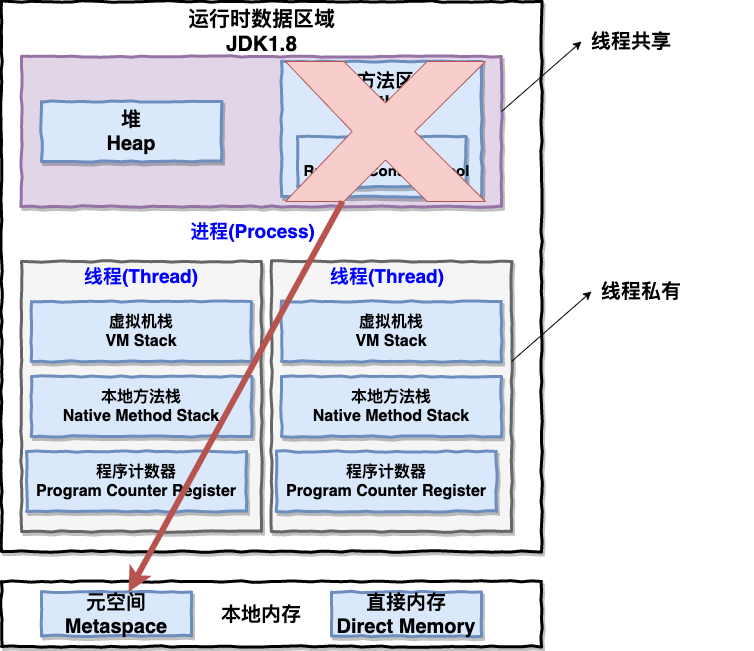
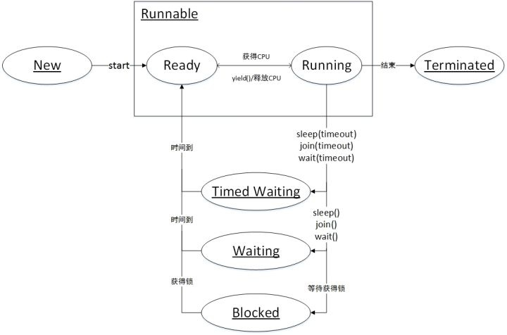

# Java并发基础

##  进程和线程

### 进程

进程是程序的一次执行过程，是系统运行程序的基本单位，因此进程是动态的。系统运行一个程序即是一个进程从创建，运行到消亡的过程。

在 Java 中，当我们启动 main 函数时其实就是启动了一个 JVM 的进程，而 main 函数所在的线程就是这个进程中的一个线程，也称主线程。

### 线程

线程与进程相似，但线程是一个比进程更小的执行单位。一个进程在其执行的过程中可以产生多个线程。与进程不同的是同类的多个线程共享进程的**堆**和**方法区**资源，但每个线程有自己的**程序计数器**、**虚拟机栈**和**本地方法栈**，所以系统在产生一个线程，或是在各个线程之间作切换工作时，负担要比进程小得多，也正因为如此，线程也被称为轻量级进程。

### 进程与线程的关系、区别



一个进程可以包含多个线程，多个线程共享该进程的堆和方法区（JDK1.8之后，去掉了方法区，改成了元空间），每个线程都有独立的程序计数器，Java虚拟机栈，本地方法栈。

**总结：** **线程是进程划分成的更小的运行单位。线程和进程最大的不同在于基本上各进程是独立的，而各线程则不一定，因为同一进程中的线程极有可能会相互影响。线程执行开销小，但不利于资源的管理和保护；而进程正相反。**

### 程序计数器

* **程序计数器** 

1.字节码解释器需要通过改变程序计数器来依次读取指令，实现对代码的流程控制，如：分支，跳转，循环，异常处理。

2.多线程执行时，程序计数器用来记录当前线程执行的位置，为了线程切换后可以恢复到正确的执行位置，每个线程都需要有一个独立的程序计数器，不同线程之间的程序计数器互补影响，相互独立。

**注**：程序计数器私有也是为了线程切换后可以恢复到正确的执行位置。

### Java虚拟机栈

* **Java虚拟机栈**每个方法被执行的时候都会创建一个栈帧，用来储存局部变量表，操作站，动态链接，方法出口信息等。每个方法被调用的过程就对应一个栈桢在虚拟机中从如站到出站的过程。

>栈帧: 是用来存储数据和部分过程结果的数据结构。
>栈帧的位置:  内存 -> 运行时数据区 -> 某个线程对应的虚拟机栈 -> here[在这里]
>栈帧大小确定时间: 编译期确定，不受运行期数据影响。

### 本地方法栈

* **本地方法栈** 本地方法栈与Java虚拟机栈的作用十分相似，区别是：虚拟机栈执行的是Java方法（也就是字节码）服务，而本地方法栈则是为虚拟机使用到的Native方法服务。

### 堆

* **堆** 是Java虚拟机管理内存最大的一块内存区域，几乎所有的对象实例和数组都在这里分配内存。

**注** :java虚拟机规范对这块的描述是:所有对象实例及数组都要在堆上分配内存，但随着JIT编译器的发展和逃逸分析技术的成熟，这个说法也不是那么绝对，但是大多数情况都是这样的。

>即时编译器:可以把把Java的字节码，包括需要被解释的指令的程序）转换成可以直接发送给处理器的指令的程序)
>
>逃逸分析:通过逃逸分析来决定某些实例或者变量是否要在堆中进行分配，如果开启了逃逸分析，即可将这些变量直接在栈上进行分配，而非堆上进行分配。这些变量的指针可以被全局所引用，或者其其它线程所引用。
>
>[参考逃逸分析](https://www.jianshu.com/p/20bd2e9b1f03)

### 方法区

方法区同堆一样，是所有线程共享的内存区域，为了区分堆，又被称为非堆。

用于存储已被虚拟机加载的类信息、常量、静态变量，如static修饰的变量加载类的时候就被加载到方法区中。

> 运行时常量池
>
> 是方法区的一部分，class文件除了有类的字段、接口、方法等描述信息之外，还有常量池用于存放编译期间生成的各种字面量和符号引用。

在老版jdk，方法区也被称为永久代【因为没有强制要求方法区必须实现垃圾回收，HotSpot虚拟机以永久代来实现方法区，从而JVM的垃圾收集器可以像管理堆区一样管理这部分区域，从而不需要专门为这部分设计垃圾回收机制。不过自从JDK7之后，Hotspot虚拟机便将运行时常量池从永久代移除了。】

### 线程状态

查看Thread源码，能够看到java的线程有六种状态：

```java
public enum State {
    NEW,
    RUNNABLE,
    BLOCKED,
    WAITING,
    TIMED_WAITING,
    TERMINATED;
  }
```

**NEW(新建)** 线程刚被创建，但是并未启动。 

**RUNNABLE(可运行)** 线程可以在java虚拟机中运行的状态，可能正在运行自己代码，也可能没有，这取决于操作系统处理器。 

**BLOCKED(锁阻塞)** 当一个线程试图获取一个对象锁，而该对象锁被其他的线程持有，则该线程进入Blocked状态；当该线程持有锁时，该线程将变成Runnable状态。 

**WAITING(无限等待)** 一个线程在等待另一个线程执行一个（唤醒）动作时，该线程进入Waiting状态。进入这个状态后是不能自动唤醒的，必须等待另一个线程调用notify或者notifyAll方法才能够唤醒。

**TIMED_WAITING(计时等待)** 同waiting状态，有几个方法有超时参数，调用他们将进入Timed Waiting状态。这一状态将一直保持到超时期满或者接收到唤醒通知。带有超时参数的常用方法有Thread.sleep 、Object.wait。 

**TERMINATED(被终止)** 因为run方法正常退出而死亡，或者因为没有捕获的异常终止了run方法而死亡。



### 上下文切换

线程在执行过程中会有自己的运行条件和状态（也称上下文），比如上文所说到过的程序计数器，栈信息等。当出现如下情况的时候，线程会从占用 CPU 状态中退出。

- 主动让出 CPU，比如调用了 `sleep()`, `wait()` 等。
- 时间片用完，因为操作系统要防止一个线程或者进程长时间占用CPU导致其他线程或者进程饿死。
- 调用了阻塞类型的系统中断，比如请求 IO，线程被阻塞。
- 被终止或结束运行

这其中前三种都会发生线程切换，线程切换意味着需要保存当前线程的上下文，留待线程下次占用 CPU 的时候恢复现场。并加载下一个将要占用 CPU 的线程上下文。这就是所谓的 **上下文切换**。

上下文切换是现代操作系统的基本功能，因其每次需要保存信息恢复信息，这将会占用 CPU，内存等系统资源进行处理，也就意味着效率会有一定损耗，如果频繁切换就会造成整体效率低下。

### 死锁


#### 死锁的定义

锁是指两个或两个以上的线程在执行过程中，因争夺资源而造成的一种互相等待的现象，若无外力作用，它们都将无法推进下去。

####  死锁的四个条件

* 互斥条件：互斥条件：一个资源每次只能被一个进程使用；

* 请求与保持条件：一个进程因请求资源而阻塞时，对已获得的资源保持不放；

* 不剥夺条件:进程已获得的资源，在末使用完之前，不能强行剥夺；

* 循环等待条件:若干进程之间形成一种头尾相接的循环等待资源关系；

#### 如何避免死锁

**如何预防死锁？** 破坏死锁的产生的必要条件即可：

1. **破坏请求与保持条件** ：一次性申请所有的资源。
2. **破坏不剥夺条件** ：占用部分资源的线程进一步申请其他资源时，如果申请不到，可以主动释放它占有的资源。
3. **破坏循环等待条件** ：靠按序申请资源来预防。按某一顺序申请资源，释放资源则反序释放。破坏循环等待条件。

**如何避免死锁？**

避免死锁就是在资源分配时，借助于算法（比如[银行家算法](https://blog.csdn.net/baidu_20363843/article/details/69944639)）对资源分配进行计算评估，使其进入安全状态。

**安全状态** 指的是系统能够按照某种进程推进顺序（P1、P2、P3.....Pn）来为每个进程分配所需资源，直到满足每个进程对资源的最大需求，使每个进程都可顺利完成。称<P1、P2、P3.....Pn>序列为安全序列。

### sleep()方法和wait()方法对比

相同点：两者都能使线程暂停执行并让出cpu的执行时间。

区别：sleep()是Thread类的方法，wait()是Object的方法。调用sleep()方法不会释放对象的锁，到时间后会继续执行；调用wait()方法会释放对象的锁，进入等待池中，需要notify()、notifyAll()后重新获取到对象锁资源后才能继续执行。`wait()` 通常被用于线程间交互/通信，`sleep() `通常被用于暂停执行。

### 调用 start() 方法执行 run() 方法，而不是直接调用 run() 方法

new 一个 Thread，线程进入了新建状态。调用 `start()`方法，会启动一个线程并使线程进入了就绪状态，当分配到时间片后就可以开始运行了。 `start()` 会执行线程的相应准备工作，然后自动执行 `run()` 方法的内容，这是真正的多线程工作。 但是，直接执行 `run()` 方法，会把 `run()` 方法当成一个 main 线程下的普通方法去执行，并不会在某个线程中执行它，所以这并不是多线程工作。

**总结： 调用 `start()` 方法方可启动线程并使线程进入就绪状态，直接执行 `run()` 方法的话不会以多线程的方式执行。**