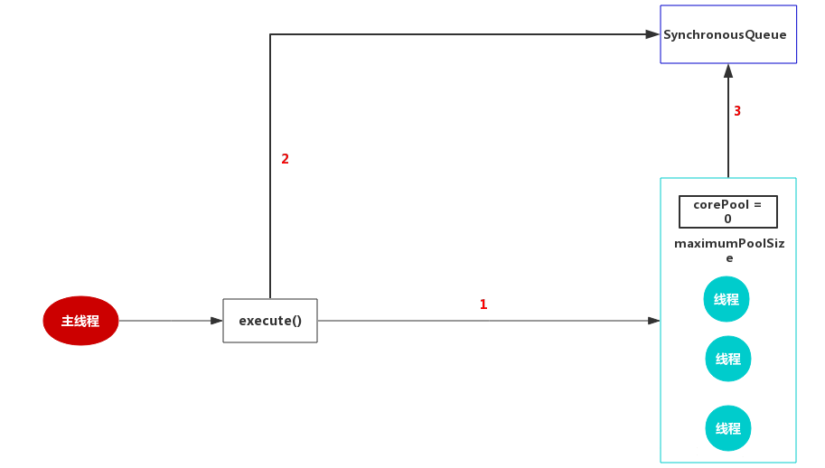

# Java线程池

## 线程池的优势

线程是一个程序员一定会涉及到的概念，但是线程的创建和切换都是代价比较大的。所以，我们需要有一个好的方案能做到线程的复用，这就涉及到一个概念——线程池。合理的使用线程池能够带来3个很明显的好处：

1. 降低资源消耗：通过重用已经创建的线程来降低线程创建和销毁的消耗
2. 提高响应速度：任务到达时不需要等待线程创建就可以立即执行。
3. 提高线程的可管理性：线程池可以统一管理、分配、调优和监控。

Java的线程池支持主要通过`ThreadPoolExecutor`来实现，我们使用的`ExecutorService`的各种线程池策略都是基于`ThreadPoolExecutor`实现的，所以`ThreadPoolExecutor`十分重要。要弄明白各种线程池策略，必须先弄明白`ThreadPoolExecutor`。

 ## `ThreadPoolExecutor` 

`ThreadPoolExecutor` 构造方法：

```java
public ThreadPoolExecutor(int corePoolSize,  // 核心线程数
                          int maximumPoolSize, // 最大线程数
                          long keepAliveTime, // 当线程数大于核心线程数时，空闲线程的存活时间
                          TimeUnit unit, // 存活时间单位
                          BlockingQueue<Runnable> workQueue, // 任务队列，等待执行的任务队列
                          ThreadFactory threadFactory, // 线程工厂，用来创建线程，默认即可
                          RejectedExecutionHandler handler // 拒绝策略，当提交的任务过多而不能及时处理时，我们可以定制策略来处理任务
                         ) {
    if (corePoolSize < 0 ||
        maximumPoolSize <= 0 ||
        maximumPoolSize < corePoolSize ||
        keepAliveTime < 0)
        throw new IllegalArgumentException();
    if (workQueue == null || threadFactory == null || handler == null)
        throw new NullPointerException();
    this.acc = System.getSecurityManager() == null ?
        null :
    AccessController.getContext();
    this.corePoolSize = corePoolSize;
    this.maximumPoolSize = maximumPoolSize;
    this.workQueue = workQueue;
    this.keepAliveTime = unit.toNanos(keepAliveTime);
    this.threadFactory = threadFactory;
    this.handler = handler;
}
```

共有七个参数，每个参数含义如下：

* **`corePoolSize`**：线程池中核心线程的数量（也称为线程池的基本大小）。当提交一个任务时，线程池会新建一个线程来执行任务，直到当前线程数等于`corePoolSize`。如果调用了线程池的`prestartAllCoreThreads()`方法，线程池会提前创建并启动所有基本线程。

* **`maximumPoolSize`**：线程池中允许的最大线程数。线程池的阻塞队列满了之后，如果还有任务提交，如果当前的线程数小于`maximumPoolSize`，则会新建线程来执行任务。注意，如果使用的是无界队列，该参数也就没有什么效果了。

* **`keepAliveTime`**：线程空闲的时间。线程的创建和销毁是需要代价的。线程执行完任务后不会立即销毁，而是继续存活一段时间：`keepAliveTime`。默认情况下，该参数只有在线程数大于`corePoolSize`时才会生效。

* **`unit`**：`keepAliveTime`的单位。`TimeUnit`

* **`workQueue`**：用来保存等待执行的任务的`BlockQueue`阻塞队列，等待的任务必须实现Runnable接口。选择如下：`ArrayBlockingQueue`：基于数组结构的有界阻塞队列，FIFO。`LinkedBlockingQueue`：基于链表结构的有界阻塞队列，FIFO。 `PriorityBlockingQueue`：具有优先级别的阻塞队列。 `SynchronousQueue`：不存储元素的阻塞队列，每个插入操作都必须等待一个移出操作。

* **`threadFactory`**：用于设置创建线程的工厂。`ThreadFactory`的作用就是提供创建线程的功能的线程工厂。他是通过`newThread()`方法提供创建线程的功能，`newThread()`方法创建的线程都是“非守护线程”而且“线程优先级都是默认优先级”。

* **`handler`**：`RejectedExecutionHandler`，线程池的拒绝策略。所谓拒绝策略，是指将任务添加到线程池中时，线程池拒绝该任务所采取的相应策略。当向线程池中提交任务时，如果此时线程池中的线程已经饱和了，而且阻塞队列也已经满了，则线程池会选择一种拒绝策略来处理该任务。

线程池提供了四种拒绝策略：

`AbortPolicy`：直接抛出异常`RejectedExecutionException`,来拒绝新任务的处理，默认策略； 

`CallerRunsPolicy`：用调用者所在的线程来执行任务；

`DiscardOldestPolicy`：丢弃阻塞队列中靠最前的任务，并执行当前任务； 

`DiscardPolicy`：直接丢弃任务； 当然我们也可以实现自己的拒绝策略，例如记录日志等等，实现`RejectedExecutionHandler`接口即可。

> Spring 通过 `ThreadPoolTaskExecutor` 或者我们直接通过 `ThreadPoolExecutor` 的构造函数创建线程池的时候，当我们不指定 `RejectedExecutionHandler` 饱和策略的话来配置线程池的时候默认使用的是 `ThreadPoolExecutor.AbortPolicy`。在默认情况下，`ThreadPoolExecutor` 将抛出 `RejectedExecutionException` 来拒绝新来的任务 ，这代表你将丢失对这个任务的处理。 对于可伸缩的应用程序，建议使用 `ThreadPoolExecutor.CallerRunsPolicy`。当最大池被填满时，此策略为我们提供可伸缩队列。

### 推荐使用 `ThreadPoolExecutor` 构造函数创建线程池


**方式一：通过`ThreadPoolExecutor`构造函数实现（推荐）**


**方式二：通过 `Executor` 框架的工具类 `Executors` 来实现** 我们可以创建三种类型的 `ThreadPoolExecutor`：

- `FixedThreadPool`
- `SingleThreadExecutor`
- CachedThreadPool

对应 Executors 工具类中的方法如图所示：


### ThreadPoolExecutor 使用+原理分析

**代码示例**

首先创建一个 `Runnable` 接口的实现类。`MyRunnable.java`

```java
import java.util.Date;

public class MyRunnable implements Runnable {

    private String command;

    public MyRunnable(String s) {
        this.command = s;
    }

    @Override
    public void run() {
        System.out.println(Thread.currentThread().getName() + " Start. Time = " + new Date());
        processCommand();
        System.out.println(Thread.currentThread().getName() + " End. Time = " + new Date());
    }

    private void processCommand() {
        try {
            Thread.sleep(5000);
        } catch (InterruptedException e) {
            e.printStackTrace();
        }
    }

    @Override
    public String toString() {
        return this.command;
    }
}
```

编写测试程序，我们这里以阿里巴巴推荐的使用 `ThreadPoolExecutor` 构造函数自定义参数的方式来创建线程池。`ThreadPoolExecutorDemo.java`

```java
import java.util.concurrent.ArrayBlockingQueue;
import java.util.concurrent.ThreadPoolExecutor;
import java.util.concurrent.TimeUnit;

public class ThreadPoolExecutorDemo {

    private static final int CORE_POOL_SIZE = 5;
    private static final int MAX_POOL_SIZE = 10;
    private static final int QUEUE_CAPACITY = 100;
    private static final Long KEEP_ALIVE_TIME = 1L;
    public static void main(String[] args) {

        //使用阿里巴巴推荐的创建线程池的方式
        //通过ThreadPoolExecutor构造函数自定义参数创建
        ThreadPoolExecutor executor = new ThreadPoolExecutor(
                CORE_POOL_SIZE,
                MAX_POOL_SIZE,
                KEEP_ALIVE_TIME,
                TimeUnit.SECONDS,
                new ArrayBlockingQueue<>(QUEUE_CAPACITY),
                new ThreadPoolExecutor.CallerRunsPolicy());

        for (int i = 0; i < 10; i++) {
            //创建WorkerThread对象（WorkerThread类实现了Runnable 接口）
            Runnable worker = new MyRunnable("" + i);
            //执行Runnable
            executor.execute(worker);
        }
        //终止线程池
        executor.shutdown();
        while (!executor.isTerminated()) {
        }
        System.out.println("Finished all threads");
    }
}
```

可以看到我们上面的代码指定了：

1. `corePoolSize`: 核心线程数为 5。
2. `maximumPoolSize` ：最大线程数 10
3. `keepAliveTime` : 等待时间为 1L。
4. `unit`: 等待时间的单位为 TimeUnit.SECONDS。
5. `workQueue`：任务队列为 `ArrayBlockingQueue`，并且容量为 100;
6. `handler`:饱和策略为 `CallerRunsPolicy`。

输出：

```java
pool-1-thread-3 Start. Time = Sun Apr 12 11:14:37 CST 2020
pool-1-thread-5 Start. Time = Sun Apr 12 11:14:37 CST 2020
pool-1-thread-2 Start. Time = Sun Apr 12 11:14:37 CST 2020
pool-1-thread-1 Start. Time = Sun Apr 12 11:14:37 CST 2020
pool-1-thread-4 Start. Time = Sun Apr 12 11:14:37 CST 2020
pool-1-thread-3 End. Time = Sun Apr 12 11:14:42 CST 2020
pool-1-thread-4 End. Time = Sun Apr 12 11:14:42 CST 2020
pool-1-thread-1 End. Time = Sun Apr 12 11:14:42 CST 2020
pool-1-thread-5 End. Time = Sun Apr 12 11:14:42 CST 2020
pool-1-thread-1 Start. Time = Sun Apr 12 11:14:42 CST 2020
pool-1-thread-2 End. Time = Sun Apr 12 11:14:42 CST 2020
```

### 线程池原理分析

我们通过代码输出结果可以看出：**线程池首先会先执行 5 个任务，然后这些任务有任务被执行完的话，就会去拿新的任务执行。**

**为了搞懂线程池的原理，我们需要首先分析一下 `execute`方法。** 在 Demo 中我们使用 `executor.execute(worker)`来提交一个任务到线程池中去，这个方法非常重要，下面我们来看看它的源码：

```java
   // 存放线程池的运行状态 (runState) 和线程池内有效线程的数量 (workerCount)
   private final AtomicInteger ctl = new AtomicInteger(ctlOf(RUNNING, 0));

    private static int workerCountOf(int c) {
        return c & CAPACITY;
    }
    //任务队列
    private final BlockingQueue<Runnable> workQueue;

    public void execute(Runnable command) {
        // 如果任务为null，则抛出异常。
        if (command == null)
            throw new NullPointerException();
        // ctl 中保存的线程池当前的一些状态信息
        int c = ctl.get();

        //  下面会涉及到 3 步 操作
        // 1.首先判断当前线程池中执行的任务数量是否小于 corePoolSize
        // 如果小于的话，通过addWorker(command, true)新建一个线程，并将任务(command)添加到该线程中；然后，启动该线程从而执行任务。
        if (workerCountOf(c) < corePoolSize) {
            if (addWorker(command, true))
                return;
            c = ctl.get();
        }
        // 2.如果当前之行的任务数量大于等于 corePoolSize 的时候就会走到这里
        // 通过 isRunning 方法判断线程池状态，线程池处于 RUNNING 状态才会被并且队列可以加入任务，该任务才会被加入进去
        if (isRunning(c) && workQueue.offer(command)) {
            int recheck = ctl.get();
            // 再次获取线程池状态，如果线程池状态不是 RUNNING 状态就需要从任务队列中移除任务，并尝试判断线程是否全部执行完毕。同时执行拒绝策略。
            if (!isRunning(recheck) && remove(command))
                reject(command);
                // 如果当前线程池为空就新创建一个线程并执行。
            else if (workerCountOf(recheck) == 0)
                addWorker(null, false);
        }
        //3. 通过addWorker(command, false)新建一个线程，并将任务(command)添加到该线程中；然后，启动该线程从而执行任务。
        //如果addWorker(command, false)执行失败，则通过reject()执行相应的拒绝策略的内容。
        else if (!addWorker(command, false))
            reject(command);
    }
```


**`addWorker` 这个方法主要用来创建新的工作线程，如果返回 true 说明创建和启动工作线程成功，否则的话返回的就是 false。**

```java
    // 全局锁，并发操作必备
    private final ReentrantLock mainLock = new ReentrantLock();
    // 跟踪线程池的最大大小，只有在持有全局锁mainLock的前提下才能访问此集合
    private int largestPoolSize;
    // 工作线程集合，存放线程池中所有的（活跃的）工作线程，只有在持有全局锁mainLock的前提下才能访问此集合
    private final HashSet<Worker> workers = new HashSet<>();
    //获取线程池状态
    private static int runStateOf(int c)     { return c & ~CAPACITY; }
    //判断线程池的状态是否为 Running
    private static boolean isRunning(int c) {
        return c < SHUTDOWN;
    }

    /**
     * 添加新的工作线程到线程池
     * @param firstTask 要执行
     * @param core参数为true的话表示使用线程池的基本大小，为false使用线程池最大大小
     * @return 添加成功就返回true否则返回false
     */
   private boolean addWorker(Runnable firstTask, boolean core) {
        retry:
        for (;;) {
            //这两句用来获取线程池的状态
            int c = ctl.get();
            int rs = runStateOf(c);

            // Check if queue empty only if necessary.
            if (rs >= SHUTDOWN &&
                ! (rs == SHUTDOWN &&
                   firstTask == null &&
                   ! workQueue.isEmpty()))
                return false;

            for (;;) {
               //获取线程池中线程的数量
                int wc = workerCountOf(c);
                // core参数为true的话表明队列也满了，线程池大小变为 maximumPoolSize
                if (wc >= CAPACITY ||
                    wc >= (core ? corePoolSize : maximumPoolSize))
                    return false;
               //原子操作将workcount的数量加1
                if (compareAndIncrementWorkerCount(c))
                    break retry;
                // 如果线程的状态改变了就再次执行上述操作
                c = ctl.get();
                if (runStateOf(c) != rs)
                    continue retry;
                // else CAS failed due to workerCount change; retry inner loop
            }
        }
        // 标记工作线程是否启动成功
        boolean workerStarted = false;
        // 标记工作线程是否创建成功
        boolean workerAdded = false;
        Worker w = null;
        try {
            w = new Worker(firstTask);
            final Thread t = w.thread;
            if (t != null) {
              // 加锁
                final ReentrantLock mainLock = this.mainLock;
                mainLock.lock();
                try {
                   //获取线程池状态
                    int rs = runStateOf(ctl.get());
                   //rs < SHUTDOWN 如果线程池状态依然为RUNNING,并且线程的状态是存活的话，就会将工作线程添加到工作线程集合中
                  //(rs=SHUTDOWN && firstTask == null)如果线程池状态小于STOP，也就是RUNNING或者SHUTDOWN状态下，同时传入的任务实例firstTask为null，则需要添加到工作线程集合和启动新的Worker
                   // firstTask == null证明只新建线程而不执行任务
                    if (rs < SHUTDOWN ||
                        (rs == SHUTDOWN && firstTask == null)) {
                        if (t.isAlive()) // precheck that t is startable
                            throw new IllegalThreadStateException();
                        workers.add(w);
                       //更新当前工作线程的最大容量
                        int s = workers.size();
                        if (s > largestPoolSize)
                            largestPoolSize = s;
                      // 工作线程是否启动成功
                        workerAdded = true;
                    }
                } finally {
                    // 释放锁
                    mainLock.unlock();
                }
                //// 如果成功添加工作线程，则调用Worker内部的线程实例t的Thread#start()方法启动真实的线程实例
                if (workerAdded) {
                    t.start();
                  /// 标记线程启动成功
                    workerStarted = true;
                }
            }
        } finally {
           // 线程启动失败，需要从工作线程中移除对应的Worker
            if (! workerStarted)
                addWorkerFailed(w);
        }
        return workerStarted;
    }
```

> 代码中模拟了 10 个任务，我们配置的核心线程数为 5 、等待队列容量为 100 ，所以每次只可能存在 5 个任务同时执行，剩下的 5 个任务会被放到等待队列中去。当前的 5 个任务中如果有任务被执行完了，线程池就会去拿新的任务执行。

###  几个常见的对比

#### `Runnable` vs `Callable`

`Runnable`自 Java 1.0 以来一直存在，但`Callable`仅在 Java 1.5 中引入,目的就是为了来处理`Runnable`不支持的用例。**`Runnable` 接口**不会返回结果或抛出检查异常，但是 **`Callable` 接口**可以。所以，如果任务不需要返回结果或抛出异常推荐使用 **`Runnable` 接口**，这样代码看起来会更加简洁。

工具类 `Executors` 可以实现将 `Runnable` 对象转换成 `Callable` 对象。（`Executors.callable(Runnable task)` 或 `Executors.callable(Runnable task, Object result)`）。

`Runnable.java`

```java
@FunctionalInterface
public interface Runnable {
   /**
    * 被线程执行，没有返回值也无法抛出异常
    */
    public abstract void run();
}
```

`Callable.java`

```java
@FunctionalInterface
public interface Callable<V> {
    /**
     * 计算结果，或在无法这样做时抛出异常。
     * @return 计算得出的结果
     * @throws 如果无法计算结果，则抛出异常
     */
    V call() throws Exception;
}
```

#### `execute()` vs `submit()`

- `execute()`方法用于提交不需要返回值的任务，所以无法判断任务是否被线程池执行成功与否；
- `submit()`方法用于提交需要返回值的任务。线程池会返回一个 `Future` 类型的对象，通过这个 `Future` 对象可以判断任务是否执行成功，并且可以通过 `Future` 的 `get()`方法来获取返回值，`get()`方法会阻塞当前线程直到任务完成，而使用 `get（long timeout，TimeUnit unit）`方法则会阻塞当前线程一段时间后立即返回，这时候有可能任务没有执行完。

我们以 `AbstractExecutorService` 接口中的一个 `submit()` 方法为例子来看看源代码：

```java
    public Future<?> submit(Runnable task) {
        if (task == null) throw new NullPointerException();
        RunnableFuture<Void> ftask = newTaskFor(task, null);
        execute(ftask);
        return ftask;
    }
```

上面方法调用的 `newTaskFor` 方法返回了一个 `FutureTask` 对象。

```java
    protected <T> RunnableFuture<T> newTaskFor(Runnable runnable, T value) {
        return new FutureTask<T>(runnable, value);
    }
```

我们再来看看`execute()`方法：

```java
    public void execute(Runnable command) {
      ...
    }
```

#### `shutdown()`VS`shutdownNow()`

- **`shutdown（）`** :关闭线程池，线程池的状态变为 `SHUTDOWN`。线程池不再接受新任务了，但是队列里的任务得执行完毕。
- **`shutdownNow（）`** :关闭线程池，线程的状态变为 `STOP`。线程池会终止当前正在运行的任务，并停止处理排队的任务并返回正在等待执行的 List。

#### `isTerminated()` VS `isShutdown()`

- **`isShutDown`** 当调用 `shutdown()` 方法后返回为 true。
- **`isTerminated`** 当调用 `shutdown()` 方法后，并且所有提交的任务完成后返回为 true

## 四种线程池

我们除了可以使用`ThreadPoolExecuto`r自己根据实际情况创建线程池以外，`Executor`框架也提供了三种线程池，他们都可以通过工具类`Executors`来创建。

还有一种线程池`ScheduledThreadPoolExecutor`，它相当于提供了“延迟”和“周期执行”功能的`ThreadPoolExecutor`

#### `FixedThreadPool`

`FixedThreadPool`是复用**固定数量的线程**处理一个**共享的无边界队列**，其定义如下：

```java
public static ExecutorService newFixedThreadPool(int nThreads) {
    return new ThreadPoolExecutor(nThreads, nThreads,
                                  0L, TimeUnit.MILLISECONDS,
                                  new LinkedBlockingQueue<Runnable>());
}
```

`corePoolSize` 和 `maximumPoolSize`都设置为创建`FixedThreadPool`时指定的参数`nThreads`，由于该线程池是固定线程数的线程池，当线程池中的线程数量等于`corePoolSize` 时，如果继续提交任务，该任务会被添加到阻塞队列`workQueue`中，而`workQueue`使用的是`LinkedBlockingQueue`，但没有设置范围，那么则是最大值（`Integer.MAX_VALUE）`，这基本就相当于一个无界队列了。


```java
public class FixedThreadPoolCase {
    public static void main(String[] args) throws InterruptedException {
        ExecutorService exec = Executors.newFixedThreadPool(3);
        for (int i = 0; i < 5; i++) {
            exec.execute(new Demo());
            Thread.sleep(10);
        }
        exec.shutdown();
    }
    
    static class Demo implements Runnable {
        @Override
        public void run() {
            String name = Thread.currentThread().getName();
            for (int i = 0; i < 2; i++) {
                System.out.println(name + ":" + i);
            }
        }
    }
}
```

#### `SingleThreadExecutor`

`SingleThreadExecutor`只会使用单个工作线程来执行一个无边界的队列。

```
public static ExecutorService newSingleThreadExecutor() {
    return new FinalizableDelegatedExecutorService
        (new ThreadPoolExecutor(1, 1,
                                0L, TimeUnit.MILLISECONDS,
                                new LinkedBlockingQueue<Runnable>()));
}
```

作为单一worker线程的线程池，它把`corePool`和`maximumPoolSize`均被设置为1，和`FixedThreadPool`一样使用的是无界队列`LinkedBlockingQueue`,所以带来的影响和`FixedThreadPool`一样。

`SingleThreadExecutor`只会使用单个工作线程，它可以保证认为是按顺序执行的，任何时候都不会有多于一个的任务处于活动状态。注意，如果单个线程在执行过程中因为某些错误中止，新的线程会替代它执行后续线程。


```java
public class SingleThreadPoolCase {
    static int count = 0;
    public static void main(String[] args) throws InterruptedException {
        ExecutorService exec = Executors.newSingleThreadExecutor();
        for (int i = 0; i < 10; i++) {
            exec.execute(new Demo());
            Thread.sleep(5);
        }
        exec.shutdown();
    }

    static class Demo implements Runnable {
        @Override
        public void run() {
            String name = Thread.currentThread().getName();
            for (int i = 0; i < 2; i++) {
                count++;
                System.out.println(name + ":" + count);
            }
        }
    }
}
```

#### `CachedThreadPool`

`CachedThreadPool`会根据需要，在线程可用时，重用之前构造好的池中线程，否则创建新线程：

```java
public static ExecutorService newCachedThreadPool() {
    return new ThreadPoolExecutor(0, Integer.MAX_VALUE,
                                  60L, TimeUnit.SECONDS,
                                  new SynchronousQueue<Runnable>());
}
```

它把`corePool`为0，`maximumPoolSize`为`Integer.MAX_VALUE`，这就意味着所有的任务一提交就会加入到阻塞队列中。因为线程池的基本大小设置为0，一般情况下线程池中没有程池，用的时候再创建。

但是`keepAliveTime`设置60，unit设置为秒，意味着空闲线程等待新任务的最长时间为60秒，空闲线程超过60秒后将会被终止。阻塞队列采用的`SynchronousQueue`，这是是一个没有元素的阻塞队列。

这个线程池在执行 大量短生命周期的异步任务时，可以显著提高程序性能。调用 execute 时，可以重用之前已构造的可用线程，如果不存在可用线程，那么会重新创建一个新的线程并将其加入到线程池中。如果线程超过 60 秒还未被使用，就会被中止并从缓存中移除。因此，线程池在长时间空闲后不会消耗任何资源。

但是这样就处理线程池会存在一个问题，如果主线程提交任务的速度远远大于`CachedThreadPool`的处理速度，则`CachedThreadPool`会不断地创建新线程来执行任务，这样有可能会导致系统耗尽CPU和内存资源，所以在使用该线程池是，一定要注意控制并发的任务数，否则创建大量的线程可能导致严重的性能问题。



```java
public class CachedThreadPoolCase {
    public static void main(String[] args) throws InterruptedException {
        ExecutorService exec = Executors.newCachedThreadPool();
        for (int i = 0; i < 10; i++) {
            exec.execute(new Demo());
            Thread.sleep(1);
        }
        exec.shutdown();
    }

    static class Demo implements Runnable {
        @Override
        public void run() {
            String name = Thread.currentThread().getName();
            try {
                //修改睡眠时间，模拟线程执行需要花费的时间
                Thread.sleep(1);
                System.out.println(name + "执行完了");
            } catch (InterruptedException e) {
                e.printStackTrace();
            }
        }
    }
}
```

#### `ScheduledThreadPool`

`Timer`与`TimerTask`虽然可以实现线程的周期和延迟调度，但是`Timer`与`TimerTask`存在一些问题：

- `Timer`在执行定时任务时只会创建一个线程，所以如果存在多个任务，且任务时间过长，超过了两个任务的间隔时间，会发生一些缺陷。
- 如果`TimerTask`抛出`RuntimeException`，Timer会停止所有任务的运行。
- Timer执行周期任务时依赖系统时间，如果当前系统时间发生变化会出现一些执行上的变化

为了解决这些问题，我们一般都是推荐`ScheduledThreadPoolExecutor`来实现。

`ScheduledThreadPoolExecutor`，继承`ThreadPoolExecutor`且实现了`ScheduledExecutorService`接口，它就相当于提供了“延迟”和“周期执行”功能的`ThreadPoolExecutor`。

`ScheduledThreadPoolExecutor`，它可另行安排在给定的延迟后运行命令，或者定期执行命令。需要多个辅助线程时，或者要求 `ThreadPoolExecutor` 具有额外的灵活性或功能时，此类要优于`Timer`。

提供了四种构造方法：

  ```java
public ScheduledThreadPoolExecutor(int corePoolSize) {
        super(corePoolSize, Integer.MAX_VALUE, 0, NANOSECONDS,
                new DelayedWorkQueue());
    }

    public ScheduledThreadPoolExecutor(int corePoolSize,
                                       ThreadFactory threadFactory) {
        super(corePoolSize, Integer.MAX_VALUE, 0, NANOSECONDS,
                new DelayedWorkQueue(), threadFactory);
    }

    public ScheduledThreadPoolExecutor(int corePoolSize,
                                       RejectedExecutionHandler handler) {
        super(corePoolSize, Integer.MAX_VALUE, 0, NANOSECONDS,
                new DelayedWorkQueue(), handler);
    }

    public ScheduledThreadPoolExecutor(int corePoolSize,
                                       ThreadFactory threadFactory,
                                       RejectedExecutionHandler handler) {
        super(corePoolSize, Integer.MAX_VALUE, 0, NANOSECONDS,
                new DelayedWorkQueue(), threadFactory, handler);
    }
  ```

在`ScheduledThreadPoolExecutor`的构造函数中，我们发现它都是利用`ThreadLocalExecutor`来构造的，唯一变动的地方就在于它所使用的阻塞队列变成了`DelayedWorkQueue`。

`DelayedWorkQueue`为`ScheduledThreadPoolExecutor`中的内部类，类似于延时队列和优先级队列。在执行定时任务的时候，每个任务的执行时间都不同，所以`DelayedWorkQueue`的工作就是按照执行时间的升序来排列，执行时间距离当前时间越近的任务在队列的前面，这样就可以保证每次出队的任务都是当前队列中执行时间最靠前的。

```java
public class Demo9ScheduledThreadPool {
        public static void main(String[] args) throws InterruptedException {
            ScheduledExecutorService scheduledThreadPool = Executors.newScheduledThreadPool(2);
            System.out.println("程序开始：" + new Date());
            // 第二个参数是延迟多久执行
            scheduledThreadPool.schedule(new Task(), 0, TimeUnit.SECONDS);
            scheduledThreadPool.schedule(new Task(), 1, TimeUnit.SECONDS);
            scheduledThreadPool.schedule(new Task(), 5, TimeUnit.SECONDS);
            Thread.sleep(5000);
            // 关闭线程池
            scheduledThreadPool.shutdown();
        }

        static class Task implements Runnable {
            @Override
            public void run() {
                try {
                    String name = Thread.currentThread().getName();
                    System.out.println(name + ", 开始：" + new Date());
                    Thread.sleep(1000);
                    System.out.println(name + ", 结束：" + new Date());
                } catch (InterruptedException e) {
                    e.printStackTrace();
                }
            }
        }
    }
```

##  线程池大小确定

**线程池数量的确定一直是困扰着程序员的一个难题，大部分程序员在设定线程池大小的时候就是随心而定。**

很多人甚至可能都会觉得把线程池配置过大一点比较好！我觉得这明显是有问题的。就拿我们生活中非常常见的一例子来说：**并不是人多就能把事情做好，增加了沟通交流成本。你本来一件事情只需要 3 个人做，你硬是拉来了 6 个人，会提升做事效率嘛？我想并不会。** 线程数量过多的影响也是和我们分配多少人做事情一样，对于多线程这个场景来说主要是增加了**上下文切换**成本。不清楚什么是上下文切换的话，可以看我下面的介绍。

> 上下文切换：
>
> 多线程编程中一般线程的个数都大于 CPU 核心的个数，而一个 CPU 核心在任意时刻只能被一个线程使用，为了让这些线程都能得到有效执行，CPU 采取的策略是为每个线程分配时间片并轮转的形式。当一个线程的时间片用完的时候就会重新处于就绪状态让给其他线程使用，这个过程就属于一次上下文切换。概括来说就是：当前任务在执行完 CPU 时间片切换到另一个任务之前会先保存自己的状态，以便下次再切换回这个任务时，可以再加载这个任务的状态。**任务从保存到再加载的过程就是一次上下文切换**。
>
> 上下文切换通常是计算密集型的。也就是说，它需要相当可观的处理器时间，在每秒几十上百次的切换中，每次切换都需要纳秒量级的时间。所以，上下文切换对系统来说意味着消耗大量的 CPU 时间，事实上，可能是操作系统中时间消耗最大的操作。
>
> Linux 相比与其他操作系统（包括其他类 Unix 系统）有很多的优点，其中有一项就是，其上下文切换和模式切换的时间消耗非常少。

**类比于实现世界中的人类通过合作做某件事情，我们可以肯定的一点是线程池大小设置过大或者过小都会有问题，合适的才是最好。**

**如果我们设置的线程池数量太小的话，如果同一时间有大量任务/请求需要处理，可能会导致大量的请求/任务在任务队列中排队等待执行，甚至会出现任务队列满了之后任务/请求无法处理的情况，或者大量任务堆积在任务队列导致 OOM。这样很明显是有问题的！ CPU 根本没有得到充分利用。**

**但是，如果我们设置线程数量太大，大量线程可能会同时在争取 CPU 资源，这样会导致大量的上下文切换，从而增加线程的执行时间，影响了整体执行效率。**

有一个简单并且适用面比较广的公式：

- **CPU 密集型任务(N+1)：** 这种任务消耗的主要是 CPU 资源，可以将线程数设置为 N（CPU 核心数）+1，比 CPU 核心数多出来的一个线程是为了防止线程偶发的缺页中断，或者其它原因导致的任务暂停而带来的影响。一旦任务暂停，CPU 就会处于空闲状态，而在这种情况下多出来的一个线程就可以充分利用 CPU 的空闲时间。
- **I/O 密集型任务(2N)：** 这种任务应用起来，系统会用大部分的时间来处理 I/O 交互，而线程在处理 I/O 的时间段内不会占用 CPU 来处理，这时就可以将 CPU 交出给其它线程使用。因此在 I/O 密集型任务的应用中，我们可以多配置一些线程，具体的计算方法是 2N。

**如何判断是 CPU 密集任务还是 IO 密集任务？**

CPU 密集型简单理解就是利用 CPU 计算能力的任务比如你在内存中对大量数据进行排序。但凡涉及到网络读取，文件读取这类都是 IO 密集型，这类任务的特点是 CPU 计算耗费时间相比于等待 IO 操作完成的时间来说很少，大部分时间都花在了等待 IO 操作完成上。

