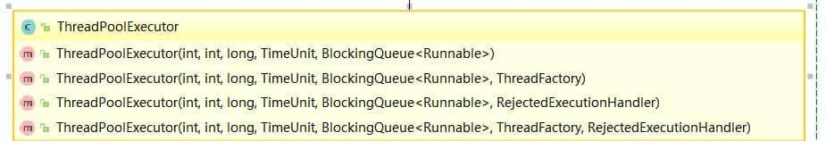

# Java线程池

## 线程池的优势

线程是一个程序员一定会涉及到的概念，但是线程的创建和切换都是代价比较大的。所以，我们需要有一个好的方案能做到线程的复用，这就涉及到一个概念——线程池。合理的使用线程池能够带来3个很明显的好处：

1. 降低资源消耗：通过重用已经创建的线程来降低线程创建和销毁的消耗
2. 提高响应速度：任务到达时不需要等待线程创建就可以立即执行。
3. 提高线程的可管理性：线程池可以统一管理、分配、调优和监控。

java的线程池支持主要通过ThreadPoolExecutor来实现，我们使用的ExecutorService的各种线程池策略都是基于ThreadPoolExecutor实现的，所以ThreadPoolExecutor十分重要。要弄明白各种线程池策略，必须先弄明白ThreadPoolExecutor。

 ## ThreadPoolExecutor 

```java
public ThreadPoolExecutor(int corePoolSize,  // 核心线程数
                          int maximumPoolSize, // 最大线程数
                          long keepAliveTime, // 当线程数大于核心线程数时，空闲线程的存活时间
                          TimeUnit unit, // 存活时间单位
                          BlockingQueue<Runnable> workQueue, // 任务队列，等待执行的任务队列
                          ThreadFactory threadFactory, // 线程工厂，用来创建线程，默认即可
                          RejectedExecutionHandler handler // 拒绝策略，当提交的任务过多而不能及时处理时，我们可以定制策略来处理任务
                         ) {
    if (corePoolSize < 0 ||
        maximumPoolSize <= 0 ||
        maximumPoolSize < corePoolSize ||
        keepAliveTime < 0)
        throw new IllegalArgumentException();
    if (workQueue == null || threadFactory == null || handler == null)
        throw new NullPointerException();
    this.acc = System.getSecurityManager() == null ?
        null :
    AccessController.getContext();
    this.corePoolSize = corePoolSize;
    this.maximumPoolSize = maximumPoolSize;
    this.workQueue = workQueue;
    this.keepAliveTime = unit.toNanos(keepAliveTime);
    this.threadFactory = threadFactory;
    this.handler = handler;
}
```

共有七个参数，每个参数含义如下：

* **corePoolSize**：线程池中核心线程的数量（也称为线程池的基本大小）。当提交一个任务时，线程池会新建一个线程来执行任务，直到当前线程数等于corePoolSize。如果调用了线程池的prestartAllCoreThreads()方法，线程池会提前创建并启动所有基本线程。

* **maximumPoolSize**：线程池中允许的最大线程数。线程池的阻塞队列满了之后，如果还有任务提交，如果当前的线程数小于maximumPoolSize，则会新建线程来执行任务。注意，如果使用的是无界队列，该参数也就没有什么效果了。

* **keepAliveTime**：线程空闲的时间。线程的创建和销毁是需要代价的。线程执行完任务后不会立即销毁，而是继续存活一段时间：keepAliveTime。默认情况下，该参数只有在线程数大于corePoolSize时才会生效。

* **unit**：keepAliveTime的单位。TimeUnit

* **workQueue**：用来保存等待执行的任务的BlockQueue阻塞队列，等待的任务必须实现Runnable接口。选择如下：ArrayBlockingQueue：基于数组结构的有界阻塞队列，FIFO。 LinkedBlockingQueue：基于链表结构的有界阻塞队列，FIFO。 PriorityBlockingQueue：具有优先级别的阻塞队列。 SynchronousQueue：不存储元素的阻塞队列，每个插入操作都必须等待一个移出操作。

* **threadFactory**：用于设置创建线程的工厂。`ThreadFactory`的作用就是提供创建线程的功能的线程工厂。他是通过newThread()方法提供创建线程的功能，newThread()方法创建的线程都是“非守护线程”而且“线程优先级都是默认优先级”。

* **handler**：`RejectedExecutionHandler`，线程池的拒绝策略。所谓拒绝策略，是指将任务添加到线程池中时，线程池拒绝该任务所采取的相应策略。当向线程池中提交任务时，如果此时线程池中的线程已经饱和了，而且阻塞队列也已经满了，则线程池会选择一种拒绝策略来处理该任务。

线程池提供了四种拒绝策略：

`AbortPolicy`：直接抛出异常`RejectedExecutionException`,来拒绝新任务的处理，默认策略； 

`CallerRunsPolicy`：用调用者所在的线程来执行任务；

`DiscardOldestPolicy`：丢弃阻塞队列中靠最前的任务，并执行当前任务； 

`DiscardPolicy`：直接丢弃任务； 当然我们也可以实现自己的拒绝策略，例如记录日志等等，实现`RejectedExecutionHandler`接口即可。

> Spring 通过 `ThreadPoolTaskExecutor` 或者我们直接通过 `ThreadPoolExecutor` 的构造函数创建线程池的时候，当我们不指定 `RejectedExecutionHandler` 饱和策略的话来配置线程池的时候默认使用的是 `ThreadPoolExecutor.AbortPolicy`。在默认情况下，`ThreadPoolExecutor` 将抛出 `RejectedExecutionException` 来拒绝新来的任务 ，这代表你将丢失对这个任务的处理。 对于可伸缩的应用程序，建议使用 `ThreadPoolExecutor.CallerRunsPolicy`。当最大池被填满时，此策略为我们提供可伸缩队列。

### 推荐使用 `ThreadPoolExecutor` 构造函数创建线程池


**方式一：通过`ThreadPoolExecutor`构造函数实现（推荐）**



**方式二：通过 `Executor` 框架的工具类 `Executors` 来实现** 我们可以创建三种类型的 `ThreadPoolExecutor`：

- `FixedThreadPool`
- `SingleThreadExecutor`
- CachedThreadPool

对应 Executors 工具类中的方法如图所示：


### ThreadPoolExecutor 使用+原理分析

**代码示例**

首先创建一个 `Runnable` 接口的实现类。`MyRunnable.java`

```java
import java.util.Date;

public class MyRunnable implements Runnable {

    private String command;

    public MyRunnable(String s) {
        this.command = s;
    }

    @Override
    public void run() {
        System.out.println(Thread.currentThread().getName() + " Start. Time = " + new Date());
        processCommand();
        System.out.println(Thread.currentThread().getName() + " End. Time = " + new Date());
    }

    private void processCommand() {
        try {
            Thread.sleep(5000);
        } catch (InterruptedException e) {
            e.printStackTrace();
        }
    }

    @Override
    public String toString() {
        return this.command;
    }
}
```

编写测试程序，我们这里以阿里巴巴推荐的使用 `ThreadPoolExecutor` 构造函数自定义参数的方式来创建线程池。`ThreadPoolExecutorDemo.java`

```java
import java.util.concurrent.ArrayBlockingQueue;
import java.util.concurrent.ThreadPoolExecutor;
import java.util.concurrent.TimeUnit;

public class ThreadPoolExecutorDemo {

    private static final int CORE_POOL_SIZE = 5;
    private static final int MAX_POOL_SIZE = 10;
    private static final int QUEUE_CAPACITY = 100;
    private static final Long KEEP_ALIVE_TIME = 1L;
    public static void main(String[] args) {

        //使用阿里巴巴推荐的创建线程池的方式
        //通过ThreadPoolExecutor构造函数自定义参数创建
        ThreadPoolExecutor executor = new ThreadPoolExecutor(
                CORE_POOL_SIZE,
                MAX_POOL_SIZE,
                KEEP_ALIVE_TIME,
                TimeUnit.SECONDS,
                new ArrayBlockingQueue<>(QUEUE_CAPACITY),
                new ThreadPoolExecutor.CallerRunsPolicy());

        for (int i = 0; i < 10; i++) {
            //创建WorkerThread对象（WorkerThread类实现了Runnable 接口）
            Runnable worker = new MyRunnable("" + i);
            //执行Runnable
            executor.execute(worker);
        }
        //终止线程池
        executor.shutdown();
        while (!executor.isTerminated()) {
        }
        System.out.println("Finished all threads");
    }
}
```

可以看到我们上面的代码指定了：

1. `corePoolSize`: 核心线程数为 5。
2. `maximumPoolSize` ：最大线程数 10
3. `keepAliveTime` : 等待时间为 1L。
4. `unit`: 等待时间的单位为 TimeUnit.SECONDS。
5. `workQueue`：任务队列为 `ArrayBlockingQueue`，并且容量为 100;
6. `handler`:饱和策略为 `CallerRunsPolicy`。

输出：

```java
pool-1-thread-3 Start. Time = Sun Apr 12 11:14:37 CST 2020
pool-1-thread-5 Start. Time = Sun Apr 12 11:14:37 CST 2020
pool-1-thread-2 Start. Time = Sun Apr 12 11:14:37 CST 2020
pool-1-thread-1 Start. Time = Sun Apr 12 11:14:37 CST 2020
pool-1-thread-4 Start. Time = Sun Apr 12 11:14:37 CST 2020
pool-1-thread-3 End. Time = Sun Apr 12 11:14:42 CST 2020
pool-1-thread-4 End. Time = Sun Apr 12 11:14:42 CST 2020
pool-1-thread-1 End. Time = Sun Apr 12 11:14:42 CST 2020
pool-1-thread-5 End. Time = Sun Apr 12 11:14:42 CST 2020
pool-1-thread-1 Start. Time = Sun Apr 12 11:14:42 CST 2020
pool-1-thread-2 End. Time = Sun Apr 12 11:14:42 CST 2020
```

### 线程池原理分析

我们通过代码输出结果可以看出：**线程池首先会先执行 5 个任务，然后这些任务有任务被执行完的话，就会去拿新的任务执行。**

**为了搞懂线程池的原理，我们需要首先分析一下 `execute`方法。** 在 Demo 中我们使用 `executor.execute(worker)`来提交一个任务到线程池中去，这个方法非常重要，下面我们来看看它的源码：

```java
   // 存放线程池的运行状态 (runState) 和线程池内有效线程的数量 (workerCount)
   private final AtomicInteger ctl = new AtomicInteger(ctlOf(RUNNING, 0));

    private static int workerCountOf(int c) {
        return c & CAPACITY;
    }
    //任务队列
    private final BlockingQueue<Runnable> workQueue;

    public void execute(Runnable command) {
        // 如果任务为null，则抛出异常。
        if (command == null)
            throw new NullPointerException();
        // ctl 中保存的线程池当前的一些状态信息
        int c = ctl.get();

        //  下面会涉及到 3 步 操作
        // 1.首先判断当前线程池中执行的任务数量是否小于 corePoolSize
        // 如果小于的话，通过addWorker(command, true)新建一个线程，并将任务(command)添加到该线程中；然后，启动该线程从而执行任务。
        if (workerCountOf(c) < corePoolSize) {
            if (addWorker(command, true))
                return;
            c = ctl.get();
        }
        // 2.如果当前之行的任务数量大于等于 corePoolSize 的时候就会走到这里
        // 通过 isRunning 方法判断线程池状态，线程池处于 RUNNING 状态才会被并且队列可以加入任务，该任务才会被加入进去
        if (isRunning(c) && workQueue.offer(command)) {
            int recheck = ctl.get();
            // 再次获取线程池状态，如果线程池状态不是 RUNNING 状态就需要从任务队列中移除任务，并尝试判断线程是否全部执行完毕。同时执行拒绝策略。
            if (!isRunning(recheck) && remove(command))
                reject(command);
                // 如果当前线程池为空就新创建一个线程并执行。
            else if (workerCountOf(recheck) == 0)
                addWorker(null, false);
        }
        //3. 通过addWorker(command, false)新建一个线程，并将任务(command)添加到该线程中；然后，启动该线程从而执行任务。
        //如果addWorker(command, false)执行失败，则通过reject()执行相应的拒绝策略的内容。
        else if (!addWorker(command, false))
            reject(command);
    }
```


**`addWorker` 这个方法主要用来创建新的工作线程，如果返回 true 说明创建和启动工作线程成功，否则的话返回的就是 false。**