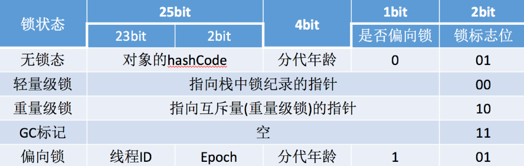
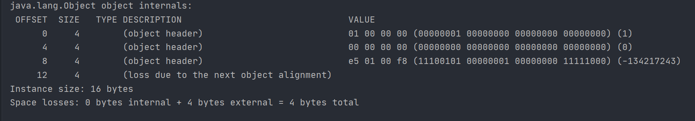

# Java的对象头和对象组成详解

## 对象内存布局

`HotSpot`虚拟机中，对象在内存中存储的布局可以分为三块区域：对象头（`Header`）、实例数据（`Instance Data`）和对齐填充（`Padding`）。

## 1. 对象头

Java对象的对象头由三部分组成：

1. **Mark Word**
2. **类型指针**
3. **数组长度（只有数组对象有）**

### 1.1 Mark Word

`MarkWord`用于存储对象自身的运行时数据， 如哈希码（`HashCode`）、`GC`分代年龄、锁信息等等。

Mark Word在32位JVM中的长度是32bit，在64位JVM中长度是64bit。

例如在32位的`HotSpot`虚拟机中对象未被锁定的状态下，`Mark Word`的`32`个bits空间中的`25bits`用于存储对象哈希码（`HashCode`），`4bits`用于存储对象分代年龄，`2bits`用于存储锁标志位，`1bit`固定为0，在其他状态（轻量级锁定、重量级锁定、GC标记、可偏向）下对象的存储内容如下表所示。



### 1.2 类型指针

该指针在32位JVM中的长度是32bit，在64位JVM中长度是64bit。

类型指针指向对象的类元数据，虚拟机通过这个指针确定该对象是哪个类的实例。

Java对象的类数据保存在方法区。

### 1.3 数组长度

如果对象是一个数组，那么对象头还需要有额外的空间用于存储数组的长度。

这部分数据的长度也随着`JVM`架构的不同而不同：`32`位的JVM上，长度为`32`位；`64`位`JVM`则为`64`位。

`64`位JVM如果开启`+UseCompressedOops`选项，**该区域长度也将由64位压缩至32位**。

## 2. 实例数据

对象的实例数据就是在java代码中能看到的属性和他们的值。

## 3. 对齐填充字节

因为JVM要求Java的对象占的内存大小应该是8bit的倍数，所以后面有几个字节用于把对象的大小补齐至8bit的倍数，没有特别的功能。

 ## 4. 使用JOL来分析java的对象布局

`JOL`的全称是`Java Object Layout`。是一个用来分析`JVM`中`Object`布局的小工具。包括`Object`在内存中的占用情况，实例对象的引用情况等等。

`JOL`可以在代码中使用，也可以独立的以命令行中运行。命令行的我这里就不具体介绍了，今天主要讲解怎么在代码中使用`JOL`。

使用JOL需要添加`maven`依赖：

```xml
<dependency>
    <groupId>org.openjdk.jol</groupId>
    <artifactId>jol-core</artifactId>
    <version>0.9</version>
</dependency>
```

通过JOL查看jvm信息:

```java
public class Test01 {
    public static void main(String[] args) {
        Object o = new Object();
        System.out.println(ClassLayout.parseInstance(o).toPrintable());
    }
}
```

输出：



先解释下各个字段的含义

- `OFFSET`是偏移量，也就是到这个字段位置所占用的byte数，
- `SIZE`是后面类型的大小，
- `TYPE`是Class中定义的类型，
- `DESCRIPTION`是类型的描述，
- `VALUE`是`TYPE`在内存中的值。

从上图可以看出Object o = new Object(); 在内存中占16个字节。