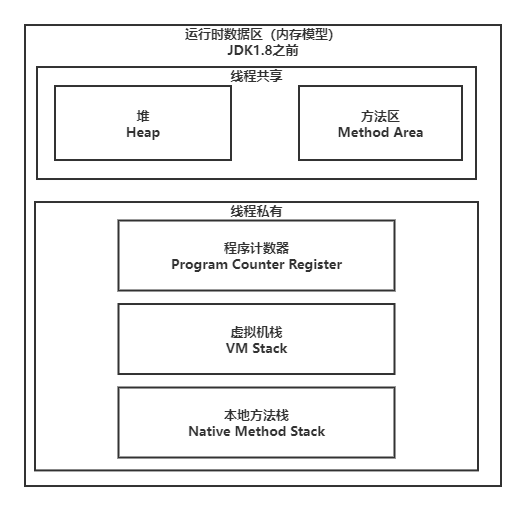
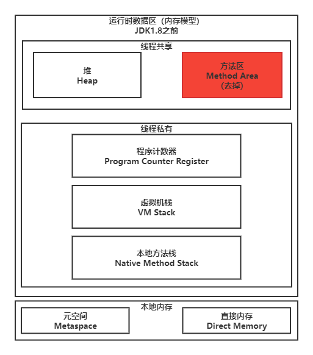
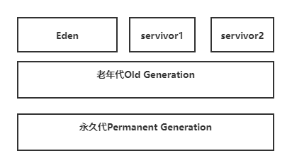
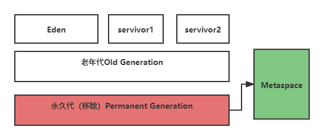
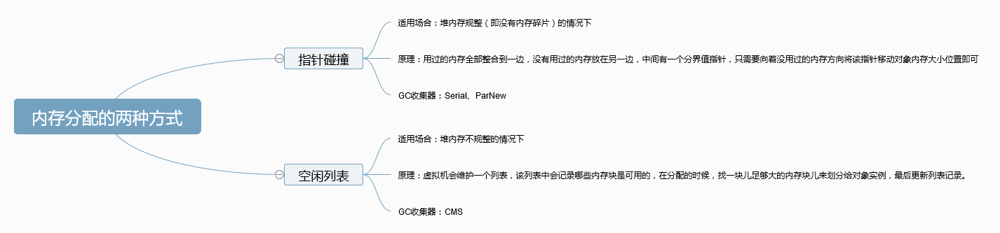
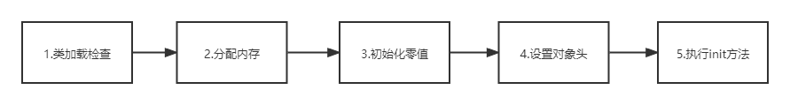
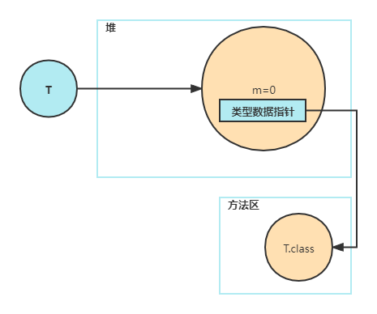
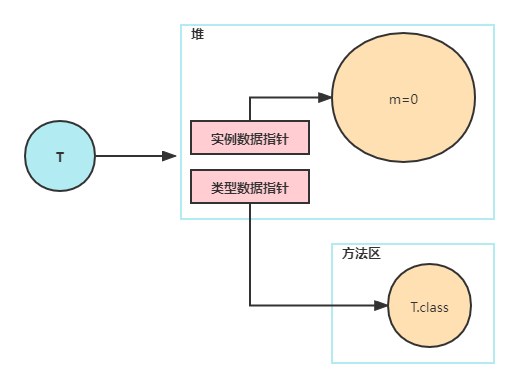

# JVM内存区域详解

## 一 概述

JVM是Java Virtual Mechine（Java虚拟机）的缩写。对于 Java 程序员来说，在虚拟机自动内存管理机制下，不再需要像 C/C++程序开发程序员这样为每一个 new 操作去写对应的 delete/free 操作，不容易出现内存泄漏和内存溢出问题。正是因为 Java 程序员把内存控制权利交给 Java 虚拟机，一旦出现内存泄漏和溢出方面的问题，如果不了解虚拟机是怎样使用内存的，那么排查错误将会是一个非常艰巨的任务。

## 二 JVM运行时数据区域

Java 虚拟机在执行 Java 程序的过程中会把它管理的内存划分成若干个不同的数据区域。JDK 1.8 和之前的版本略有不同，下面会介绍到。

**JDK1.8之前**：

**JDK1.8之后：**

**线程私有**

- 程序计数器
- 虚拟机栈
- 本地方法栈

**线程共享**

- 堆
- 方法区
- 直接内存 (非运行时数据区的一部分)

### 2.1 程序计数器

程序计数器是一块较小的内存空间，可以看作是当前线程所执行的字节码的行号指示器。**字节码解释器通过改变程序计数器的值来选取下一条需要执行的字节码指令，分支，跳转，循环，异常处理，线程恢复等功能都需要依赖这个计数器来完成**。

另外，**多线程执行的情况下，程序计数器用来记录当前线程执行的位置，为了线程切换后能恢复到正确的执行位置，每个线程都需要一个独立的程序计数器，各个线程之间计数器互不影响，独立存储**。

**程序计数器的两个作用**

1. 字节码解释器通过改变程序计数器的值来依次读取指令，从而实现代码的流程控制，如：顺序执行，选择，循环，异常处理。
2. 在多线程的情况下，程序计数器用来记录当前线程执行的位置，从而线程切换回来后能够恢复到上次执行的位置。

### 2.2 Java虚拟机栈

Java虚拟机栈和程序计数器一样都是线程私有的，它的生命周期和线程相同，描述的是Java方法执行的内存模型，每次方法调用的数据都是通过栈传递的。

**Java 虚拟机栈是由一个个栈帧组成，而每个栈帧中都拥有：局部变量表、操作数栈、动态链接、方法出口信息**。（Java 内存可以粗糙的区分为堆内存（Heap）和栈内存 (Stack)，其中栈就是现在说的虚拟机栈，或者说是虚拟机栈中局部变量表部分。）

**局部变量表存放了编译期各种可知的数据类型（byte，short，int，long，float，double，boolean，char），对象的引用**（reference类型，它不同于对象本身，可能是一个指向对象起始地址的引用指针，也可能是指向一个代表对象的句柄或其他与此对象相关的位置）。

**Java 虚拟机栈会出现两种错误：`StackOverFlowError` 和 `OutOfMemoryError`。**

- **`StackOverFlowError`：** 若 Java 虚拟机栈的内存大小不允许动态扩展，那么当线程请求栈的深度超过当前 Java 虚拟机栈的最大深度的时候，就抛出 StackOverFlowError 错误。
- **`OutOfMemoryError`：** Java 虚拟机栈的内存大小可以动态扩展， 如果虚拟机在动态扩展栈时无法申请到足够的内存空间，则抛出`OutOfMemoryError`异常。

### 2.3 本地方法栈

和虚拟机栈所发挥的作用非常相似，区别是： **虚拟机栈为虚拟机执行 Java 方法 （也就是字节码）服务，而本地方法栈则为虚拟机使用到的 Native 方法服务。**

本地方法被执行的时候，在本地方法栈也会创建一个栈帧，用于存放该本地方法的局部变量表、操作数栈、动态链接、出口信息。

方法执行完毕后相应的栈帧也会出栈并释放内存空间，也会出现 `StackOverFlowError` 和 `OutOfMemoryError` 两种错误。

### 2.4 堆

**堆内存区域的唯一目的就是存放对象实例，几乎所有的对象实例以及数组都在这里分配内存。**

Java 世界中“几乎”所有的对象都在堆中分配，但是，随着 JIT 编译器的发展与逃逸分析技术逐渐成熟，栈上分配、标量替换优化技术将会导致一些微妙的变化，所有的对象都分配到堆上也渐渐变得不那么“绝对”了。从 JDK 1.7 开始已经默认开启逃逸分析，如果某些方法中的对象引用没有被返回或者未被外面使用（也就是未逃逸出去），那么对象可以直接在栈上分配内存。

Java 堆是垃圾收集器管理的主要区域，因此也被称作**GC 堆（Garbage Collected Heap）**。从垃圾回收的角度，由于现在收集器基本都采用分代垃圾收集算法，所以 Java 堆还可以细分为：新生代和老年代；再细致一点有：Eden 空间、From Survivor、To Survivor 空间等。**进一步划分的目的是更好地回收内存，或者更快地分配内存。**

在 JDK 7 版本及 JDK 7 版本之前，堆内存被通常分为下面三部分：

1. 新生代内存(Young Generation)
2. 老生代(Old Generation)
3. 永生代(Permanent Generation)

JDK 8 版本之后方法区（HotSpot 的永久代）被彻底移除了（JDK1.7 就已经开始了），取而代之是元空间，元空间使用的是直接内存。

**上图所示的 Eden 区、两个 Survivor 区都属于新生代（为了区分，这两个 Survivor 区域按照顺序被命名为 from 和 to），中间一层属于老年代。**

大部分情况，对象都会首先在 Eden 区域分配，在一次新生代垃圾回收后，如果对象还存活，则会进入 s0 或者 s1，并且对象的年龄还会加 1(Eden 区->Survivor 区后对象的初始年龄变为 1)，当它的年龄增加到一定程度（默认为 15 岁），就会被晋升到老年代中。对象晋升到老年代的年龄阈值，可以通过参数 `-XX:MaxTenuringThreshold` 来设置。

堆这里最容易出现的就是 OutOfMemoryError 错误，并且出现这种错误之后的表现形式还会有几种，比如：

1. **`java.lang.OutOfMemoryError: GC Overhead Limit Exceeded`** ： 当 JVM 花太多时间执行垃圾回收并且只能回收很少的堆空间时，就会发生此错误。
2. **`java.lang.OutOfMemoryError: Java heap space`** :假如在创建新的对象时, 堆内存中的空间不足以存放新创建的对象, 就会引发此错误。(和配置的最大堆内存有关，且受制于物理内存大小。最大堆内存可通过`-Xmx`参数配置，若没有特别配置，将会使用默认值）。

### 2.5 方法区

方法区与Java堆一样，是各个线程共享的内存区域，它用于存储被虚拟机加载的类的信息，常量，静态变量，即使编译后的代码等数据。

虽然 **Java 虚拟机规范把方法区描述为堆的一个逻辑部分**，但是它却有一个别名叫做 **Non-Heap（非堆）**，目的应该是与 Java 堆区分开来。

方法区也被称为永久代。

>《Java 虚拟机规范》只是规定了有方法区这么个概念和它的作用，并没有规定如何去实现它。那么，在不同的 JVM 上方法区的实现肯定是不同的了。 **方法区和永久代的关系很像 Java 中接口和类的关系，类实现了接口，而永久代就是 HotSpot 虚拟机对虚拟机规范中方法区的一种实现方式。** 也就是说，永久代是 HotSpot 的概念，方法区是 Java 虚拟机规范中的定义，是一种规范，而永久代是一种实现，一个是标准一个是实现，其他的虚拟机实现并没有永久代这一说法。

### 2.6 运行时常量池

运行时常量池是方法区的一部分。Class 文件中除了有类的版本、字段、方法、接口等描述信息外，还有常量池表（用于存放编译期生成的各种字面量和符号引用）

既然运行时常量池是方法区的一部分，自然受到方法区内存的限制，当常量池无法再申请到内存时会抛出 OutOfMemoryError 错误。

### 2.7 直接内存

**直接内存并不是虚拟机运行时数据区的一部分，也不是虚拟机规范中定义的内存区域，但是这部分内存也被频繁地使用。而且也可能导致 OutOfMemoryError 错误出现。**

JDK1.4 中新加入的 **NIO(New Input/Output) 类**，引入了一种基于**通道（Channel）\**与\**缓存区（Buffer）\**的 I/O 方式，它可以直接使用 Native 函数库直接分配堆外内存，然后通过一个存储在 Java 堆中的 DirectByteBuffer 对象作为这块内存的引用进行操作。这样就能在一些场景中显著提高性能，因为\**避免了在 Java 堆和 Native 堆之间来回复制数据**。

本机直接内存的分配不会受到 Java 堆的限制，但是，既然是内存就会受到本机总内存大小以及处理器寻址空间的限制。

## 三 HotSpot 虚拟机对象

### 3.1 对象创建的过程

1. 申请空间，设默认值
2. 调用构造方法设初始值
3. 建立关联

- **1.类加载检查**
  当虚拟机遇到一条new指令时，首先去检查这个指令的参数是否能在常量池中定位到这个类的符号引用，并且检查这个符号引用代表的类是否已经被加载、解析和初始化过。如果没有，需要先执行相应的类加载过程。
- **2.分配内存**
  在类加载检查通过后，接下来虚拟机会为新生的对象**分配内存**。对象所需内存的大小在类加载完成后便可以确定，为对象分配内存就是在**堆**中划分出一块确定大小的区域分配给对象。
  分配内存的方式：**指针碰撞**和**空闲列表**。选择哪种分配方式，由Java堆是否规整决定，Java堆是否规整由所采用的垃圾收集器是否带有压缩整理功能决定。
  指针碰撞：
  适用场景：内存规整的情况下。
  原理：使用过的内存被全部整合到一端，没用过的内存放在另一端，中间有一个分界值指针，只需要将分界值指针向没有使用过的内存移动对象内存大小的位置即可。
  空闲列表：
  适用场景：内存不规整的情况。
  原理：虚拟机会维护一个列表，该列表中会记录那些内存块是可用的，在分配的时候，找一块足够大的内存来划分给对象实例，后更新到列表记录。

- **3.初始化零值**
  内存分配完成后，虚拟机需要将分配到的内存空间都初始化为零值（不包括对象头），这一步保证了对象的实例字段在Java代码中可以不赋任何初始值就可以使用，程序能访问到这些字段的数据类型所对应的零值。
- **4.设置对象头**
  在初始化零值完成之后，虚拟机要对对象进行必要的设置，例如这个对象时哪个类的实例、如何才能找到类的元数据信息、对象的hashCode，对象的GC分代年龄信息等。这些信息放在对象头中。另外，根据虚拟机当前运行状态的不同，如是否启用偏向锁等，对象头会有不同的设置方式。
- **5.执行init方法**
  在完成上面的几个过程之后，从虚拟机的角度来看，一个新的对象已经产生了。但从Java的角度来看，对象创建才刚刚开始，<init>方法还没执行，所有的字段都还为零。所以一般来说，执行 new 指令之后会接着执行 <init> 方法，把对象按照程序员的意愿进行初始化，这样一个真正可用的对象才算完全产生出来。
  

### 3.2 对象在内存中存储布局

在Hotspot虚拟机中，对象在内存中的存储布局分为3块区域：**对象头、示例数据和对齐填充**。

Hotspot虚拟机的对象头包含两部分信息，**第一部分用于存储对象自身的运行时数据**（哈希码，GC分代年龄，锁状态标志等）。**另一部分是类型指针**，即对象指向它的类的元数据的指针，虚拟机通过这个指针来确定对象是哪一个类的实例。

**实例数据部分是对象真正存储的有效信息**，也是在程序中所定义的各种类型的字段内容。

**对齐填充部分不是必然存在的，也没有什么特别的含义，仅仅起占位作用（所占字节数被8整除）。** 因为 Hotspot 虚拟机的自动内存管理系统要求对象起始地址必须是 8 字节的整数倍，换句话说就是对象的大小必须是 8 字节的整数倍。而对象头部分正好是 8 字节的倍数（1 倍或 2 倍），因此，当对象实例数据部分没有对齐时，就需要通过对齐填充来补全。

### 3.3 对象定位

- 直接指针

如果使用直接指针访问，那么 Java 堆对象的布局中就必须考虑如何放置访问类型数据的相关信息，而 reference 中存储的直接就是对象的地址。

- 句柄方式

 如果使用句柄的话，那么 Java 堆中将会划分出一块内存来作为句柄池，reference 中存储的就是对象的句柄地址，而句柄中包含了对象实例数据与类型数据各自的具体地址信息；

这两种对象访问方式各有优势。使用句柄来访问的最大好处是 reference 中存储的是稳定的句柄地址，在对象被移动时只会改变句柄中的实例数据指针，而 reference 本身不需要修改。使用直接指针访问方式最大的好处就是速度快，它节省了一次指针定位的时间开销。