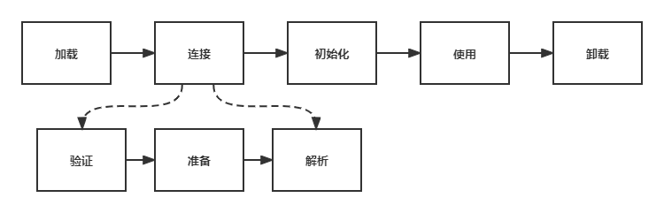

# 简述类加载过程详解

## 1. 类的生命周期

一个类的生命周期如下图：

## 2. 类加载过程

class文件的加载主要分三步：**加载->连接->初始化**。连接又可以分为三个步骤：**校验->准备->解析**。

### 2.1 加载

类加载的第一步，主要完成三件事：

1. 通过全类名获取此类的二进制字节流。
2. 将字节流代表的静态存储结构转换为方法区的运行时数据结构。
3. 在内存中生成代表该类的`class`对象，作为方法区这些数据的访问入口。

一个非数组类的加载阶段（加载阶段获取类的二进制字节流的动作）是可控性最强的阶段，这一步我们可以去完成还可以自定义类加载器去控制字节流的获取方式（重写一个类加载器的 `loadClass()` 方法）。数组类型不通过类加载器创建，它由 Java 虚拟机直接创建。 

### 2.2 连接

**验证**

验证主要分为：

- 文件格式验证

验证字节流是否符合class文件格式规范。例如：主版本号是否在当前虚拟机内；常量池中的常量是否存在不被支持的类型等。

- 元数据验证：

对字节码描述的信息进行语义分析（注意：对比javac编译阶段的语义分析），以保证其描述的信息符合java语言规范的要求，例如：这个类是否有父类（除java.lang.Object之外都有父类）；这个类是否继承了不允许继承的类（被final修饰的类）等。

- 字节码验证：

最复杂的一个阶段，通过数据流和控制流分析，确定程序语义是合法的，符合逻辑的，比如：任意时刻操作数栈和指令代码序列都能配合工作。

- 符号引用验证：

确保解析动作能够正确执行。

**准备**

准备阶段是正式为类变量分配内存并设置类变量初始值的阶段，这些内存都将在方法区中分配。对于准备阶段有以下几点需要注意：

1. 准备阶段进行内存分配仅包括类变量（即被static修饰的静态变量），不包括实例变量，实例变量会在对象实例化时随对象在堆中分配。
2. 这里所设置的初始值"通常情况"下是数据类型默认的零值（如 0、0L、null、false 等），比如我们定义了`public static int value=111` ，那么 value 变量在准备阶段的初始值就是 0 而不是 111（初始化阶段才会赋值）。特殊情况：比如给 value 变量加上了 final 关键字`public static final int value=111` ，那么准备阶段 value 的值就被赋值为 111。 

**解析**

解析是Java虚拟机将常量池中符号引用替换为直接引用的过程。解析动作主要针对类或接口，字段，类方法，接口方法，方法类型，方法句柄和调用限定符7类符号应用进行。

### 2.3 初始化

初始化阶段是执行初始化方法`<init>()`方法的过程，是类加载的最后一步，这一步JVM才开始真正执行定义的Java程序代码(字节码)。

> 说明： `<clinit> ()`方法是编译之后自动生成的。

### 2.4 卸载

卸载类指的就是该类的class文件被GC。