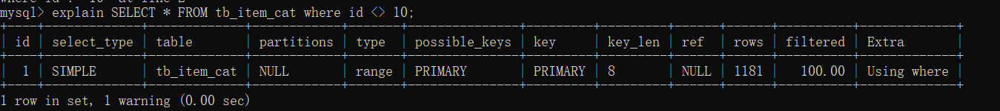

# MySQL性能优化

## 优化的思路

### 优化的方向

在数据库优化上有两个主要方向：即安全与性能。

- 安全 ---> 数据安全性
- 性能 ---> 数据的高性能访问

我们主要是在**性能优化**方向进行介绍

### 优化的维度


从上图中可以看出，我们把数据库优化分为四个纬度：硬件，系统配置，数据库表结构，SQL及索引

**硬件：** CPU、内存、存储、网络设备等

**系统配置：** 服务器系统、数据库服务参数等

**数据库表结构：** 高可用、分库分表、读写分离、存储引擎、表设计等

**Sql及索引：** sql语句、索引使用等

- 从优化成本进行考虑：硬件>系统配置>数据库表结构>SQL及索引
- 从优化效果进行考虑：硬件<系统配置<数据库表结构<SQL及索引

### 数据库使用优化思路

**应急调优的思路：**

针对突然的业务办理卡顿，无法进行正常的业务处理！需要立马解决的场景！

1. show processlist（查看链接session状态）
2. explain(分析查询计划)，show index from table（分析索引）
3. 通过执行计划判断，索引问题（有没有、合不合理）或者语句本身问题
4. show status like '%lock%'; # 查询锁状态
5. SESSION_ID; # 杀掉有问题的session

**常规调优的思路：**

针对业务周期性的卡顿，例如在每天10-11点业务特别慢，但是还能够使用，过了这段时间就好了。

1. 查看slowlog，分析slowlog，分析出查询慢的语句。
2. 按照一定优先级，进行一个一个的排查所有慢语句。
3. 分析top sql，进行explain调试，查看语句执行时间。
4. 调整索引或语句本身。

## 索引优化

### 查看SQL执行频率

MySQL 客户端连接成功后，通过 show [session|global] status 命令可以提供服务器状态信息。show [session|global] status 可以根据需要加上参数“session”或者“global”来显示 session 级（当前连接）的计结果和 global 级（自数据库上次启动至今）的统计结果。如果不写，默认使用参数是“session”。

下面的命令显示了当前 session 中所有统计参数的值：

```sql
show status like 'Com_______';
```


```sql
show status like 'Innodb_rows_%';
```


Com_xxx 表示每个 xxx 语句执行的次数，我们通常比较关心的是以下几个统计参数。

| 参数                 | 含义                                                         |
| -------------------- | ------------------------------------------------------------ |
| Com_select           | 执行 select 操作的次数，一次查询只累加 1。                   |
| Com_insert           | 执行 INSERT 操作的次数，对于批量插入的 INSERT 操作，只累加一次。 |
| Com_update           | 执行 UPDATE 操作的次数。                                     |
| Com_delete           | 执行 DELETE 操作的次数。                                     |
| Innodb_rows_read     | select 查询返回的行数。                                      |
| Innodb_rows_inserted | 执行 INSERT 操作插入的行数。                                 |
| Innodb_rows_updated  | 执行 UPDATE 操作更新的行数。                                 |
| Innodb_rows_deleted  | 执行 DELETE 操作删除的行数。                                 |
| Connections          | 试图连接 MySQL 服务器的次数。                                |
| Uptime               | 服务器工作时间。                                             |
| Slow_queries         | 慢查询的次数。                                               |

Com_***      :  这些参数对于所有存储引擎的表操作都会进行累计。

Innodb_*** :  这几个参数只是针对InnoDB 存储引擎的，累加的算法也略有不同。

### 定位低效率执行SQL

可以通过以下两种方式定位执行效率较低的 SQL 语句。

- 慢查询日志 : 通过慢查询日志定位那些执行效率较低的 SQL 语句，用--log-slow-queries[=file_name]选项启动时，mysqld 写一个包含所有执行时间超过 long_query_time 秒的 SQL 语句的日志文件。具体可以查看本书第 26 章中日志管理的相关部分。
- show processlist  : 慢查询日志在查询结束以后才纪录，所以在应用反映执行效率出现问题的时候查询慢查询日志并不能定位问题，可以使用show processlist命令查看当前MySQL在进行的线程，包括线程的状态、是否锁表等，可以实时地查看 SQL 的执行情况，同时对一些锁表操作进行优化。

**慢查询日志开启**

在配置文件my.cnf或my.ini中在[mysqld]一行下面加入两个配置参数

```properties
log-slow-queries=/data/mysqldata/slow-query.log
long_query_time=5
```

`log-slow-queries`参数为慢查询日志存放的位置，一般这个目录要有mysql的运行帐号的可写权限，一般都将这个目录设置为mysql的数据存放目录；

`long_query_time=5`中的5表示查询超过五秒才记录；

还可以在my.cnf或者my.ini中添加`log-queries-not-using-indexes`参数，表示记录下没有使用索引的查询。

**慢查询分析**

我们可以通过打开log文件查看得知哪些SQL执行效率低下 ，从日志中，可以发现查询时间超过5 秒的SQL。

如果慢查询日志中记录内容很多，可以使用mysqldumpslow工具（MySQL客户端安装自带）来对慢查询日志进行分类汇总。mysqldumpslow对日志文件进行了分类汇总，显示汇总后摘要结果。进入log的存放目录，运行：

```shell
[root@mysql_data]# mysqldumpslow slow-query.log

Reading mysql slow query log fromslow-query.log

Count: 2 Time=11.00s (22s) Lock=0.00s (0s)Rows=1.0 (2), root[root]@mysql

select count(N) from t_user; 

mysqldumpslow命令

/path/mysqldumpslow -s c -t 10/database/mysql/slow-query.log
```

这会输出记录次数最多的10条SQL语句，其中：

`-s`, 是表示按照何种方式排序，c、t、l、r分别是按照记录次数、时间、查询时间、返回的记录数来排序，ac、at、al、ar，表示相应的倒叙

`-t`, 是top n的意思，即为返回前面多少条的数据；

`-g`, 后边可以写一个正则匹配模式，大小写不敏感的；

例如：

`/path/mysqldumpslow -s r -t 10/database/mysql/slow-log`

得到返回记录集最多的10个查询。

`/path/mysqldumpslow -s t -t 10 -g “leftjoin” /database/mysql/slow-log`

得到按照时间排序的前10条里面含有左连接的查询语句。

 使用`mysqldumpslow`命令可以非常明确的得到各种我们需要的查询语句，对MySQL查询语句的监控、分析、优化是MySQL优化非常重要的一步。开启慢查询日志后，由于日志记录操作，在一定程度上会占用CPU资源影响mysql的性能，但是可以阶段性开启来定位性能瓶颈。

**show processlist**

```sql
show processlist;
```


*  id列，用户登录mysql时，系统分配的"connection_id"，可以使用函数connection_id()查看 
*  user列，显示当前用户。如果不是root，这个命令就只显示用户权限范围的sql语句
*  host列，显示这个语句是从哪个ip的哪个端口上发的，可以用来跟踪出现问题语句的用户 
* db列，显示这个进程目前连接的是哪个数据库 
*  command列，显示当前连接的执行的命令，一般取值为休眠（sleep），查询（query），连接（connect）等 
*  time列，显示这个状态持续的时间，单位是秒
* state列，显示使用当前连接的sql语句的状态，很重要的列。state描述的是语句执行中的某一个状态。一个sql语句，以查询为例，可能需要经过copying to tmp table、sorting result、sending data等状态才可以完成 
* info列，显示这个sql语句，是判断问题语句的一个重要依据

### explain分析执行计划

通过以上步骤查询到效率低的 SQL 语句后，可以通过 EXPLAIN或者 DESC命令获取 MySQL如何执行 SELECT 语句的信息，包括在 SELECT 语句执行过程中表如何连接和连接的顺序。

查询SQL语句的执行计划 ： 

```sql
explain  select * from tb_item where id = 1;
```


```sql
explain  select * from tb_item where title = '阿尔卡特 (OT-979) 冰川白 联通3G手机3';
```


| 字段          | 含义                                                         |
| ------------- | ------------------------------------------------------------ |
| id            | select查询的序列号，是一组数字，表示的是查询中执行select子句或者是操作表的顺序。 |
| select_type   | 表示 SELECT 的类型，常见的取值有 SIMPLE（简单表，即不使用表连接或者子查询）、PRIMARY（主查询，即外层的查询）、UNION（UNION 中的第二个或者后面的查询语句）、SUBQUERY（子查询中的第一个 SELECT）等 |
| table         | 输出结果集的表                                               |
| type          | 表示表的连接类型，性能由好到差的连接类型为( system ---> const -----> eq_ref ------> ref -------> ref_or_null----> index_merge ---> index_subquery -----> range -----> index ------> all ) |
| possible_keys | 表示查询时，可能使用的索引                                   |
| key           | 表示实际使用的索引                                           |
| key_len       | 索引字段的长度                                               |
| rows          | 扫描行的数量                                                 |
| extra         | 执行情况的说明和描述                                         |

#### 环境准备

```sql
CREATE TABLE `t_role` (
  `id` varchar(32) NOT NULL,
  `role_name` varchar(255) DEFAULT NULL,
  `role_code` varchar(255) DEFAULT NULL,
  `description` varchar(255) DEFAULT NULL,
  PRIMARY KEY (`id`),
  UNIQUE KEY `unique_role_name` (`role_name`)
) ENGINE=InnoDB DEFAULT CHARSET=utf8;

CREATE TABLE `t_user` (
  `id` varchar(32) NOT NULL,
  `username` varchar(45) NOT NULL,
  `password` varchar(96) NOT NULL,
  `name` varchar(45) NOT NULL,
  PRIMARY KEY (`id`),
  UNIQUE KEY `unique_user_username` (`username`)
) ENGINE=InnoDB DEFAULT CHARSET=utf8;

CREATE TABLE `user_role` (
  `id` int(11) NOT NULL auto_increment ,
  `user_id` varchar(32) DEFAULT NULL,
  `role_id` varchar(32) DEFAULT NULL,
  PRIMARY KEY (`id`),
  KEY `fk_ur_user_id` (`user_id`),
  KEY `fk_ur_role_id` (`role_id`),
  CONSTRAINT `fk_ur_role_id` FOREIGN KEY (`role_id`) REFERENCES `t_role` (`id`) ON DELETE NO ACTION ON UPDATE NO ACTION,
  CONSTRAINT `fk_ur_user_id` FOREIGN KEY (`user_id`) REFERENCES `t_user` (`id`) ON DELETE NO ACTION ON UPDATE NO ACTION
) ENGINE=InnoDB DEFAULT CHARSET=utf8;

insert into `t_user` (`id`, `username`, `password`, `name`) values('1','super','$2a$10$TJ4TmCdK.X4wv/tCqHW14.w70U3CC33CeVncD3SLmyMXMknstqKRe','超级管理员');
insert into `t_user` (`id`, `username`, `password`, `name`) values('2','admin','$2a$10$TJ4TmCdK.X4wv/tCqHW14.w70U3CC33CeVncD3SLmyMXMknstqKRe','系统管理员');
insert into `t_user` (`id`, `username`, `password`, `name`) values('3','itcast','$2a$10$8qmaHgUFUAmPR5pOuWhYWOr291WJYjHelUlYn07k5ELF8ZCrW0Cui','test02');
insert into `t_user` (`id`, `username`, `password`, `name`) values('4','stu1','$2a$10$pLtt2KDAFpwTWLjNsmTEi.oU1yOZyIn9XkziK/y/spH5rftCpUMZa','学生1');
insert into `t_user` (`id`, `username`, `password`, `name`) values('5','stu2','$2a$10$nxPKkYSez7uz2YQYUnwhR.z57km3yqKn3Hr/p1FR6ZKgc18u.Tvqm','学生2');
insert into `t_user` (`id`, `username`, `password`, `name`) values('6','t1','$2a$10$TJ4TmCdK.X4wv/tCqHW14.w70U3CC33CeVncD3SLmyMXMknstqKRe','老师1');
INSERT INTO `t_role` (`id`, `role_name`, `role_code`, `description`) VALUES('5','学生','student','学生');
INSERT INTO `t_role` (`id`, `role_name`, `role_code`, `description`) VALUES('7','老师','teacher','老师');
INSERT INTO `t_role` (`id`, `role_name`, `role_code`, `description`) VALUES('8','教学管理员','teachmanager','教学管理员');
INSERT INTO `t_role` (`id`, `role_name`, `role_code`, `description`) VALUES('9','管理员','admin','管理员');
INSERT INTO `t_role` (`id`, `role_name`, `role_code`, `description`) VALUES('10','超级管理员','super','超级管理员');
INSERT INTO user_role(id,user_id,role_id) VALUES(NULL, '1', '5'),(NULL, '1', '7'),(NULL, '2', '8'),(NULL, '3', '9'),(NULL, '4', '8'),(NULL, '5', '10') ;

```

#### explain - id

id 字段是 select查询的序列号，是一组数字，表示的是查询中执行select子句或者是操作表的顺序。id 情况有三种 ： 

* id 相同表示加载表的顺序是从上到下。

```sql
explain select * from t_role r, t_user u, user_role ur where r.id = ur.role_id and u.id = ur.user_id;
```


* id 不同id值越大，优先级越高，越先被执行。 

```sql
EXPLAIN SELECT * FROM t_role WHERE id = (SELECT role_id FROM user_role WHERE user_id = (SELECT id FROM t_user WHERE username = 'stu1'))
```


* id 有相同，也有不同，同时存在。id相同的可以认为是一组，从上往下顺序执行；在所有的组中，id的值越大，优先级越高，越先执行。

```sql
EXPLAIN SELECT * FROM t_role r , (SELECT * FROM user_role ur WHERE ur.`user_id` = '2') a WHERE r.id = a.role_id ; 
```


#### explain - select_type

表示 SELECT 的类型，常见的取值，如下表所示：

| select_type  | 含义                                                         |
| ------------ | ------------------------------------------------------------ |
| SIMPLE       | 简单的select查询，查询中不包含子查询或者UNION                |
| PRIMARY      | 查询中若包含任何复杂的子查询，最外层查询标记为该标识         |
| SUBQUERY     | 在SELECT 或 WHERE 列表中包含了子查询                         |
| DERIVED      | 在FROM 列表中包含的子查询，被标记为 DERIVED（衍生） MYSQL会递归执行这些子查询，把结果放在临时表中 |
| UNION        | 若第二个SELECT出现在UNION之后，则标记为UNION ； 若UNION包含在FROM子句的子查询中，外层SELECT将被标记为 ： DERIVED |
| UNION RESULT | 从UNION表获取结果的SELECT                                    |

 #### explain - table

展示这一行的数据是关于哪一张表的 

#### explain - type

type 显示的是访问类型，是较为重要的一个指标，可取值为： 

| type   | 含义                                                         |
| ------ | ------------------------------------------------------------ |
| NULL   | MySQL不访问任何表，索引，直接返回结果                        |
| system | 表只有一行记录(等于系统表)，这是const类型的特例，一般不会出现 |
| const  | 表示通过索引一次就找到了，const 用于比较primary key 或者 unique 索引。因为只匹配一行数据，所以很快。如将主键置于where列表中，MySQL 就能将该查询转换为一个常亮。const于将 "主键" 或 "唯一" 索引的所有部分与常量值进行比较 |
| eq_ref | 类似ref，区别在于使用的是唯一索引，使用主键的关联查询，关联查询出的记录只有一条。常见于主键或唯一索引扫描 |
| ref    | 非唯一性索引扫描，返回匹配某个单独值的所有行。本质上也是一种索引访问，返回所有匹配某个单独值的所有行（多个） |
| range  | 只检索给定返回的行，使用一个索引来选择行。 where 之后出现 between ， < , > , in 等操作。 |
| index  | index 与 ALL的区别为 index 类型只是遍历了索引树， 通常比ALL 快， ALL 是遍历数据文件。 |
| all    | 将遍历全表以找到匹配的行                                     |

结果值从最好到最坏以此是：

```text
NULL > system > const > eq_ref > ref > fulltext > ref_or_null > index_merge > unique_subquery > index_subquery > range > index > ALL  system > const > eq_ref > ref > range > index > ALL
```

一般来说， 我们需要保证查询至少达到 range 级别， 最好达到ref 。

 #### explain - key

* **possible_keys** : 显示可能应用在这张表的索引， 一个或多个。  

* **key** ： 实际使用的索引， 如果为NULL， 则没有使用索引。 key_len : 表示索引中使用的字节数， 该值为索引字段最大可能长度，并非实际使用长度，在不损失精确性的前提下， 长度越短越好 。

#### explain - key_len

索引长度。

 #### explain - rows

扫描行的数量。

#### explain - extra

其他的额外的执行计划信息，在该列展示 。

| extra           | 含义                                                         |
| --------------- | ------------------------------------------------------------ |
| using filesort  | 说明mysql会对数据使用一个外部的索引排序，而不是按照表内的索引顺序进行读取， 称为 “文件排序”, 效率低。 |
| using temporary | 使用了临时表保存中间结果，MySQL在对查询结果排序时使用临时表。常见于 order by 和 group by； 效率低 |
| using index     | 表示相应的select操作使用了覆盖索引， 避免访问表的数据行， 效率不错。 |

### 索引的使用

#### 准备环境

```sql
create table `tb_seller` (
	`sellerid` varchar (100),
	`name` varchar (100),
	`nickname` varchar (50),
	`password` varchar (60),
	`status` varchar (1),
	`address` varchar (100),
	`createtime` datetime,
    primary key(`sellerid`)
)engine=innodb default charset=utf8mb4; 

insert into `tb_seller` (`sellerid`, `name`, `nickname`, `password`, `status`, `address`, `createtime`) values('alibaba','阿里巴巴','阿里小店','e10adc3949ba59abbe56e057f20f883e','1','北京市','2088-01-01 12:00:00');
insert into `tb_seller` (`sellerid`, `name`, `nickname`, `password`, `status`, `address`, `createtime`) values('baidu','百度科技有限公司','百度小店','e10adc3949ba59abbe56e057f20f883e','1','北京市','2088-01-01 12:00:00');
insert into `tb_seller` (`sellerid`, `name`, `nickname`, `password`, `status`, `address`, `createtime`) values('huawei','华为科技有限公司','华为小店','e10adc3949ba59abbe56e057f20f883e','0','北京市','2088-01-01 12:00:00');
insert into `tb_seller` (`sellerid`, `name`, `nickname`, `password`, `status`, `address`, `createtime`) values('itcast','传智播客教育科技有限公司','传智播客','e10adc3949ba59abbe56e057f20f883e','1','北京市','2088-01-01 12:00:00');
insert into `tb_seller` (`sellerid`, `name`, `nickname`, `password`, `status`, `address`, `createtime`) values('itheima','黑马程序员','黑马程序员','e10adc3949ba59abbe56e057f20f883e','0','北京市','2088-01-01 12:00:00');
insert into `tb_seller` (`sellerid`, `name`, `nickname`, `password`, `status`, `address`, `createtime`) values('luoji','罗技科技有限公司','罗技小店','e10adc3949ba59abbe56e057f20f883e','1','北京市','2088-01-01 12:00:00');
insert into `tb_seller` (`sellerid`, `name`, `nickname`, `password`, `status`, `address`, `createtime`) values('oppo','OPPO科技有限公司','OPPO官方旗舰店','e10adc3949ba59abbe56e057f20f883e','0','北京市','2088-01-01 12:00:00');
insert into `tb_seller` (`sellerid`, `name`, `nickname`, `password`, `status`, `address`, `createtime`) values('ourpalm','掌趣科技股份有限公司','掌趣小店','e10adc3949ba59abbe56e057f20f883e','1','北京市','2088-01-01 12:00:00');
insert into `tb_seller` (`sellerid`, `name`, `nickname`, `password`, `status`, `address`, `createtime`) values('qiandu','千度科技','千度小店','e10adc3949ba59abbe56e057f20f883e','2','北京市','2088-01-01 12:00:00');
insert into `tb_seller` (`sellerid`, `name`, `nickname`, `password`, `status`, `address`, `createtime`) values('sina','新浪科技有限公司','新浪官方旗舰店','e10adc3949ba59abbe56e057f20f883e','1','北京市','2088-01-01 12:00:00');
insert into `tb_seller` (`sellerid`, `name`, `nickname`, `password`, `status`, `address`, `createtime`) values('xiaomi','小米科技','小米官方旗舰店','e10adc3949ba59abbe56e057f20f883e','1','西安市','2088-01-01 12:00:00');
insert into `tb_seller` (`sellerid`, `name`, `nickname`, `password`, `status`, `address`, `createtime`) values('yijia','宜家家居','宜家家居旗舰店','e10adc3949ba59abbe56e057f20f883e','1','北京市','2088-01-01 12:00:00');

-- 创建联合索引
create index idx_seller_name_sta_addr on tb_seller(name,status,address);
```

#### 避免索引失效

**1.全值匹配 ，对索引中所有列都指定具体值。该情况下，索引生效，执行效率高。**

```sql
explain select * from tb_seller where name='小米科技' and status='1' and address='北京市'\G;
```


**2.最左前缀法则**

如果索引了多列，要遵守最左前缀法则。指的是查询从索引的最左前列开始，并且不跳过索引中的列。

匹配最左前缀法则，走索引：

```sql
explain select * from tb_seller where name = '小米科技'

explain select * from tb_seller where name = '小米科技' and status = '1'

explain select * from tb_seller where name = '小米科技' and status = '1' and address = '北京市'
```


**违法最左前缀法则 ， 索引失效**：

```sql
explain select * from tb_seller where status = '1'

explain select * from tb_seller where status = '1' and address = '北京市'
```


**如果符合最左法则，但是出现跳跃某一列，只有最左列索引生效**

```sql
explain select * from tb_seller where name = '小米科技' and address = '北京市'
```


**3.范围查询右边的列，不能使用索引 **。

```sql
explain select * from tb_seller where name = '小米科技' and status = '1' and address = '北京市'

explain select * from tb_seller where name = '小米科技' and status > '1' and address = '北京市'
```


 根据前面的两个字段name ， status 查询是走索引的， 但是最后一个条件address 没有用到索引。

**4.不要在索引列上进行运算操作， 索引将失效。**

```sql
explain select * from tb_seller where substring(name, 3, 2) = '科技';
```


**5.字符串不加单引号，造成索引失效。**

```sql
explain select * from tb_seller where name = '科技' and status = '0';

explain select * from tb_seller where name = '科技' and status = 0;
```


 由于，在查询是，没有对字符串加单引号，MySQL的查询优化器，会自动的进行类型转换，造成索引失效。

**6.尽量使用覆盖索引，避免select * from table**

尽量使用覆盖索引（只访问索引的查询（索引列完全包含查询列）），减少select * 。

```sql
explain select * from tb_seller;
```


 如果查询列，超出索引列，也会降低性能。


```text
TIP :      
using index ：使用覆盖索引的时候就会出现     
using where：在查找使用索引的情况下，需要回表去查询所需的数据     
using index condition：查找使用了索引，但是需要回表查询数据     
using index ; using where：查找使用了索引，但是需要的数据都在索引列中能找到，所以不需要回表查询数据
```

**7.用or分割开的条件， 如果or前的条件中的列有索引，而后面的列中没有索引，那么涉及的索引都不会被用到。**

示例，name字段是索引列 ， 而createtime不是索引列，中间是or进行连接是不走索引的 ： 

```sql
explain select * from tb_seller where name='黑马程序员' or createtime = '2088-01-01 12:00:00'\G;	
```


**8.以%开头的Like模糊查询，索引失效。**

如果仅仅是尾部模糊匹配，索引不会失效。如果是头部模糊匹配，索引失效。

```java
select * from tb_seller where name like '%黑马程序员';
```


 **解决方案 ： 通过覆盖索引来解决 **

**9.如果MySQL评估使用索引比全表更慢，则不使用索引。**


**10.is  NULL ， is NOT NULL  有时索引失效。**

```sql
explain SELECT * FROM tb_item_cat where name is null;

explain SELECT * FROM tb_item_cat where name is not null;

explain SELECT * FROM tb_user where name is null;

explain SELECT * FROM tb_user where name is not null;
```


**11.in 走索引， not in 索引失效。**

```java
explain SELECT * FROM tb_seller where sellerid in ('oppo', 'xiaomi', 'sina');

explain SELECT * FROM tb_seller where sellerid not in ('oppo', 'xiaomi', 'sina');
```


**12.<> 不等于可以用到索引**

```sql
explain SELECT * FROM tb_item_cat where id <> 10;
```



**13.单列索引和复合索引。尽量使用复合索引，而少使用单列索引 。**

创建复合索引 

```sql
create index idx_name_sta_address on tb_seller(name, status, address); 
就相当于创建了三个索引 ：  
name 
name + status 
name + status + address 
创建单列索引  
create index idx_seller_name on tb_seller(name); 
create index idx_seller_status on tb_seller(status);
create index idx_seller_address on tb_seller(address);
```

#### 查看索引的使用

```sql
show status like 'Handler_read%';	 
show global status like 'Handler_read%';	
```


```text
Handler_read_first：索引中第一条被读的次数。如果较高，表示服务器正执行大量全索引扫描（这个值越低越好）。 
Handler_read_key：如果索引正在工作，这个值代表一个行被索引值读的次数，如果值越低，表示索引得到的性能改善不高，因为索引不经常使用（这个值越高越好）。 
Handler_read_next ：按照键顺序读下一行的请求数。如果你用范围约束或如果执行索引扫描来查询索引列，该值增加。 Handler_read_prev：按照键顺序读前一行的请求数。该读方法主要用于优化ORDER BY ... DESC。 
Handler_read_rnd ：根据固定位置读一行的请求数。如果你正执行大量查询并需要对结果进行排序该值较高。你可能使用了大量需要MySQL扫描整个表的查询或你的连接没有正确使用键。这个值较高，意味着运行效率低，应该建立索引来补救。 
Handler_read_rnd_next：在数据文件中读下一行的请求数。如果你正进行大量的表扫描，该值较高。通常说明你的表索引不正确或写入的查询没有利用索引。
```

## SQL语句优化

### 批量插入优化

准备环境：

```sql
CREATE TABLE `tb_user_2` (
  `id` int(11) NOT NULL AUTO_INCREMENT,
  `username` varchar(45) NOT NULL,
  `password` varchar(96) NOT NULL,
  `name` varchar(45) NOT NULL,
  `birthday` datetime DEFAULT NULL,
  `sex` char(1) DEFAULT NULL,
  `email` varchar(45) DEFAULT NULL,
  `phone` varchar(45) DEFAULT NULL,
  `qq` varchar(32) DEFAULT NULL,
  `status` varchar(32) NOT NULL COMMENT '用户状态',
  `create_time` datetime NOT NULL,
  `update_time` datetime DEFAULT NULL,
  PRIMARY KEY (`id`),
  UNIQUE KEY `unique_user_username` (`username`)
) ENGINE=InnoDB DEFAULT CHARSET=utf8 ;
```

对于 InnoDB 类型的表，有以下几种方式可以提高导入的效率：

**1.主键顺序插入**

因为InnoDB类型的表是按照主键的顺序保存的，所以将导入的数据按照主键的顺序排列，可以有效的提高导入数据的效率。如果InnoDB表没有主键，那么系统会自动默认创建一个内部列作为主键，所以如果可以给表创建一个主键，将可以利用这点，来提高导入数据的效率。

脚本文件介绍 : sql1.log  ----> 主键有序 ,sql2.log  ----> 主键无序

插入ID顺序排列数据：


插入ID无序排列数据：


**2.关闭唯一性校验**

在导入数据前执行 `SET UNIQUE_CHECKS=0`，关闭唯一性校验，在导入结束后执行`SET UNIQUE_CHECKS=1`，恢复唯一性校验，可以提高导入的效率。


**3.手动提交事务**

如果应用使用自动提交的方式，建议在导入前执行 `SET AUTOCOMMIT=0`，关闭自动提交，导入结束后再执行 `SET AUTOCOMMIT=1`，打开自动提交，也可以提高导入的效率。


**5.2 优化insert语句**

当进行数据的insert操作的时候，可以考虑采用以下几种优化方案。

- 如果需要同时对一张表插入很多行数据时，应该尽量使用多个值表的insert语句，这种方式将大大的缩减客户端与数据库之间的连接、关闭等消耗。使得效率比分开执行的单个insert语句快。

示例， 原始方式为：

```sql
insert into tb_test values(1,'Tom'); 
insert into tb_test values(2,'Cat'); 
insert into tb_test values(3,'Jerry');
```

优化后的方案为 ： 

```sql
insert into tb_test values(1,'Tom'), (2,'Cat'), (3,'Jerry');
```

- 在事务中进行数据插入。

```sql
start transaction; 
insert into tb_test values(1,'Tom'); 
insert into tb_test values(2,'Cat'); 
insert into tb_test values(3,'Jerry'); 
commit;
```

- 数据有序插入

```sql
insert into tb_test values(4,'Tim'); 
insert into tb_test values(1,'Tom'); 
insert into tb_test values(3,'Jerry'); 
insert into tb_test values(5,'Rose'); 
insert into tb_test values(2,'Cat');
```

优化后

```sql
insert into tb_test values(1,'Tom'); 
insert into tb_test values(2,'Cat'); 
insert into tb_test values(3,'Jerry'); 
insert into tb_test values(4,'Tim'); 
insert into tb_test values(5,'Rose');
```

### 优化order by语句

环境准备:

```sql
CREATE TABLE `emp` (  
    `id` int(11) NOT NULL AUTO_INCREMENT,  
    `name` varchar(100) NOT NULL,  
    `age` int(3) NOT NULL,  
    `salary` int(11) DEFAULT NULL,  
    PRIMARY KEY (`id`) 
) ENGINE=InnoDB  DEFAULT CHARSET=utf8mb4; 

insert into `emp` (`id`, `name`, `age`, `salary`) values('1','Tom','25','2300'); 
insert into `emp` (`id`, `name`, `age`, `salary`) values('2','Jerry','30','3500'); 
insert into `emp` (`id`, `name`, `age`, `salary`) values('3','Luci','25','2800'); 
insert into `emp` (`id`, `name`, `age`, `salary`) values('4','Jay','36','3500'); 
insert into `emp` (`id`, `name`, `age`, `salary`) values('5','Tom2','21','2200'); 
insert into `emp` (`id`, `name`, `age`, `salary`) values('6','Jerry2','31','3300'); 
insert into `emp` (`id`, `name`, `age`, `salary`) values('7','Luci2','26','2700'); 
insert into `emp` (`id`, `name`, `age`, `salary`) values('8','Jay2','33','3500'); 
insert into `emp` (`id`, `name`, `age`, `salary`) values('9','Tom3','23','2400'); 
insert into `emp` (`id`, `name`, `age`, `salary`) values('10','Jerry3','32','3100'); 
insert into `emp` (`id`, `name`, `age`, `salary`) values('11','Luci3','26','2900'); 
insert into `emp` (`id`, `name`, `age`, `salary`) values('12','Jay3','37','4500'); 
-- 创建索引
create index idx_emp_age_salary on emp(age, salary);
```

**两种排序方式**

1. 第一种是通过对返回数据进行排序，也就是通常说的 filesort 排序，所有不是通过索引直接返回排序结果的排序都叫 FileSort 排序。

```sql
explain select * from emp order by age desc;

explain select * from emp order by age asc;
```


2. 第二种通过有序索引顺序扫描直接返回有序数据，这种情况即为 using index，不需要额外排序，操作效率高。

```sql
explain select id from emp order by age asc;

explain select id, age from emp order by age asc;

explain select id, age, salary from emp order by age asc;
```


多字段排序

```sql
explain select id, age, salary from emp order by age, salary;

explain select id, age, salary from emp order by age desc, salary desc;

explain select id, age, salary from emp order by salary desc, age desc;

explain select id, age, salary from emp order by age desc, salary asc;
```


了解了MySQL的排序方式，优化目标就清晰了：

尽量减少额外的排序，通过索引直接返回有序数据。where 条件和Order by 使用相同的索引，并且Order By 的顺序和索引顺序相同， 并且Order  by 的字段都是升序，或者都是降序。否则肯定需要额外的操作，这样就会出现FileSort。

**Filesort 的优化**

通过创建合适的索引，能够减少 Filesort 的出现，但是在某些情况下，条件限制不能让Filesort消失，那就需要加快 Filesort的排序操作。对于Filesort ， MySQL 有两种排序算法：

1） 两次扫描算法 ：MySQL4.1 之前，使用该方式排序。首先根据条件取出排序字段和行指针信息，然后在排序区 sort buffer 中排序，如果sort buffer不够，则在临时表 temporary table 中存储排序结果。完成排序之后，再根据行指针回表读取记录，该操作可能会导致大量随机I/O操作。

2）一次扫描算法：一次性取出满足条件的所有字段，然后在排序区 sort  buffer 中排序后直接输出结果集。排序时内存开销较大，但是排序效率比两次扫描算法要高。

MySQL 通过比较系统变量 `max_length_for_sort_data` 的大小和Query语句取出的字段总大小， 来判定是否那种排序算法，如果`max_length_for_sort_data` 更大，那么使用第二种优化之后的算法；否则使用第一种。

可以适当提高 `sort_buffer_size`  和 `max_length_for_sort_data`  系统变量，来增大排序区的大小，提高排序的效率。

```sql
show variables like 'max_length_for_sort_data';

show variables like 'sort_buffer_size';
```


### 优化group by 语句

由于GROUP BY 实际上也同样会进行排序操作，而且与ORDER BY 相比，GROUP BY 主要只是多了排序之后的分组操作。当然，如果在分组的时候还使用了其他的一些聚合函数，那么还需要一些聚合函数的计算。所以，在GROUP BY 的实现过程中，与 ORDER BY 一样也可以利用到索引。

如果查询包含 group by 但是用户想要避免排序结果的消耗， 则可以执行order by null 禁止排序。如下 ：

```sql
drop index idx_emp_age_salary on emp; 

explain select age,count(*) from emp group by age;
```


优化后

```sql
explain select age,count(*) from emp group by age order by null;
```


从上面的例子可以看出，第一个SQL语句需要进行"filesort"，而第二个SQL由于order  by  null 不需要进行 "filesort"， 而上文提过Filesort往往非常耗费时间。

创建索引 ：

```sql
create index idx_emp_age_salary on emp(age,salary);
```


### 优化嵌套查询

Mysql4.1版本之后，开始支持SQL的子查询。这个技术可以使用SELECT语句来创建一个单列的查询结果，然后把这个结果作为过滤条件用在另一个查询中。使用子查询可以一次性的完成很多逻辑上需要多个步骤才能完成的SQL操作，同时也可以避免事务或者表锁死，并且写起来也很容易。但是，有些情况下，子查询是可以被更高效的连接（JOIN）替代。

示例 ，查找有角色的所有的用户信息 : 

 ```sql
explain select * from t_user where id in (select user_id from user_role );
 ```

执行计划为 : 


优化后 :

```sql
explain select * from t_user u , user_role ur where u.id = ur.user_id;s
```


连接(Join)查询之所以更有效率一些 ，是因为MySQL不需要在内存中创建临时表来完成这个逻辑上需要两个步骤的查询工作。

### 优化OR条件

对于包含OR的查询子句，如果要利用索引，则OR之间的每个条件列都必须用到索引 ， 而且不能使用到复合索引； 如果没有索引，则应该考虑增加索引。

获取 emp 表中的所有的索引 ： 

```sql
show index from emp;
```


示例 ： 

```sql
explain select * from emp where id = 1 or age = 30;
```


**建议使用 union 替换 or ** 


我们来比较下重要指标，发现主要差别是 type 和 ref 这两项

type 显示的是访问类型，是较为重要的一个指标，结果值从好到坏依次是：

```text
system > const > eq_ref > ref > fulltext > ref_or_null  > index_merge > unique_subquery > index_subquery > range > index > ALL
```

`UNION` 语句的 type 值为 ref，OR 语句的 type 值为 range，可以看到这是一个很明显的差距

`UNION` 语句的 ref 值为 const，OR 语句的 type 值为 null，const 表示是常量值引用，非常快

这两项的差距就说明了 UNION 要优于 OR 

### 分页查询优化

一般分页查询时，通过创建覆盖索引能够比较好地提高性能。一个常见又非常头疼的问题就是 limit 2000000,10  ，此时需要MySQL排序前2000010 记录，仅仅返回2000000 - 2000010 的记录，其他记录丢弃，查询排序的代价非常大 。

```sql
explain select * from tb_item limit 2000000, 10;
```


**优化思路一（子查询）**

在索引上完成排序分页操作，最后根据主键关联回原表查询所需要的其他列内容。

```sql
explain select * from tb_item t, (select id from tb_item order by id limit 2000000, 10) a where t.id = a.id limit 2000000, 10;
```


**优化思路二(主键自增)**

```sql
explain select * from tb_item  where id > 1000000 10;

explain select * from tb_item  where id between 1000000 and 1000010;
```

该方案适用于主键自增的表，可以把Limit 查询转换成某个位置的查询 。


### 使用SQL提示

SQL提示，是优化数据库的一个重要手段，简单来说，就是在SQL语句中加入一些人为的提示来达到优化操作的目的。

### USE INDEX

在查询语句中表名的后面，添加 use index 来提供希望MySQL去参考的索引列表，就可以让MySQL不再考虑其他可用的索引。

```sql
create index idx_seller_name on tb_seller(name);

explain select * from tb_seller where name = '小米科技';

explain select * from tb_seller use index(idx_seller_name) where name = '小米科技'; 
```


### IGNORE INDEX

如果用户只是单纯的想让MySQL忽略一个或者多个索引，则可以使用 ignore index 作为 hint 。

```sql
 explain select * from tb_seller ignore index(idx_seller_name) where name = '小米科技';
 
 explain select * from tb_seller ignore index(idx_seller_name_sta_address) where name = '小米科技';
```


### FORCE INDEX

为强制MySQL使用一个特定的索引，可在查询中使用 force index 作为hint 。 

```sql
create index idx_seller_address on tb_seller(address);

explain select * from tb_seller where address = '北京市';

explain select * from tb_seller use index(idx_seller_address) where address = '北京市';

explain select * from tb_seller force index(idx_seller_address) where address = '北京市';
```


 