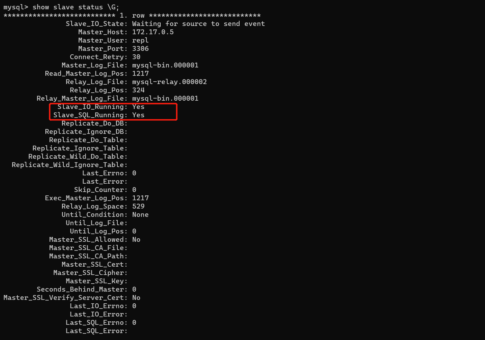

# MySQL主从复制

## 1.什么是主从复制

MySQL 主从复制是指数据可以从一个MySQL数据库服务器主节点复制到一个或多个从节点。MySQL 默认采用异步复制方式，这样从节点不用一直访问主服务器来更新自己的数据，数据的更新可以在远程连接上进行，从节点可以复制主数据库中的所有数据库或者特定的数据库，或者特定的表。

## 2.为什么主从复制

1. 在业务复杂的系统中，有这么一个情景，有一句sql语句需要锁表，导致暂时不能使用读的服务，那么就很影响运行中的业务，使用主从复制，让主库负责写，从库负责读，这样，即使主库出现了锁表的情景，通过读从库也可以保证业务的正常运行。
2. 做数据的热备，主库宕机后能够及时替换主库，保证业务可用性。
3. 架构的扩展。业务量越来越大，I/O访问频率过高，单机无法满足，此时做多库的存储，降低磁盘I/O访问的频率，提高单个机器的I/O性能。

## 2.主从复制的流程


1. 主库db的更新事件(update、insert、delete)被写到binlog
2. 主库创建一个binlog dump thread，把binlog的内容发送到从库
3. 从库启动并发起连接，连接到主库
4. 从库启动之后，创建一个I/O线程，读取主库传过来的binlog内容并写入到relay log
5. 从库启动之后，创建一个SQL线程，从relay log里面读取内容，从Exec_Master_Log_Pos位置开始执行读取到的更新事件，将更新内容写入到slave的db

## 3.主从复制的原理

1. master服务器将数据的改变记录二进制binlog日志，当master上的数据发生改变时，则将其改变写入二进制日志中；
2. slave服务器会在一定时间间隔内对master二进制日志进行探测其是否发生改变，如果发生改变，则开始一个I/OThread请求master二进制事件
3. 同时主节点为每个I/O线程启动一个dump线程，用于向其发送二进制事件，并保存至从节点本地的中继日志中，从节点将启动SQL线程从中继日志中读取二进制日志，在本地重放，使得其数据和主节点的保持一致，最后I/OThread和SQLThread将进入睡眠状态，等待下一次被唤醒。

**也就是说：**

- 从库会生成两个线程,一个I/O线程,一个SQL线程;
- I/O线程会去请求主库的binlog,并将得到的binlog写到本地的relay-log(中继日志)文件中;
- 主库会生成一个log dump线程,用来给从库I/O线程传binlog;
- SQL线程,会读取relay log文件中的日志,并解析成sql语句逐一执行;

## 4.mysql主从同步延时分析

mysql的主从复制都是单线程的操作，主库对所有DDL和DML产生的日志写进binlog，由于binlog是顺序写，所以效率很高，slave的sql thread线程将主库的DDL和DML操作事件在slave中重放。DML和DDL的IO操作是随机的，不是顺序，所以成本要高很多，另一方面，由于sql thread也是单线程的，当主库的并发较高时，产生的DML数量超过slave的SQL thread所能处理的速度，或者当slave中有大型query语句产生了锁等待，那么延时就产生了。

解决方案：

1.业务的持久化层的实现采用分库架构，mysql服务可平行扩展，分散压力。

2.单个库读写分离，一主多从，主写从读，分散压力。这样从库压力比主库高，保护主库。

3.服务的基础架构在业务和mysql之间加入memcache或者redis的cache层。降低mysql的读压力。

4.不同业务的mysql物理上放在不同机器，分散压力。

5.使用比主库更好的硬件设备作为slave，mysql压力小，延迟自然会变小。

6.使用更加强劲的硬件设备

## 5.主从复制实现

### 基于Docker搭建MySQL主从

#### 1.环境准备

* docker拉取MySQL镜像

```bash
# 查询mysql镜像
docker search mysql
# 拉取镜像
docker pull mysql
```

* 安装运行MySQL容器

```bash
# 创建mysql-master容器 
docker run -di --name=mysql-master -p 3333:3306 -e MYSQL_ROOT_PASSWORD=root mysql
# 创建mysql-slave容器 
docker run -di --name=mysql-slave -p 3334:3306 -e MYSQL_ROOT_PASSWORD=root mysql
```

1. -i：表示运行容器
2. -t：表示容器启动后会进入其命令行。加入这两个参数后，容器创建就能登录进去。即分配一个伪终端。
3. --name :为创建的容器命名。
4. -v：表示目录映射关系（前者是宿主机目录，后者是映射到宿主机上的目录），可以使用多个－v做多个目录或文件映射。注意：最好做目录映射，在宿主机上做修改，然后共享到容器上
5. -d：在run后面加上-d参数,则会创建一个守护式容器在后台运行（这样创建容器后不会自动登录容器，如果只加-i -t两个参数，创建后就会自动进去容器）。
6. -p：表示端口映射，前者是宿主机端口，后者是容器内的映射端口。可以使用多个-p做多个端口映射。

* 查看容器

```bash
# 查看运行的容器
docker ps
```

#### 2.配置主节点master

```bash
# 进入主节点容器
docker exec -it -u root mysql-master /bin/bash
# 进入到etc目录下
cd /etc/mysql
# 查看my.cnf文件
vi my.cnf
# vi: command not found
apt-get update
apt-get install vim
# 查看my.cnf
vi my.cnf
```

添加如下配置：

```properties
[mysqld]
#主服务器唯一ID
server-id=1
#启用二进制日志
log-bin=mysql-bin
#设置不要复制的数据库（可以设置多个）
binlog-ignore-db=mysql
binlog-ignore-db=information_schema
#设置需要复制的数据库
binlog-do-db=需要复制的主数据库名字
#设置logbin格式
binlog_format=STATEMENT
```

配置完成之后，需要重启mysql服务使配置生效。使用`service mysql restart`完成重启。重启mysql服务时会使得docker容器停止，我们还需要`docker start mysql-master`启动容器。

* 创建同步账户

下一步在Master数据库创建数据同步用户，授予用户 slave REPLICATION SLAVE权限和REPLICATION CLIENT权限，用于在主从库之间同步数据

```sql
CREATE USER 'repl'@'%' IDENTIFIED WITH 'mysql_native_password' BY 'root'; 
GRANT REPLICATION SLAVE ON *.* TO 'repl'@'%'; 
```

#### 3.配置从节点slave

```bash
# 进入主节点容器
docker exec -it -u root mysql-slave /bin/bash
# 进入到etc目录下
cd /etc/mysql
# 查看my.cnf文件
vi my.cnf
# vi: command not found
apt-get update
apt-get install vim
# 查看my.cnf
vi my.cnf
```

添加一下配置：

```bash
[mysqld]
#唯一id
server-id=2
#开启二进制日志功能，以备Slave作为其它Slave的Master使用
log-bin=mysql-slave-bin
#启用中继日志
relay-log=mysql-relay  
```

#### 4.连接主节点和从节点

`show master status;`主节点查看状态


File和Position字段的值后面将会用到，在后面的操作完成之前，需要保证Master库不能做任何操作，否则将会引起状态变化，File和Position字段的值变化

* 在mysql-slave中进入mysql执行以下命令

```sql
change master to master_host='172.17.0.5', master_user='repl', master_password='root', master_port=3306, master_log_file='mysql-bin.000001', master_log_pos=1217, master_connect_retry=30;
```

1. master_port： Master的端口号，指的是容器的端口号
2. master_user： 用于数据同步的用户
3. master_password： 用于同步的用户的密码
4. master_log_file： 指定 Slave 从哪个日志文件开始复制数据，即上文中提到的 File 字段的值
5. master_log_pos： 从哪个 Position 开始读，即上文中提到的 Position 字段的值
6. master_connect_retry： 如果连接失败，重试的时间间隔，单位是秒，默认是60秒

在Slave 中的mysql终端执行show slave status \G;用于查看主从同步状态。

注意使用一下命令查看容器ip：

```bash
docker inspect --format='{{.NetworkSettings.IPAddress}}' mysql-master
```

先使用`start slave`开启主从，使用`show slave status \G;`查看从节点状态；

```sql
# 开启主从复制
start slave
# 停止主从复制
stop slave;
# 重新配置主从
reset master;
```



MySQL8可能出现的错误：https://www.modb.pro/db/29919

#### 5.测试

进入master节点，创建user_db数据库；