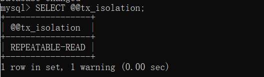
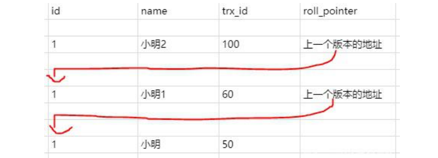

# MySQL事务详解

## 什么是事务

简单来说，事务是指逻辑上的一组操作，要么全都执行，要么全部执行失败。

**举个栗子：**事务最常见的例子就是转账了。假如小红要给小明转1000元，转账会涉及两个关键的步骤：

- 小红的账户减少1000元。
- 小明的账户增加100元。

事务会把这两个操作看成逻辑上的一 个整体，要么这个整体包含的操作都成功，要么都失败。这样就不会出现小红账户余额减少了，小名账户余额却没有增加。

## 事务的四个特性（ACID）

关系型数据库（例如：`MySQL`、`SQL Server`、`Oracle` 等）事务都有 **ACID** 特性：

1. **原子性**（Atomicity）：事务是最小的执行单位不允许分割。事务的原子性确保动作要么全都成功，要么失败回滚。
2. **一致性**（Consistency）：事务执行前后，数据保持一致。例如转账业务，无论操作是否成功，转账者和收款者的账户总额是不变的。
3. **隔离性**（Isolation）：多个事务并发访问数据库时，一个事务不受其他事务的影响，各个并发事务之间数据库是独立的。
4. **持久性**（Durability）：一个事务提交之后，对数据库中数据的改变是持久的，即使数据库发生故障也不会对其产生任何的影响。

## 事务的隔离级别

**并发事务带来的问题**

- **脏读**： 当一个事务正在访问数据并且对数据进行了修改，而这种修改还没有提交到数据库中，这时另外一个事务也访问了这个数据，然后使用了这个数据。因为这个数据是还没有提交的数据，那么另外一个事务读到的这个数据是“脏数据”，依据“脏数据”所做的操作可能是不正确的。
- **不可重复读**：指在一个事务内多次读同一数据。在这个事务还没有结束时，另一个事务也访问该数据。那么，在第一个事务中的两次读数据之间，由于第二个事务的修改导致第一个事务两次读取的数据可能不太一样。这就发生了在一个事务内两次读到的数据是不一样的情况，因此称为不可重复读 。
- **幻读**：幻读与不可重复读类似。它发生在一个事务（T1）读取了几行数据，接着另一个并发事务（T2）插入了一些数据时。在随后的查询中，第一个事务（T1）就会发现多了一些原本不存在的记录，就好像发生了幻觉一样，所以称为幻读。 
- **丢失修改**：指在一个事务读取一个数据时，另外一个事务也访问了该数据，那么在第一个事务中修改了这个数据后，第二个事务也修改了这个数据。这样第一个事务内的修改结果就被丢失，因此称为丢失修改。 例如：事务 1 读取某表中的数据 A=20，事务 2 也读取 A=20，事务 1 修改 A=A-1，事务 2 也修改 A=A-1，最终结果 A=19，事务 1 的修改被丢失。

**事务的隔离级别**

- **READ-UNCOMMITTED(读取未提交):**最低的隔离级别，允许读取尚未提交的数据变更，**可能会导致脏读、幻读或不可重复读**。
- **READ-COMMITTED(读取已提交)：**允许读取并发事务已经提交的数据，**可以阻止脏读，但是幻读或不可重复读仍有可能发生**。
- **REPEATABLE-READ(可重复读)：** 对同一字段的多次读取结果都是一致的，除非数据是被本身事务自己所修改，**可以阻止脏读和不可重复读，但幻读仍有可能发生**。
- **SERIALIZABLE(可串行化)：** 最高的隔离级别，完全服从 ACID 的隔离级别。所有的事务依次逐个执行，这样事务之间就完全不可能产生干扰，也就是说，**该级别可以防止脏读、不可重复读以及幻读**。

|     隔离级别     |   脏读   | 不可重复读 |   幻读   |
| :--------------: | :------: | :--------: | :------: |
| READ-UNCOMMITTED | &#10004; |  &#10004;  | &#10004; |
|  READ-COMMITTED  |    x     |  &#10004;  | &#10004; |
| REPEATABLE-READ  |    x     |     x      | &#10004; |
|   SERIALIZABLE   |    x     |     x      |    x     |

**MySQL 的默认隔离级别是什么**

MySQL InnoDB 存储引擎的默认支持的隔离级别是 **REPEATABLE-READ（可重读）**。我们可以通过`SELECT @@tx_isolation;`命令来查看，MySQL 8.0 该命令改为`SELECT @@transaction_isolation;`



因为隔离级别越低，事务请求的锁越少，所以大部分数据库系统的隔离级别都是 **READ-COMMITTED(读取提交内容)** ，但是你要知道的是 InnoDB 存储引擎默认使用 **REPEATABLE-READ（可重读）** 并不会有任何性能损失。

InnoDB 存储引擎在 **分布式事务** 的情况下一般会用到 **SERIALIZABLE(可串行化)** 隔离级别。

## 事务实现的原理

- A原子性由undo log（回滚日志）日志保证，它记录了需要回滚的日志信息，事务回滚时撤销已经执行成功的sql。

- C一致性由其他三大特性保证、程序代码要保证业务上的一致性

- I隔离性由MVCC来保证。

- D持久性由内存+redo log（重做日志）来保证，mysql修改数据同时在内存和redo log记录这次操作，宕机的时候可以从redo log恢复。

> InnoDB redo log 写盘，InnoDB 事务进入 prepare 状态。 如果前面 prepare 成功，binlog 写盘，再继续将事务日志持久化到 binlog，如果持久化成功，那么InnoDB 事务则进入 commit 状态(在 redo log 里面写一个 commit 记录)。

redolog的刷盘会在系统空闲时进行。

## 什么是MVCC

多版本并发控制：读取数据时通过一种类似快照的方式将数据保存下来，这样读锁就和写锁不冲突了，不同的事务session会看到自己特定版本的数据，版本链。

`MVCC` 的实现依赖于：**隐藏字段、Read View、undo log**。在内部实现中，`InnoDB` 通过数据行的 `DB_TRX_ID` 和 `Read View` 来判断数据的可见性，如不可见，则通过数据行的 `DB_ROLL_PTR` 找到 `undo log` 中的历史版本。每个事务读到的数据版本可能是不一样的，在同一个事务中，用户只能看到该事务创建 `Read View` 之前已经提交的修改和该事务本身做的修改。

在内部，InnoDB存储引擎，为每行字段添加了三个隐藏字段。

- DB_TRX_ID：表示最后一个插入或者更新这行事务的id。delete操作在内部被视为更新，只不过会在记录头Record Header记录投中的deleted_flag将其标记为已删除。

- DB_ROLL_PTR：回滚指针。指向该行的undo log，如果没有被更新，则为空。

- DB_ROW_ID：如果没有设置主键且表没有创建唯一非空索引时，InnoDB会用该id来生成聚簇索引。

  

**Read View**

```java
class ReadView {
  /* ... */
private:
  trx_id_t m_low_limit_id;      /* 大于等于这个 ID 的事务均不可见 */

  trx_id_t m_up_limit_id;       /* 小于这个 ID 的事务均可见 */

  trx_id_t m_creator_trx_id;    /* 创建该 Read View 的事务ID */

  trx_id_t m_low_limit_no;      /* 事务 Number, 小于该 Number 的 Undo Logs 均可以被 Purge */

  ids_t m_ids;                  /* 创建 Read View 时的活跃事务列表 */

  m_closed;                     /* 标记 Read View 是否 close */
}
```

`Read View`主要是用来做可见性判断，里面保存了 “当前对本事务不可见的其他活跃事务”。

`m_low_limit_id`：目前出现过的最大的事务 ID+1，即下一个将被分配的事务 ID。大于等于这个 ID 的数据版本均不可见。

`m_up_limit_id`：活跃事务列表 `m_ids` 中最小的事务 ID，如果 `m_ids` 为空，则 `m_up_limit_id` 为 `m_low_limit_id`。小于这个 ID 的数据版本均可见。

`m_ids`：`Read View` 创建时其他未提交的活跃事务 ID 列表。创建 `Read View`时，将当前未提交事务 ID 记录下来，后续即使它们修改了记录行的值，对于当前事务也是不可见的。`m_ids` 不包括当前事务自己和已提交的事务（正在内存中）。

`m_creator_trx_id`：创建该 `Read View` 的事务 ID。

**数据可见性**

在 `InnoDB` 存储引擎中，创建一个新事务后，执行每个 `select` 语句前，都会创建一个快照（Read View），**快照中保存了当前数据库系统中正处于活跃（没有 commit）的事务的 ID 号**。其实简单的说保存的是系统中当前不应该被本事务看到的其他事务 ID 列表（即 m_ids）。当用户在这个事务中要读取某个记录行的时候，`InnoDB` 会将该记录行的 `DB_TRX_ID` 与 `Read View` 中的一些变量及当前事务 ID 进行比较，判断是否满足可见性条件。

1. 开始事务时创建readview，readView维护当前活动的事务id，即未提交的事务id，排序生成一个数组。
2. 访问数据，获取数据中的事务id（获取的是事务id最大的记录），对比readview。
3. 如果在readview的左边（比readview都小），可以访问（在左边意味着该事务已经提交）。
4. 如果在readview的右边（比readview都大）或者就在readview中，不可以访问，获取roll_pointer，取上一版本重新对比（在右边意味着，该事务在readview生成之后出现，在readview中意味着该事务还未提交）。

这就是Mysql的MVCC,通过版本链，实现多版本，可并发读-写，写-读。通过ReadView生成策略的不同实现不同的隔离级别。

**已提交读和可重复读的区别就在于它们生成ReadView的策略不同**。

在事务隔离级别 `RC` 和 `RR` （InnoDB 存储引擎的默认事务隔离级别）下，`InnoDB` 存储引擎使用 `MVCC`（非锁定一致性读），但它们生成 `Read View` 的时机却不同

- 在 RC 隔离级别下的 **`每次select`** 查询前都生成一个`Read View` (m_ids 列表)
- 在 RR 隔离级别下只在事务开始后 **`第一次select`** 数据前生成一个`Read View`（m_ids 列表）