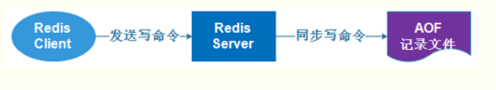

# Redis知识点

## Redis简介

**Redis 就是一个使用 C 语言开发的数据库**，不过与传统数据库不同的是 **Redis 的数据是存在内存中的** ，也就是它是内存数据库，所以读写速度非常快，因此 Redis 被广泛应用于缓存方向。Redis本质上是一个Key-Value类型的内存数据库，整个数据库统统加载在内存当中进行操作，定期通过异步操作把数据库数据flush到硬盘上进行保存。因为是纯内存操作，Redis的性能非常出色，每秒可以处理超过10万次读写操作，是已知性能最快的Key-Value DB。

**Redis 除了做缓存之外，也经常用来做分布式锁，甚至是消息队列。**

**Redis 提供了多种数据类型来支持不同的业务场景。Redis 还支持事务 、持久化、Lua 脚本、多种集群方案。**

### Redis 常见数据结构

#### string

1. **介绍** ：string 数据结构是简单的 key-value 类型。虽然 Redis 是用 C 语言写的，但是 Redis 并没有使用 C 的字符串表示，而是自己构建了一种 **简单动态字符串**（simple dynamic string，**SDS**）。相比于 C 的原生字符串，Redis 的 SDS 不光可以保存文本数据还可以保存二进制数据，并且获取字符串长度复杂度为 O(1)（C 字符串为 O(N)）,除此之外，Redis 的 SDS API 是安全的，不会造成缓冲区溢出。
2. **常用命令：** `set,get,strlen,exists,decr,incr,setex` 等等。
3. **应用场景：** 一般常用在需要计数的场景，比如用户的访问次数、热点文章的点赞转发数量等等。

下面我们简单看看它的使用！

**普通字符串的基本操作：**

```bash
127.0.0.1:6379> set key value #设置 key-value 类型的值
OK
127.0.0.1:6379> get key # 根据 key 获得对应的 value
"value"
127.0.0.1:6379> exists key  # 判断某个 key 是否存在
(integer) 1
127.0.0.1:6379> strlen key # 返回 key 所储存的字符串值的长度。
(integer) 5
127.0.0.1:6379> del key # 删除某个 key 对应的值
(integer) 1
127.0.0.1:6379> get key
(nil)
```

**批量设置** :

```bash
127.0.0.1:6379> mset key1 value1 key2 value2 # 批量设置 key-value 类型的值
OK
127.0.0.1:6379> mget key1 key2 # 批量获取多个 key 对应的 value
1) "value1"
2) "value2"
```

**计数器（字符串的内容为整数的时候可以使用）：**

```bash
127.0.0.1:6379> set number 1
OK
127.0.0.1:6379> incr number # 将 key 中储存的数字值增一
(integer) 2
127.0.0.1:6379> get number
"2"
127.0.0.1:6379> decr number # 将 key 中储存的数字值减一
(integer) 1
127.0.0.1:6379> get number
"1"
```

**过期（默认为永不过期）**：

```bash
127.0.0.1:6379> expire key  60 # 数据在 60s 后过期
(integer) 1
127.0.0.1:6379> setex key 60 value # 数据在 60s 后过期 (setex:[set] + [ex]pire)
OK
127.0.0.1:6379> ttl key # 查看数据还有多久过期
(integer) 56
```

#### list

1. **介绍** ：**list** 即是 **链表**。链表是一种非常常见的数据结构，特点是易于数据元素的插入和删除并且可以灵活调整链表长度，但是链表的随机访问困难。许多高级编程语言都内置了链表的实现比如 Java 中的 **LinkedList**，但是 C 语言并没有实现链表，所以 Redis 实现了自己的链表数据结构。Redis 的 list 的实现为一个 **双向链表**，即可以支持反向查找和遍历，更方便操作，不过带来了部分额外的内存开销。
2. **常用命令:** `rpush,lpop,lpush,rpop,lrange,llen` 等。
3. **应用场景:** 发布与订阅或者说消息队列、慢查询。

下面我们简单看看它的使用！

**通过 `rpush/lpop` 实现队列：**

```bash
127.0.0.1:6379> rpush myList value1 # 向 list 的头部（右边）添加元素
(integer) 1
127.0.0.1:6379> rpush myList value2 value3 # 向list的头部（最右边）添加多个元素
(integer) 3
127.0.0.1:6379> lpop myList # 将 list的尾部(最左边)元素取出
"value1"
127.0.0.1:6379> lrange myList 0 1 # 查看对应下标的list列表， 0 为 start,1为 end
1) "value2"
2) "value3"
127.0.0.1:6379> lrange myList 0 -1 # 查看列表中的所有元素，-1表示倒数第一
1) "value2"
2) "value3"
```

**通过 `rpush/rpop` 实现栈：**

```bash
127.0.0.1:6379> rpush myList2 value1 value2 value3
(integer) 3
127.0.0.1:6379> rpop myList2 # 将 list的头部(最右边)元素取出
"value3"
```

我专门画了一个图方便小伙伴们来理解：

![redis list](data:image/png;base64,iVBORw0KGgoAAAANSUhEUgAAArgAAABvCAMAAAAwukOjAAAABGdBTUEAALGPC/xhBQAAAAFzUkdCAK7OHOkAAAMAUExURf///2pqakJCQkdHRw0NDU1NTQICAgAAADU1NQEBAQYGBiIiIgQEBBwcHAUFBTQ0NAMDA/Dw8GhoaAcHByYmJklJSUNDQyoqKjMzMwkJCR4eHi0tLRYWFvX19c7OzkBAQEtLS/39/S4uLigoKCEhITIyMgoKCkpKSsXFxVZWVjExMSUlJZiYmCMjI/7+/lFRUR8fHywsLO/v72xsbI6OjiAgIDAwMB0dHTs7OwgICEhISCcnJ/v7+wwMDCQkJDk5OS8vLwsLCz09PWVlZWZmZqqqqrS0tFVVVTw8PDg4OL29vV9fX5eXlykpKTY2NhsbG11dXZmZmVpaWtvb2w8PD0xMTGdnZxERERMTE5OTk9HR0XFxcURERBAQEBkZGVNTU+7u7hISEllZWWBgYE5OTvz8/BgYGBQUFE9PT1JSUlxcXMjIyMrKyqCgoGRkZJ6enrm5uXNzc1hYWKenp35+fltbWysrKxUVFZ+fn9jY2JqamvT09D8/P/f39/j4+PPz84iIiIeHh3d3dz4+PkFBQYuLi39/fxcXF0VFRdDQ0BoaGr6+vjo6Om5ubnZ2dnl5eWJiYtra2pSUlLOzs6Ghobu7u4KCgqKiomlpaVdXV15eXg4ODjc3N9LS0u3t7efn54CAgFRUVPb29uDg4M3NzYODg8fHx5aWlrKyssLCwmtra5KSkvHx8XBwcJWVlcvLy/n5+Zubm21tbXh4eMTExI+Pj5CQkImJiXV1debm5nJycq2trdPT03t7e3R0dEZGRlBQUMDAwLa2tn19fevr6/r6+t/f34SEhNTU1I2NjZycnHx8fKSkpLW1tXp6etfX14yMjGNjY+jo6GFhYczMzKampuXl5YWFhbGxserq6sPDw52dnW9vb8HBwb+/v+Li4qOjo5GRkeTk5IqKitbW1q6urqmpqYGBgYaGhtXV1dzc3OPj46+vr+zs7KioqPLy8t7e3uHh4aurq+np6cbGxqWlpaysrMnJyby8vLCwsLi4uNnZ2d3d3bq6us/Pz7e3tzLkXoMAACAASURBVHja7JwJWIxbH8DfmtG/xbTvzUijUinapLSjTdMqtFHqqlSEQlJp06KSQrYoaf1KSmkjhFAhS1d213YR13LvxeduvjMzIc/9nvso995m6vyeaTrvO0vvnP/v/Z/znv8zEQQGg8FgMBgMBoMZLBM/2zL57RruEm6PYixtBHziNDjYb+sBFZJju3ZjEbgNmNRvg0T+0Mq+M2w/8RjQ77eVC9PTPCEei8BtSOr9X3EhdYSIKw4/EVhcbmfkiEvr5Kcsn0kQehSQyuIHIXUcfK7hHanIi7rWJw41O3jpy8qdryNxt/hQDcOIKyQgk54OY3FpMkDPFIJIIlcSxC+oA38W9oFr8AAy0GnMOW4jSLoCwFaCBEBXB9hyUg+oej8NY3FPMycHvhRqG5oq0PBUgdvElTnMujjrAsNqwleRJS664J4JBcN+qqACJdnZ2cGQhsXlRnEZ7FWFGrBCjasscSsJQhdch7240Ec6FpcbxQ1li5sFRagRwhSXeXFWCOrDXlwqPJjFpBCLy43i7meLGwfPUCOcc8Wd+JePKtFMBizuKChHLX+KLxaXi8V9COIo/EEcK+7npa4/oQYuAxY3FKgN74LAn2CJ+xTsjmMfuE/cahmwCbOBz8QVIlut4aSx/S/F1RzQ23kyz4OHZDTDDUYfcRsUEigBk7EPXEMOdLPFJe4EAcj0wEO2uDGwnCAqAFYPU3HZFHbfvvJpq8kX+8B9mJwsrF5DfPu5qYWXOOpqymVSiD2VnzGRaCM9RrtaSaEE7cYoMr++EhJ3XS2d4pqPAznS8AR1E+KFCphw6PExxeUBUPSShAg0HqizriSPE8ngXCsJcUhcAFchsMOBHGkopQKZl8xazOVgcZ0JQkwI8j+KWw1CqJEqhcSl+BImikDDkRxpFL7fEPRIjeBscUNQqxhmfsq4FLB/L8aa49ai+wR4gAOJ4UBxmd9TeA7fscXdisTdZYjmCLzXkbhVaE8ynME9heFAcfeiFgOs2eImA3PhtelHf4BK9qoCFhfDmeJuRi1F2L0Q+AnCxBCOz6Iw6w7+4InFxfx714MDKdP2rSq4pF9kXqHxQlC4OqCMa0e9uvoQmRyDxcX8awyoTMssdfGAPZrRTl9DELuoANOK4T1RR0d7qK1ECeu9CuAJ7lbMPy/uAKtdPKBbqcZe8FLq/VDyCrUeU4j7EsPh4nLuvKe68IXuyUv3Xr3M7jrjWRRaUncr/fdfzpU9e2MVfnZzZEcUo6qiXn9dQ/zp3IKIzvMJjcu8bmbq8YjPWHLxsv2OYFe/7ep7fCYdCxo1e6zUVNLRVGneJMXoxGm2toYZ5nZ2eY78/CKysioqGhoGBgYWFhZ0Ol3hT6CddPSYgYGGhoaKiqysCD+/o2Oenbl5hqGt7bTEaEXFJF5p79SjpKlSY2eP+ibo2CSfPTbqy/1cg513+F/euGT6HHGe/xzI3Oe1rHFD7fmWE8kFuacfxzesaz94tyKnVDOqI2zx1rPfPrd68/BdmfX7pVtm3r5V93PI0jFph590/dr7cu/TK/nXfvCtXEuLbVvIxV72kqzvS6Z/LNOmkazRTg8SbfBl2r9P3LaiEwpin9Dtx7Ure2c98OwuKZ/5S9mh789G1pRWtMedLmhJaM7kmX7Z2c/m2Oyp3oq2dvwKCg4ThOTXp7i7mcoJ8/EJG5m6LVgV4CSvbGbsoGOhIZJnbpuYJH106vhRQZN8bJb7BTvbX77IdEMv86ZX85HGhKwZLZ0RyY9yi3t64uMa7q+70K5/sP5uRYVHTlVVKYOh6eISVVNT03Hjxo2wsLDIsMjIxSw2s26sH0QkIowNemJHR2NUVJSLi4umJroxGKWlVVU5OR4eFRV36+sP6uu3X7iw7n5DQ1z8456e08W5jwqSI050trScz6pN2NB4pNlr383MA3o828TnoPNpo7/9DucV7DNqEfOMGi9FOuotjc6nabYZdnn8IioGFgo6MuO0JmgpT5anOM1PoQYumOdmaiknISzKB3yjBSVULcluc91XpQQ4TZFX1kL9slIBdYwjs2cUpVNJ42d/w+wZ1+CMjTO2HfA6ktVZUBx34WAOo2Px2edvrlovTS//+W2R55nVs049bbq2u5IWO5DzYWHMoNcByEAJ+VimncnKr+IgNvgybVlE7N+iraYsCJgLGklISAgKCgoLj0aIiory8QkICKBDQvd8fHyiomivsLAwegZ6npGRkRxCVdXS0tTUlIzYuVPDbd68eXMXLHAPDFxFTUlJCQgImD9//fr1Tk5OFAplyhR5eXltbe3JkycrKysLCWlpaZmZmU2YICkpaWxsPG6cg4ODTLSMzMqVK3V0dPrSJStb9uVLlDBRyhRBSRNlTZQ38/Ls7FDuRNkzI8PQEGVQ22mIxMTE6GiUSVEuTUriRUjLen9C+svh/SKSPqDIIpoJOoREdCTogNBhZWSgI0QDRJ6jIxohVDQMLNDAoLNSxmGcseQEMy0h5cna2vJTKE7r588PSKGuCgx0XzB37jw3IzLZ1FJVVc6IGRFhZjT4PkSDGY6PwIfwMKMjjAJjJKdqaUre6YbigIIQMN+JIj8ZnSGS4zSMVAX4jOvFBicubFH6VKb9KO5Ql2lPJRkLtOhmNrbkxunn1GwOP7Rp6W21/Z5dv9255Lu2Gs/gOIqJSgtN2qpjY2hr1r6oFPPd/UP+nZe/ogExpK51y/tNz34M3xoZxfDQXxdfnNxZe8TrAM+MjfbBfjaLsogjoVbegqZ62YMRV501vPeVaT9l3KEt097RMgvKxkaMCG7Qs9zPDULcdpa4fWVatrgbkbhDW6ZVsbyPIzpS2JFVRu4euLj6LHH7yrRscQ2BmWuHsEy7gu8djueI4dLOUA/vwYrbV6bthvMEkQ8gNqRl2jCBrTicI4icqURi2CDF7SvTxgA0b1ZB4g5lmfY6SOFgjijMX/8uMsCXsL6P2K9MG45+q4tD5RCWaWMcUrpxLEcUx2UIFevBvLBfmbb68Nq+nUNVptWb7TiwFzCiov4YTmGM6U2PjFjx9e/DRZ0SlONhP0hxOeYzFAVO//IVhbZY33q5eRrGgaJTDFdEfBe6+p5u2yD/7pqmrhCFfdbVX3n4pTWLX1s9s16afj2kaFdX76um/Pympiuvelc/8Ryz/22JWl15+a1bt8qv16mVvO3+Y9eutDH7S27999zD1x13ezJn7OG1oMhZasuSgr2+Zoi7x9jm4zg+sP+/Z4k5eepMaOvxQ2c7ci70RNQ2HxBf4h/sut1mj88iH5896stX7Ng4R88rIaKnvTTy+aZftqTfbm099/2N+uLGOX5jbWl7D/+jQa+zfE5wu7j+DUKjv9SeuHHuwvTmsteM+wnbbY2pciAsISgq+j/urj0aqu2Pn67pbGfMTKNhMS4JGS5FKq/fz6NBRdKDKaMakRBJ5PbyCN0kUpKkmktJ6aGSEnXpcUu6vVv66SE3euhxe5HeXd3fnGHVanV0zzb2WrH/MLOc/d3nc/b3M/vx/X739wjEWh7KS/vnhTrvP3Ty9GWf6NlR5ZnvR+98GbY1JeePR/dyikrejnydPaE0MW/P6lH/sRluOs6fj7P49lIrPkPFp9NbyrzY/tgQR0MLtQHsZLGEIeBxWDhBepEAE3xR2hxMpIsJJ0j/Eod0/Nna8q2l4mQthx+VHX/5QWliCk9F6eLNTvHlGhEaquJRwyc4AoZIIhExBEycaysNTrVUs9B0+2Wq+oyQn6aHbnS/cuVKgPt4zw3TZhod07UZazXfdHDqAomQxwUyTBwuYAn92QZjj3nuKSP4TKcwlFr3ndQpsa5y03ZNmcWjuUQJNWCEv+rlf+zTjtTs71uzE/fnxVpYS1gse29tX982r66WlnZQsETa5qAXyMjCYdrKdOovGafiYWhzLMR95cmDZ6N2jH7j90pT6vq0U6gvmnoqDeAOPPpzmc/NmicRf4blZDS3qMbpfcImL3ptJTAwMCZu8T67b6Wskqj9CBzHhepBI0lwne2qmyX7Mt1lysUHCcMKt08oPjuw8HLiupPph6asHLp+kotzeHi4s0vfXkPrIpccWXa67OAa8tc9MmunDHV9ZUz7PVXzU26VRydGblTH4tLVWBsR6tz7XA9Y4xny42nV6xvc+wP5mfkDxUWz59VV9z5GzKpdEZHZeL9h24gdrTvDKrweV8b/S1hHlJDdCQtKTAiusaf8cVfGW8kmwSKN/bvyYOXiBS7JNQjU4oObo9O5OKEHEHe+cDetaYJ1GsntVTVEJdBCrqnRKLD49bmYthBS5nrQcTSb6h3EMmQ6FxW2feZ3Q74WAqVm+ZdB9rTihWwGoUJiaQkrcd1iABoouQajlCFFnNRQ9YtR0GtUTdsXk38fezC8vm+S7ovP3VT/16W2iNrMJyNqsm9OcGFxiLQq2UU2gw5x/xm8EhW6w/zjkBJ7B59FhKUgVQoX32Ts3xdVvxzaOBVV0/wGDLsTy5V8DykNY6r/mvzybeOr4sKyzQfqJrn/NEMp1s3KQ2VcMIMHmPZiXy0HjeHKabGyTe60DaEB4etHsR4KiBlNdsH2dJYK950DkEGfB5vj6hDnOiIobndtS6EENodMrFVG1C0LiUpEj8l7sXU5YfCAl9QlrS1u+fCmdURx0rmh46k2AbuH5FbeqN509c7j5vyqqqaUW09mlz6IdN5g5GRiGsTABcFaHppOSubznFceWHd5+8IRmW9Liiq86m/s7siEwTZQaWDgDgwhnc3ZGvP/fj8zyCDmBUQtazxySIGTqLDOno4Eit9hzKAI0WNyAK4ShTnwEi/f3hs9pyHq9bsLrStqy8OKtvZLmZzzx6NLizK8/m6qrcpvrr9zdVNLZe6Q3TFxp+TWj1ND7nz4WBLxZNneh6tcNii5GfjymdpqysvzwiO3FWZTxJELpRJ/sdjfWyS1F9gyuQTO4gns5YdAfMexrbXkQfS+QdoLxN4ihpDPY+EEi8e3l4i1fa0tHQwsrPq4ueoul5sUxweE6+6q+20V3zo/hElM4vDpRK3fHoqMhltxSIElx4NQjbje66BFzusfQQIlaiLmtgLRY7IMcO9l17icA5F1vZyvhM4lTctLnUzG9tE0sdInzx6ZDrIczBYFJcvpRBKOw203kgMZ85h8oUiUbO1g0Uc2Uo5ff/TIurLSMXNqGi+MNu739c2mzvfnWf460+Vc4bPROYf/3WNlZrdvS7zq05bD9VVelyo+FhXU3mo9cb38fk32nGLPNaVn9uMTxdzjZno4k45VuRRHRtwmAjZV9v/4jYiwCHtBi6x1uIkESjZjxa+/I3pMboRZCE7wcSl55CnNkTwtZzLcwkNNRStV29ueSXDs/X0tDazcdNVD5jnXpW8bNuF8Y0TJx0X51X6qT6sfV2WQJxD/fHvi3YvzcwYWJp0+uaqub8B0c/WljiZf3yyi4mmXgmczuIaLMExHgNMxhyYAZMStxGFTDlfzUO23OauhReakohkXw8QNyLocb8WwTEcGR2hcUmJs/LJgVlhRv5SKex/+br7a4he/z+x7tjTEEMlRcguQN5dO9YcEMiRxRBWkhCrrBSqNwk/7xaImJFBygtEdSyFITx+2a4BID+t+5ef2/hnOp1M7Ed1SAYOOPt6HI8pZbAbg17hjWGi0nxF8FF2Pt7avo7HuWyrFIjrVyrjoIOCzoEeMZ2iQ2BF7oGUe8tBgqfdHZoDUAz3gZUp+Em061ZIQEpc1GlriPBokp/DL0DKr/NFguSGdgarDA4kd3Z+4qgwtOtUOIiQuvFWWORvRiIvfhpbpa40Gy3N+LDrivu7+xI0X0vIsrEFIXN4TWAlbRC5fPWIMtMw8RJ4ZO64JsqUCUdP9iatja0WnWjRC4tpC2wgE0YigEPANu6kgwsI1RdXhZmBh9yfuYqYNnWprURIX2kYgRRUIzSqGFlFC9T6uBb7IerwTE8v3N+JqHaNT7T5dc1gnjNc8aOLaZiPCwoMfcXVjEWGx9kemdPxM9yduIL1I+x10HRCgd0dX0hs6uMCJgN6cNSqCxe5Z5LQlBdRrEPihKG25Ilj8zrpMiaCORJ+PLuiQta77E9cM0DrclKUwcQtAR3E63Fbo5V+WAlhOeQLAANQZtIXwa5Cx6gpgqdSXn+ecTHXNho9M6bxV3Z+4GEErruQlUIy4Pu6gI+LqEP9AYw5TAEsmmLYlMAsAqtAPb/gIVc3+CmBJAEl6i6/Jc3h+VYx4yHQuWN8DiMtdQqdWBSVx56qTIZELlWZhOUv0VdzXmskV9DnROrbTnO12kgz+UmNrd0Tc3QDajgu8FMCSLn+r+DRANWovgJ9DBwxXAIs6+aLoLYAyFH06OuKK5vUE4m6jU6uZkrh7QDlJSoZOtTbwPKABtssV9DntbwMAq0cBfXkaiUUdEdePgM0HlIvHKYBlzEoyuEAZvKFo2Rd+DtVUVwBLLfnC3QiwmarhSeiIu2BGDyAui5azSJWSuPJE1VvBfiwbZGJYPvD8UkF+DIafbIgh9fYN4ubimZCQM2wDFcOC6Q0DGlRhyNbwJ8g0jRTDMlcDaBymavgoujUuO7YnEJdWyslAgjLcXB88xw6Bfpidjs6lrHNg1JcKOgFCMzIyCoB5FxPXmFAQy2RdoL+Ict6fC91/hkaKYXFXAYDynNsyATKdOxj2AOJK6NlEuZSjwl4QZact6wVVF9nemP2FglYDVZ/2JEhO314q4LBLhXe4QljihwJwl/oIiSl8ylWT/or1C4Z5ARnNvy5JQmQ6t3DoAcTlvKdVjdmP6r9PwcwsMjPqGTC+wM/uCwXZANW1INKLLHe+SVxV4j0k5GKuIlieG4KAlg5aVkuDJ+7EzmPZ1FvuCQgFVIcotqMjbh/fHkBcVi09Cwo1u+aC3mQKPw0Qj2G/tyvoU6L1IkCma0phn/4mcWMA7NmXBI4iWO6C9A5bNrCA3+hYdh7LYsCWbRTtVEATRRPn0a1xXaU9gLg4vcSuIupIwgjZ/lj2EQkeGK9hAGUvUkGfE633BuYjt2m3pan+P3tXGtbUlYZvFnKTEAIlARLAJhAIkBghjWyJEDYliBBgJEHCIhACER8KyuKClrUgAqKoA4iIW5W4TbHWigtoGW2rqAzuI1idlrG2M1rHraPPzCQ4tjPPQM2FHDspvD+T8528Od+b3HPvOef9RhXu7wgfIKQsqBwPFwwsqNNhJBcXnhT5zRlzHFws4eSGdzHwiF3MIgLLOZpk/LqdBj/Xq5394RFfnmEP66y/TgfBMHbXPu3NtO5B+49G663JuineyynsqMKdhtuMkHMUZRxc0l/Zj460fZ2VgXgAwzDjGJe3FumYRLWO1MUjcMf8qkjvGb1wr1vo52ns+ZoFtnvx6RC0ff6//0R/NFr/dvaO1/rU4JDWWMMQQXERIb88SxLGxeVKu+soE+4dpL+ASjrG729GL9yv2EN6tbNZBIwC4RbSm2ILUFS4BMS7uCIjAXHZwX4b1NcUxm03euEOYPU7qogXgmKwjXAHYYQcB+rkvykdqTkJZO0DSriJ3wETrmqp0Qv3YaF+diloUPuloQdEhFOFFxQKKEt3Wzniy7OVOSAu/yicDky4tqvetM7uGrrD/d45erVztwH1ldqxCC+JBwoSQRXRkFZeQRoSGwCIy7EkYH5tXf6GLjFR+PMbpVLp8KCBPzFPpJ+BnATYfvwvVQPIAq4Jbb8HxEVlhnjypwT1i75gBqxyYgLL1bAdLobJ9ppRjVGiKL6BBh+lEJp+N2eaDFCj2CZCuOS7rN8L1G0Lw/sF0hCxByAu97yBnZYs5w8YtsOnvEIPEr1tpLfiU8kpEhasVDflh2dbChSfnM/bWFJxaN3UL9Y/Hvp696kNqz86sPn59i3zpyAr6aFk6LdXoQ7YAmRMDcLD0sV1mH8C4uLpidhcvowPiMu3UmBGg0EBhjHqm/Fez28W5gxFV5x1I/DZAcSkEc6yEQj90BYhOjhEJrO0tJTpahD19Yc356c2bXVXMoUJ5T5iGp/qoZKzLUiBKUmeIke8BJ2aGZoaHtKRe/7PxToD06O9zz66NLT5wotbf2i9v/LlPzs+U7/zgW3AHod7JU9FFrDmbv2HgLjYmSEWbgAo+4OeDOpaMD2nz/VjcWxYVH9Tzwwbb1sPJzN/rijChi9icZxp+MiWsBpHH4nIp0bcEonXWeaacQIcpQUsKs/JVqoqTJnrx/Z9WVQOJuAsiL5+iYXVnkTYDXKQj7DrbHUhwZkr972JCk7Lb1IrrarKg8SRzgEFLK6ph1n1Kwdeui+FSCQPg0jUVaFjJ/ppgfXzCwxk0ylEkgWMI5GJFAqRbEHAEQMT7S3Ee/T7kZKmgBlFB1zuYWQR+25vPA5ILOJNoYj/pMWAuNADTQD5Vz/EkSptaJIgBrqKFmTlwmSWWQkxVQnWLZGMsjKJRKtYvljMlQQVMdAJXUIrJpdpkhmZ7BbT3CcT5K5pKzk0Z/3M3pMHll756R555SY7yI6O1Yz0cad4BDP2a0sC6qrSpaenO4w6U17R82BV+6zLc4rXyEITaKYwQb+909ZECZhRXOh19TyyCMH+x02AxFKVgnj2HAWqxIgUPlEMqGu++WwD9+gVpybPDR7t3SxvIuGCYT/wiEqzTq+G0fIIUHMF+yNI/3F3SBlgqLgQ45GGDAH6EV3xIpSCqi7pTzPww6lpBIu47J9rcM7QnqkHaMH6zXEfFQDbw7lpPuJxIq4HQ4XDQbpaVXgL0Ki4CtW/BTXiZs43DNxjw1XozeI7ZbiezofyQDDrrLPlY1iTI4Op0bwwQonQxywL3g8oM0uCNR+Dynqc3VPIyDEPlarnw6hGj3YgDLJIauRBKQogXJh7PBGuhU4hOeWByYyiZCswazo6K97YhVtaknxUv5bxdCC1JXsJ08dgd9hBBOF+NROv6EYag7kZUQUkMz6dm+4ASroDzmOtsQs35lysvmdsFxHTIajHwP7unTbXjo2lMG+/BX6GocdiMbnaDfEzv0uqGOfcnybf21rv3Du2sD3nh78u2TVdsTHvfF1nLSqkvjnGTa106UKXsSJpAXwbEdfUycPWTCqt1mK4TJ0TjyuysfOitfgUWQtN1Nev1RLMn4FK+n0sZPSQDHTl6Nk0nZdR2005CE1dcvnrWRvas97+bO32Iz1vbRuPgAJDlrrSDo8lcjYLFhvyhmCbE45UlTOGwK9KnXz555xpBaZJcl8CPUXK45sHdSmb0oIF+YrO3NwTC3JzczsV+27WdmiyG9UajUYgEKA1GhSq0VIW7KLZd2JN3s6+ikPzdkV/ceZJ7+DJ3P4qHFedXA4u6VeqjV+4tqcFg3rvy2NIrZr5kCwtVc1MKGvhFHA9qjPmsskwiY6VFyZ5e/KoEfwADg3f0oIXO/sElRUx0OiELozQhRlrosxkNIXLaus+vXpx3YdfztydM5C1F3p84myR7VhXwdbZcGRkOjYxrlJqa0qNsKN6eXlxOBxnGk2kW/0R12gZiBmMcgajiFEmCTP3shteLHLSwdSfyipw5ODFZdZWmW5R2YJP7Gs2bhkjkZWruXwWNj/VLTmTaS3BO4o8k1LCyASiX4rKmxfhWCAuSnDpDs1PC9EITtQdXHP8bF5b984zd4sPV3w+XVa88dNShSY2PDVZKUQHsCopbDbbf2tnqArkxkPSXuNXbj20m6Z348GLewY2ay+E14bWR98ubju4zzJNqDaxSigT0wJsuBHeSYVyLJuIw5G96RRfCpFMIrFxBAIBJhC4vn5+GZXVUg8nUx7P34nHM/W0vV2r7Hu/YTzkZyhudqAss+ub8xdt7S4yiWW6WAm7EtAFZRJxJM2Lz+J6m6nisL44sl+clGsXhjaJya4tbSv+eM6Sc0NHrzX0njrV2/DDk8Xrl+0ZX02xvS1noNvaK9HRWRtuLIxfevpI6/Xfj7Wv5XeyBpf96Y9Az9aQ7hu/cBkno3YhChDig6pM3JpDakvfLzk0Z8nnR3ef2jB4I+vSqm9yHtza0vPO8pX/u2g3zWHF8vlbvl/72eNHg3/f/fDc/nUVO493opofvalvuaL11oVLJxsu769oq+voy1e7oH3MHUWm3qqMRKyuUi15vBdfo8r5SvKvwErfPEv+DjSJCYUdcdG/PInxrgqUz7ObzOQEQ0mG6y9PYnTrev0giAmdzOQEg30AZPzCzfHIn8zkxEIX6emvQLhQjWoylRMJ7VTfZ9D/h3Bd3Z8pqNRcnSOAKwZr7/4NBEW7Z4Xb4+foMwE+wsZMZnOCIP2DuzSs6PkYozMvPvE58x9iezcMa9rRikhs/y3cmTBMVQTBPg7QLNjsbC0WXgWhYJihoMJ67f84iU3MGz7bWpqdHaxFSHCIFjItLGWWCyx1aLRs1ALViHqJVJRGiUJpXxk+RCTTNdcFZmvR19dXX1/f39+flpYWHh7e3NzsEqXFAi3yhxGjRaoOi7Ro0sFNi1AdtmqRrIXaSq1Wuw+ju7uluztTC6VSaaJDrA5MLVxcXKy0EOqA0SIC8wr/GpALFpUGEUAFosgApAmoUx0OfNXVQWYBMchQBSRgCMShcMAKB0CXAF3jl5Fx4ADQhZmZ8QsXurtras6cCfRQUlJQUCnQrwEBs2Z5ewPDQOzyhAkX80ABCw5TIVBAaoJnzzZt2tTbe+fOnbVro6Ojd4Gm2Pbt2LGjr6+pqWnz5s39/efOndu7d+/pw0CQd/hwSUlb24IFz59Pm7Z06fHj16+/eNHY2NCwffvjx62tFy6cPGliYrJ167ZtDx+uXh0ZOWnSunXLl/v4+OjoBAZWVW3ceOrU7dv5Zj0GXH4dLORvHmFnYWepQiS2JnaLaQHsvPUkJTa0hCtSDzrYcsVRXvb5oHPcnYBmBTAwCHKzEzUZJDiTi8tWpcxOuEsXBLh1uSEANMVkrmIKAQYQIAUCcebm/ubm5lIQAJGAqFKBAIh+sGm6vHZQoA0HIiBgDQXKLGnm2QAAAsVJREFUUOALAuJgIALEZSBgaGjIDcTSIKAEAg4gYAYGWqBZMhCQAAJ+fil+FMDBwc/NASI5CAApMOkHwRAEBQYIRShGS4CBLtBmLS2gOxwclICuMzQsKwO62tcX6BNraxFtbaCHgUHJ3a4CCjopKXNzXl7w2oS4uDTzdhkZmfLy9PSIiMTE8PDY2JCQ2bNZWGwdHR3V1CQlLS2FwfuveHgEBNjAszecbAICPDyg7VhpwpaSao4sLLNDYsMTI9LLZdrT4uK6eEGrHQxUQHM7wMAFBikwHIFhBwwyBzNQIAHDB+gx7YO/v+x3OkhB5c6+XRaR2CrZLY4yMExif05aYkNNuKBLju6yL3gCafCKsKcysoMOVlrKTuQOjQ1n94X2cDixjlamgxDoKabaHN1QV7tItrr+mmDC25uXrr3+eOxPcOWTE3M7l6z/vkzj1sHuH39/nZ18483uT++unpmem78x0Gdd5DaTC48bXix93nZ4b3/fvl1rGRj8KVo8zC5jw4BIbFXsW4GMS+yiDCQmNuSE+xPIeMR+0Y39AkhIn/0zI/tNIOMd+4PReB8FCFBNkW7wMb7wxNYEubaIXZyBvMQGTrhnGEA3kfWtZF8LEuJlV2RkB7VafdjdRiNrFFB1AAue2I6zg+6lPQZMzeQlNnDCBS2SncY++RI7N9gsUBsXtClLnn3eaHCPAionXGhie8oO2h7+ANzGJSexQUYV+rtb2UVkgUY4axSosk8FdfQCuy+CGs2jYBRQN+FCE5uNOPvJ9cUs7EfITGzghOvOzs6ucJ6BoT4ZdDJ7MQPQLG8gw7l6NLRHAbUTLiyx/eEA3QcgR0Fic2V3O5pzE8Le2R0FOjuWkd1ojYbsaFiPAmoDpMSmGDz1lSIlic0Vs1nMyD66VnEU0CjhUi2xjSbcUTAkE+7cEowT/VeU1I2G8SigASA2sQEA+yNLzd1QJ5oAAAAASUVORK5CYII=)

**通过 `lrange` 查看对应下标范围的列表元素：**


```bash
127.0.0.1:6379> rpush myList value1 value2 value3
(integer) 3
127.0.0.1:6379> lrange myList 0 1 # 查看对应下标的list列表， 0 为 start,1为 end
1) "value1"
2) "value2"
127.0.0.1:6379> lrange myList 0 -1 # 查看列表中的所有元素，-1表示倒数第一
1) "value1"
2) "value2"
3) "value3"
```

通过 `lrange` 命令，你可以基于 list 实现分页查询，性能非常高！

**通过 `llen` 查看链表长度：**

```bash
127.0.0.1:6379> llen myList
(integer) 3
```

#### hash

1. **介绍** ：hash 类似于 JDK1.8 前的 HashMap，内部实现也差不多(数组 + 链表)。不过，Redis 的 hash 做了更多优化。另外，hash 是一个 string 类型的 field 和 value 的映射表，**特别适合用于存储对象**，后续操作的时候，你可以直接仅仅修改这个对象中的某个字段的值。 比如我们可以 hash 数据结构来存储用户信息，商品信息等等。
2. **常用命令：** `hset,hmset,hexists,hget,hgetall,hkeys,hvals` 等。
3. **应用场景:** 系统中对象数据的存储。

下面我们简单看看它的使用！

```bash
127.0.0.1:6379> hmset userInfoKey name "guide" description "dev" age "24"
OK
127.0.0.1:6379> hexists userInfoKey name # 查看 key 对应的 value中指定的字段是否存在。
(integer) 1
127.0.0.1:6379> hget userInfoKey name # 获取存储在哈希表中指定字段的值。
"guide"
127.0.0.1:6379> hget userInfoKey age
"24"
127.0.0.1:6379> hgetall userInfoKey # 获取在哈希表中指定 key 的所有字段和值
1) "name"
2) "guide"
3) "description"
4) "dev"
5) "age"
6) "24"
127.0.0.1:6379> hkeys userInfoKey # 获取 key 列表
1) "name"
2) "description"
3) "age"
127.0.0.1:6379> hvals userInfoKey # 获取 value 列表
1) "guide"
2) "dev"
3) "24"
127.0.0.1:6379> hset userInfoKey name "GuideGeGe" # 修改某个字段对应的值
127.0.0.1:6379> hget userInfoKey name
"GuideGeGe"
```

#### set

1. **介绍 ：** set 类似于 Java 中的 `HashSet` 。Redis 中的 set 类型是一种无序集合，集合中的元素没有先后顺序。当你需要存储一个列表数据，又不希望出现重复数据时，set 是一个很好的选择，并且 set 提供了判断某个成员是否在一个 set 集合内的重要接口，这个也是 list 所不能提供的。可以基于 set 轻易实现交集、并集、差集的操作。比如：你可以将一个用户所有的关注人存在一个集合中，将其所有粉丝存在一个集合。Redis 可以非常方便的实现如共同关注、共同粉丝、共同喜好等功能。这个过程也就是求交集的过程。
2. **常用命令：** `sadd,spop,smembers,sismember,scard,sinterstore,sunion` 等。
3. **应用场景:** 需要存放的数据不能重复以及需要获取多个数据源交集和并集等场景

下面我们简单看看它的使用！

```bash
127.0.0.1:6379> sadd mySet value1 value2 # 添加元素进去
(integer) 2
127.0.0.1:6379> sadd mySet value1 # 不允许有重复元素
(integer) 0
127.0.0.1:6379> smembers mySet # 查看 set 中所有的元素
1) "value1"
2) "value2"
127.0.0.1:6379> scard mySet # 查看 set 的长度
(integer) 2
127.0.0.1:6379> sismember mySet value1 # 检查某个元素是否存在set 中，只能接收单个元素
(integer) 1
127.0.0.1:6379> sadd mySet2 value2 value3
(integer) 2
127.0.0.1:6379> sinterstore mySet3 mySet mySet2 # 获取 mySet 和 mySet2 的交集并存放在 mySet3 中
(integer) 1
127.0.0.1:6379> smembers mySet3
1) "value2"
```

#### sorted set

1. **介绍：** 和 set 相比，sorted set 增加了一个权重参数 score，使得集合中的元素能够按 score 进行有序排列，还可以通过 score 的范围来获取元素的列表。有点像是 Java 中 HashMap 和 TreeSet 的结合体。
2. **常用命令：** `zadd,zcard,zscore,zrange,zrevrange,zrem` 等。
3. **应用场景：** 需要对数据根据某个权重进行排序的场景。比如在直播系统中，实时排行信息包含直播间在线用户列表，各种礼物排行榜，弹幕消息（可以理解为按消息维度的消息排行榜）等信息。

```bash
127.0.0.1:6379> zadd myZset 3.0 value1 # 添加元素到 sorted set 中 3.0 为权重
(integer) 1
127.0.0.1:6379> zadd myZset 2.0 value2 1.0 value3 # 一次添加多个元素
(integer) 2
127.0.0.1:6379> zcard myZset # 查看 sorted set 中的元素数量
(integer) 3
127.0.0.1:6379> zscore myZset value1 # 查看某个 value 的权重
"3"
127.0.0.1:6379> zrange  myZset 0 -1 # 顺序输出某个范围区间的元素，0 -1 表示输出所有元素
1) "value3"
2) "value2"
3) "value1"
127.0.0.1:6379> zrange  myZset 0 1 # 顺序输出某个范围区间的元素，0 为 start  1 为 stop
1) "value3"
2) "value2"
127.0.0.1:6379> zrevrange  myZset 0 1 # 逆序输出某个范围区间的元素，0 为 start  1 为 stop
1) "value1"
2) "value2"
```

#### bitmap

1. **介绍：** bitmap 存储的是连续的二进制数字（0 和 1），通过 bitmap, 只需要一个 bit 位来表示某个元素对应的值或者状态，key 就是对应元素本身 。我们知道 8 个 bit 可以组成一个 byte，所以 bitmap 本身会极大的节省储存空间。
2. **常用命令：** `setbit` 、`getbit` 、`bitcount`、`bitop`
3. **应用场景：** 适合需要保存状态信息（比如是否签到、是否登录...）并需要进一步对这些信息进行分析的场景。比如用户签到情况、活跃用户情况、用户行为统计（比如是否点赞过某个视频）。

```bash
# SETBIT 会返回之前位的值（默认是 0）这里会生成 7 个位
127.0.0.1:6379> setbit mykey 7 1
(integer) 0
127.0.0.1:6379> setbit mykey 7 0
(integer) 1
127.0.0.1:6379> getbit mykey 7
(integer) 0
127.0.0.1:6379> setbit mykey 6 1
(integer) 0
127.0.0.1:6379> setbit mykey 8 1
(integer) 0
# 通过 bitcount 统计被被设置为 1 的位的数量。
127.0.0.1:6379> bitcount mykey
(integer) 2
```

针对上面提到的一些场景，这里进行进一步说明。

**使用场景一：用户行为分析** 很多网站为了分析你的喜好，需要研究你点赞过的内容。

```bash
# 记录你喜欢过 001 号小姐姐
127.0.0.1:6379> setbit beauty_girl_001 uid 1
```

**使用场景二：统计活跃用户**

使用时间作为 key，然后用户 ID 为 offset，如果当日活跃过就设置为 1

那么我该如何计算某几天/月/年的活跃用户呢(暂且约定，统计时间内只要有一天在线就称为活跃)，有请下一个 redis 的命令

```bash
# 对一个或多个保存二进制位的字符串 key 进行位元操作，并将结果保存到 destkey 上。
# BITOP 命令支持 AND 、 OR 、 NOT 、 XOR 这四种操作中的任意一种参数
BITOP operation destkey key [key ...]
```

初始化数据：

```bash
127.0.0.1:6379> setbit 20210308 1 1
(integer) 0
127.0.0.1:6379> setbit 20210308 2 1
(integer) 0
127.0.0.1:6379> setbit 20210309 1 1
(integer) 0
```

统计 20210308~20210309 总活跃用户数: 1

```bash
127.0.0.1:6379> bitop and desk1 20210308 20210309
(integer) 1
127.0.0.1:6379> bitcount desk1
(integer) 1
```

统计 20210308~20210309 在线活跃用户数: 2

```bash
127.0.0.1:6379> bitop or desk2 20210308 20210309
(integer) 1
127.0.0.1:6379> bitcount desk2
(integer) 2
```

**使用场景三：用户在线状态**

对于获取或者统计用户在线状态，使用 bitmap 是一个节约空间且效率又高的一种方法。

只需要一个 key，然后用户 ID 为 offset，如果在线就设置为 1，不在线就设置为 0

## 为什么使用Redis

**高性能** ：

假如用户第一次访问数据库中的某些数据的话，这个过程是比较慢，毕竟是从硬盘中读取的。但是，如果说，用户访问的数据属于高频数据并且不会经常改变的话，那么我们就可以很放心地将该用户访问的数据存在缓存中。

**这样有什么好处呢？** 那就是保证用户下一次再访问这些数据的时候就可以直接从缓存中获取了。操作缓存就是直接操作内存，所以速度相当快。

不过，要保持数据库和缓存中的数据的一致性。 如果数据库中的对应数据改变的之后，同步改变缓存中相应的数据即可！

**高并发：**

一般像 MySQL 这类的数据库的 QPS 大概都在 1w 左右（4 核 8g） ，但是使用 Redis 缓存之后很容易达到 10w+，甚至最高能达到 30w+（就单机 redis 的情况，redis 集群的话会更高）。

> QPS（Query Per Second）：服务器每秒可以执行的查询次数；
>
> TPS（TransactionsPerSecond） ：吞吐量
>
> RT（Response-time） ：响应时间

由此可见，直接操作缓存能够承受的数据库请求数量是远远大于直接访问数据库的，所以我们可以考虑把数据库中的部分数据转移到缓存中去，这样用户的一部分请求会直接到缓存这里而不用经过数据库。进而，我们也就提高了系统整体的并发。

## 过期数据的删除策略

如果假设你设置了一批 key 只能存活 1 分钟，那么 1 分钟后，Redis 是怎么对这批 key 进行删除的呢？

常用的过期数据的删除策略就两个（重要！自己造缓存轮子的时候需要格外考虑的东西）：

1. **惰性删除** ：只会在取出 key 的时候才对数据进行过期检查。这样对 CPU 最友好，但是可能会造成太多过期 key 没有被删除。
2. **定期删除** ： 每隔一段时间抽取一批 key 执行删除过期 key 操作。并且，Redis 底层会通过限制删除操作执行的时长和频率来减少删除操作对 CPU 时间的影响。

定期删除对内存更加友好，惰性删除对 CPU 更加友好。两者各有千秋，所以 Redis 采用的是 **定期删除+惰性/懒汉式删除** 。

但是，仅仅通过给 key 设置过期时间还是有问题的。因为还是可能存在定期删除和惰性删除漏掉了很多过期 key 的情况。这样就导致大量过期 key 堆积在内存里，然后就 Out of memory 了。

怎么解决这个问题呢？答案就是：**Redis 内存淘汰机制。**

## Redis 内存淘汰机制

Redis 提供 6 种数据淘汰策略：

1. **volatile-lru（least recently used）**：从已设置过期时间的数据集（server.db[i].expires）中挑选最近最少使用的数据淘汰
2. **volatile-ttl**：从已设置过期时间的数据集（server.db[i].expires）中挑选将要过期的数据淘汰
3. **volatile-random**：从已设置过期时间的数据集（server.db[i].expires）中任意选择数据淘汰
4. **allkeys-lru（least recently used）**：当内存不足以容纳新写入数据时，在键空间中，移除最近最少使用的 key（这个是最常用的）
5. **allkeys-random**：从数据集（server.db[i].dict）中任意选择数据淘汰
6. **no-eviction**：禁止驱逐数据，也就是说当内存不足以容纳新写入数据时，新写入操作会报错。这个应该没人使用吧！

4.0 版本后增加以下两种：

1. **volatile-lfu（least frequently used）**：从已设置过期时间的数据集（server.db[i].expires）中挑选最不经常使用的数据淘汰
2. **allkeys-lfu（least frequently used）**：当内存不足以容纳新写入数据时，在键空间中，移除最不经常使用的 key

> 相关问题：MySQL 里有 2000w 数据，Redis 中只存 20w 的数据，如何保证 Redis 中的数据都是热点数据?

## Redis持久化

Redis的所有数据都是保存在内存中，然后不定期的通过异步方式保存到磁盘上(这称为“半持久化模式”)；也可以把每一次数据变化都写入到一个append only file(aof)里面(这称为“全持久化模式”)。 

由于Redis的数据都存放在内存中，如果没有配置持久化，redis重启后数据就全丢失了，于是需要开启redis的持久化功能，将数据保存到磁盘上，当redis重启后，可以从磁盘中恢复数据。redis提供两种方式进行持久化，一种是RDB持久化（原理是将Reids在内存中的数据库记录定时dump到磁盘上的RDB持久化），另外一种是AOF（append only file）持久化（原理是将Reids的操作日志以追加的方式写入文件）。**Redis 的一种持久化方式叫快照（snapshotting，RDB），另一种方式是只追加文件（append-only file, AOF）**。

### 二者区别

RDB持久化是指在指定的时间间隔内将内存中的数据集快照写入磁盘，实际操作过程是fork一个子进程，先将数据集写入临时文件，写入成功后，再替换之前的文件，用二进制压缩存储。


 

AOF持久化以日志的形式记录服务器所处理的每一个写、删除操作，查询操作不会记录，以文本的方式记录，可以打开文件看到详细的操作记录。



### 快照（snapshotting）持久化（RDB）

Redis 可以通过创建快照来获得存储在内存里面的数据在某个时间点上的副本。Redis 创建快照之后，可以对快照进行备份，可以将快照复制到其他服务器从而创建具有相同数据的服务器副本（Redis 主从结构，主要用来提高 Redis 性能），还可以将快照留在原地以便重启服务器的时候使用。

快照持久化是 Redis 默认采用的持久化方式，在 Redis.conf 配置文件中默认有此下配置：

```text
save 900 1           #在900秒(15分钟)之后，如果至少有1个key发生变化，Redis就会自动触发BGSAVE命令创建快照。

save 300 10          #在300秒(5分钟)之后，如果至少有10个key发生变化，Redis就会自动触发BGSAVE命令创建快照。

save 60 10000        #在60秒(1分钟)之后，如果至少有10000个key发生变化，Redis就会自动触发BGSAVE命令创建快照。
```

### AOF（append-only file）持久化

与快照持久化相比，AOF 持久化的实时性更好，因此已成为主流的持久化方案。默认情况下 Redis 没有开启 AOF（append only file）方式的持久化，可以通过 appendonly 参数开启：

```text
appendonly yes
```

启 AOF 持久化后每执行一条会更改 Redis 中的数据的命令，Redis 就会将该命令写入到内存缓存 `server.aof_buf` 中，然后再根据 `appendfsync` 配置来决定何时将其同步到硬盘中的 AOF 文件。

AOF 文件的保存位置和 RDB 文件的位置相同，都是通过 dir 参数设置的，默认的文件名是 `appendonly.aof`。

在 Redis 的配置文件中存在三种不同的 AOF 持久化方式，它们分别是：

```text
appendfsync always    #每次有数据修改发生时都会写入AOF文件,这样会严重降低Redis的速度
appendfsync everysec  #每秒钟同步一次，显示地将多个写命令同步到硬盘
appendfsync no        #让操作系统决定何时进行同步
```

为了兼顾数据和写入性能，用户可以考虑 `appendfsync everysec` 选项 ，让 Redis 每秒同步一次 AOF 文件，Redis 性能几乎没受到任何影响。而且这样即使出现系统崩溃，用户最多只会丢失一秒之内产生的数据。当硬盘忙于执行写入操作的时候，Redis 还会优雅的放慢自己的速度以便适应硬盘的最大写入速度。

**Redis 4.0 对于持久化机制的优化**

Redis 4.0 开始支持 RDB 和 AOF 的混合持久化（默认关闭，可以通过配置项 `aof-use-rdb-preamble` 开启）。

如果把混合持久化打开，AOF 重写的时候就直接把 RDB 的内容写到 AOF 文件开头。这样做的好处是可以结合 RDB 和 AOF 的优点, 快速加载同时避免丢失过多的数据。当然缺点也是有的， AOF 里面的 RDB 部分是压缩格式不再是 AOF 格式，可读性较差。

官方文档地址：https://redis.io/topics/persistence


**补充内容：AOF 重写**

AOF 重写可以产生一个新的 AOF 文件，这个新的 AOF 文件和原有的 AOF 文件所保存的数据库状态一样，但体积更小。

AOF 重写是一个有歧义的名字，该功能是通过读取数据库中的键值对来实现的，程序无须对现有 AOF 文件进行任何读入、分析或者写入操作。

在执行 BGREWRITEAOF 命令时，Redis 服务器会维护一个 AOF 重写缓冲区，该缓冲区会在子进程创建新 AOF 文件期间，记录服务器执行的所有写命令。当子进程完成创建新 AOF 文件的工作之后，服务器会将重写缓冲区中的所有内容追加到新 AOF 文件的末尾，使得新的 AOF 文件保存的数据库状态与现有的数据库状态一致。最后，服务器用新的 AOF 文件替换旧的 AOF 文件，以此来完成 AOF 文件重写操作。

#### RDB优缺点

1). 一旦采用该方式，那么你的整个Redis数据库将只包含一个文件，这对于文件备份而言是非常完美的。比如，你可能打算每个小时归档一次最近24小时的数据，同时还要每天归档一次最近30天的数据。通过这样的备份策略，一旦系统出现灾难性故障，我们可以非常容易的进行恢复。

2). 对于灾难恢复而言，RDB是非常不错的选择。因为我们可以非常轻松的将一个单独的文件压缩后再转移到其它存储介质上。

3). 性能最大化。对于Redis的服务进程而言，在开始持久化时，它唯一需要做的只是fork出子进程，之后再由子进程完成这些持久化的工作，这样就可以极大的避免服务进程执行IO操作了。

4). 相比于AOF机制，如果数据集很大，RDB的启动效率会更高。

RDB又存在哪些劣势呢？

1). 如果你想保证数据的高可用性，即最大限度的避免数据丢失，那么RDB将不是一个很好的选择。因为系统一旦在定时持久化之前出现宕机现象，此前没有来得及写入磁盘的数据都将丢失。

2). 由于RDB是通过fork子进程来协助完成数据持久化工作的，因此，如果当数据集较大时，可能会导致整个服务器停止服务几百毫秒，甚至是1秒钟。

#### AOF优缺点

1). 该机制可以带来更高的数据安全性，即数据持久性。Redis中提供了3中同步策略，即每秒同步、每修改同步和不同步。事实上，每秒同步也是异步完成的，其效率也是非常高的，所差的是一旦系统出现宕机现象，那么这一秒钟之内修改的数据将会丢失。而每修改同步，我们可以将其视为同步持久化，即每次发生的数据变化都会被立即记录到磁盘中。可以预见，这种方式在效率上是最低的。至于无同步，无需多言，我想大家都能正确的理解它。

2). 由于该机制对日志文件的写入操作采用的是append模式，因此在写入过程中即使出现宕机现象，也不会破坏日志文件中已经存在的内容。然而如果我们本次操作只是写入了一半数据就出现了系统崩溃问题，不用担心，在Redis下一次启动之前，我们可以通过redis-check-aof工具来帮助我们解决数据一致性的问题。

3). 如果日志过大，Redis可以自动启用rewrite机制。即Redis以append模式不断的将修改数据写入到老的磁盘文件中，同时Redis还会创建一个新的文件用于记录此期间有哪些修改命令被执行。因此在进行rewrite切换时可以更好的保证数据安全性。

4). AOF包含一个格式清晰、易于理解的日志文件用于记录所有的修改操作。事实上，我们也可以通过该文件完成数据的重建。

AOF的劣势有哪些呢？

1). 对于相同数量的数据集而言，AOF文件通常要大于RDB文件。RDB 在恢复大数据集时的速度比 AOF 的恢复速度要快。

2). 根据同步策略的不同，AOF在运行效率上往往会慢于RDB。总之，每秒同步策略的效率是比较高的，同步禁用策略的效率和RDB一样高效。

二者选择的标准，就是看系统是愿意牺牲一些性能，换取更高的缓存一致性（aof），还是愿意写操作频繁的时候，不启用备份来换取更高的性能，待手动运行save的时候，再做备份（rdb）。rdb这个就更有些 eventually consistent的意思了。

## 缓存穿透

### 概述

缓存穿透是指查询一个一定不存在的数据，由于缓存是不命中时被动写的，并且出于容错考虑，如果从存储层查不到数据则不写入缓存，这将导致这个不存在的数据每次请求都要到存储层去查询，失去了缓存的意义。在流量大时，可能DB就挂掉了，要是有人利用不存在的key频繁攻击我们的应用，这就是漏洞。

### 解决方案

**1.缓存无效的key**

如果缓存和数据库都查不到某个 key 的数据就写一个到 Redis 中去并设置过期时间，具体命令如下： `SET key value EX 300` 。这种方式可以解决请求的 key 变化不频繁的情况，如果黑客恶意攻击，每次构建不同的请求 key，会导致 Redis 中缓存大量无效的 key 。很明显，这种方案并不能从根本上解决此问题。如果非要用这种方式来解决穿透问题的话，尽量将无效的 key 的过期时间设置短一点比如 1 分钟。

另外，这里多说一嘴，一般情况下我们是这样设计 key 的： `表名:列名:主键名:主键值` 。

```java
public Object getObjectInclNullById(Integer id) {
    // 从缓存中获取数据
    Object cacheValue = cache.get(id);
    // 缓存为空
    if (cacheValue == null) {
        // 从数据库中获取
        Object storageValue = storage.get(key);
        // 缓存空对象
        cache.set(key, storageValue);
        // 如果存储数据为空，需要设置一个过期时间(300秒)
        if (storageValue == null) {
            // 必须设置过期时间，否则有被攻击的风险
            cache.expire(key, 60 * 5);
        }
        return storageValue;
    }
    return cacheValue;
}
```

**2.使用布隆过滤器**

使用布隆过滤器，将所有可能存在的数据哈希到一个足够大的bitmap中，一个一定不存在的数据会被 这个bitmap拦截掉，从而避免了对底层存储系统的查询压力

### 布隆过滤器介绍

**布隆过滤器**（Bloom Filter）是一个叫做 Bloom 的老哥于1970年提出的。我们可以把它看作由二进制向量（或者说位数组）和一系列随机映射函数（哈希函数）两部分组成的数据结构。相比于我们平时常用的的 List、Map 、Set 等数据结构，它占用空间更少并且效率更高，但是缺点是其返回的结果是概率性的，而不是非常准确的。理论情况下添加到集合中的元素越多，误报的可能性就越大。并且，存放在布隆过滤器的数据不容易删除。


位数组中的每个元素都只占用 1 bit ，并且每个元素只能是 0 或者 1。这样申请一个 100w 个元素的位数组只占用 1000000Bit / 8 = 125000 Byte = 125000/1024 kb ≈ 122kb 的空间。

**布隆过滤器原理**：

当一个元素加入布隆过滤器中的时候，会进行如下操作：

1. 使用布隆过滤器中的哈希函数对元素值进行计算，得到哈希值（有几个哈希函数得到几个哈希值）。
2. 根据得到的哈希值，在位数组中把对应下标的值置为 1。

当我们需要判断一个元素是否存在于布隆过滤器的时候，会进行如下操作：

1. 对给定元素再次进行相同的哈希计算；
2. 得到值之后判断位数组中的每个元素是否都为 1，如果值都为 1，那么说明这个值在布隆过滤器中，如果存在一个值不为 1，说明该元素不在布隆过滤器中。


如图所示，当字符串存储要加入到布隆过滤器中时，该字符串首先由多个哈希函数生成不同的哈希值，然后在对应的位数组的下表的元素设置为 1（当位数组初始化时 ，所有位置均为0）。当第二次存储相同字符串时，因为先前的对应位置已设置为1，所以很容易知道此值已经存在（去重非常方便）。

如果我们需要判断某个字符串是否在布隆过滤器中时，只需要对给定字符串再次进行相同的哈希计算，得到值之后判断位数组中的每个元素是否都为 1，如果值都为 1，那么说明这个值在布隆过滤器中，如果存在一个值不为 1，说明该元素不在布隆过滤器中。

不同的字符串可能哈希出来的位置相同，这种情况我们可以适当增加位数组大小或者调整我们的哈希函数。

综上，我们可以得出：布隆过滤器说某个元素存在，小概率会误判。布隆过滤器说某个元素不在，那么这个元素一定不在。

**布隆过滤器使用场景**

1. 判断给定数据是否存在：比如判断一个数字是否在于包含大量数字的数字集中（数字集很大，5亿以上！）、 防止缓存穿透（判断请求的数据是否有效避免直接绕过缓存请求数据库）等等、邮箱的垃圾邮件过滤、黑名单功能等等。
2. 去重：比如爬给定网址的时候对已经爬取过的 URL 去重。

## 缓存雪崩

### 概述

**缓存在同一时间大面积的失效，后面的请求都直接落到了数据库上，造成数据库短时间内承受大量请求。** 这就好比雪崩一样，摧枯拉朽之势，数据库的压力可想而知，可能直接就被这么多请求弄宕机了。

举个例子：系统的缓存模块出了问题比如宕机导致不可用。造成系统的所有访问，都要走数据库。

还有一种缓存雪崩的场景是：**有一些被大量访问数据（热点缓存）在某一时刻大面积失效，导致对应的请求直接落到了数据库上。** 这样的情况，有下面几种解决办法：

举个例子 ：秒杀开始 12 个小时之前，我们统一存放了一批商品到 Redis 中，设置的缓存过期时间也是 12 个小时，那么秒杀开始的时候，这些秒杀的商品的访问直接就失效了。导致的情况就是，相应的请求直接就落到了数据库上，就像雪崩一样可怕。

### 解决方案

**针对 Redis 服务不可用的情况：**

1. 采用 Redis 集群，避免单机出现问题整个缓存服务都没办法使用。
2. 限流，避免同时处理大量的请求。

**针对热点缓存失效的情况：**

1. 设置不同的失效时间比如随机设置缓存的失效时间。
2. 缓存永不失效。

## 缓存击穿

### 概述

对于一些设置了过期时间的key，如果这些key可能会在某些时间点被超高并发地访问，是一种非常“热点”的数据。这个时候，需要考虑一个问题：缓存被“击穿”的问题，这个和缓存雪崩的区别在于这里针对某一key缓存，前者则是很多key。

缓存在某个时间点过期的时候，恰好在这个时间点对这个Key有大量的并发请求过来，这些请求发现缓存过期一般都会从后端DB加载数据并回设到缓存，这个时候大并发的请求可能会瞬间把后端DB压垮。

### 解决方案

**1.使用互斥锁(mutex key)**

业界比较常用的做法，是使用mutex。简单地来说，就是在缓存失效的时候（判断拿出来的值为空），不是立即去load db，而是先使用缓存工具的某些带成功操作返回值的操作（比如Redis的SETNX或者Memcache的ADD）去set一个mutex key，当操作返回成功时，再进行load db的操作并回设缓存；否则，就重试整个get缓存的方法。
SETNX，是「SET if Not eXists」的缩写，也就是只有不存在的时候才设置，可以利用它来实现锁的效果。在redis2.6.1之前版本未实现setnx的过期时间，所以这
最新版本代码：

```java
public String get(key) {
      String value = redis.get(key);
      // 代表缓存值过期
      if (value == null) { 
          // 设置3min的超时，防止del操作失败的时候，下次缓存过期一直不能load db
          // 代表设置成功
		  if (redis.setnx(key_mutex, 1, 3 * 60) == 1) {  
               value = db.get(key);
               redis.set(key, value, expire_secs);
               redis.del(key_mutex);
              } else {  
              	// 这个时候代表同时候的其他线程已经load db并回设到缓存了，这时候重试获取缓存值即可
                sleep(50);
                // 重试
                get(key);  
              }
      } else {
          return value;      
      }
 }
```

**2."提前"使用互斥锁(mutex key)**
在value内部设置1个超时值(timeout1), timeout1比实际的memcache timeout(timeout2)小。当从cache读取到timeout1发现它已经过期时候，马上延长timeout1并重新设置到cache。然后再从数据库加载数据并设置到cache中。伪


**3.热点key永不过期**

(1) 从redis上看，确实没有设置过期时间，这就保证了，不会出现热点key过期问题，也就是“物理”不过期。

(2) 从功能上看，如果不过期，那不就成静态的了吗？所以我们把过期时间存在key对应的value里，如果发现要过期了，通过一个后台的异步线程进行缓存的构建，也就是“逻辑”过期
从实战看，这种方法对于性能非常友好，唯一不足的就是构建缓存时候，其余线程(非构建缓存的线程)可能访问的是老数据，但是对于一般的互联网功能来说这个还是可以忍受。

```java
String get(final String key) {  
        V v = redis.get(key);  
        String value = v.getValue();  
        long timeout = v.getTimeout();  
        if (v.timeout <= System.currentTimeMillis()) {  
            // 异步更新后台异常执行  
            threadPool.execute(new Runnable() {  
                public void run() {  
                    String keyMutex = "mutex:" + key;  
                    if (redis.setnx(keyMutex, "1")) {  
                        // 3 min timeout to avoid mutex holder crash  
                        redis.expire(keyMutex, 3 * 60);  
                        String dbValue = db.get(key);  
                        redis.set(key, dbValue);  
                        redis.delete(keyMutex);  
                    }  
                }  
            });  
        }  
        return value;  
}
```

**4.资源保护**

采用netflix的hystrix，可以做资源的隔离保护主线程池，如果把这个应用到缓存的构建也未尝不可。

## 如何保证缓存和数据库数据的一致性

Cache Aside Pattern 中遇到写请求是这样的：更新 DB，然后直接删除 cache 。

如果更新数据库成功，而删除缓存这一步失败的情况的话，简单说两个解决方案：

1. **缓存失效时间变短（不推荐，治标不治本）** ：我们让缓存数据的过期时间变短，这样的话缓存就会从数据库中加载数据。另外，这种解决办法对于先操作缓存后操作数据库的场景不适用。
2. **增加 cache 更新重试机制（常用）**： 如果 cache 服务当前不可用导致缓存删除失败的话，我们就隔一段时间进行重试，重试次数可以自己定。如果多次重试还是失败的话，我们可以把当前更新失败的 key 存入队列中，等缓存服务可用之后，再将缓存中对应的 key 删除即可。

