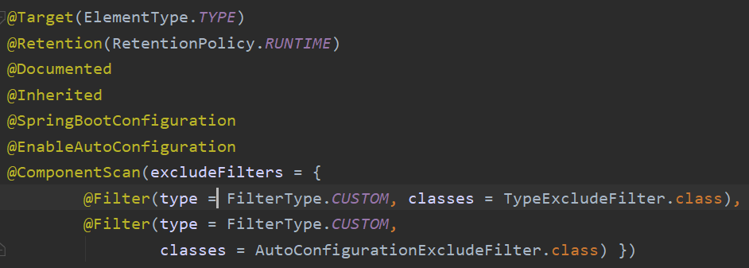
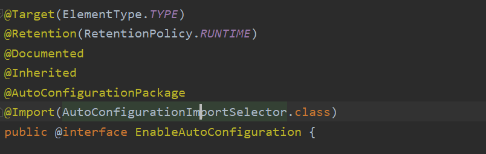
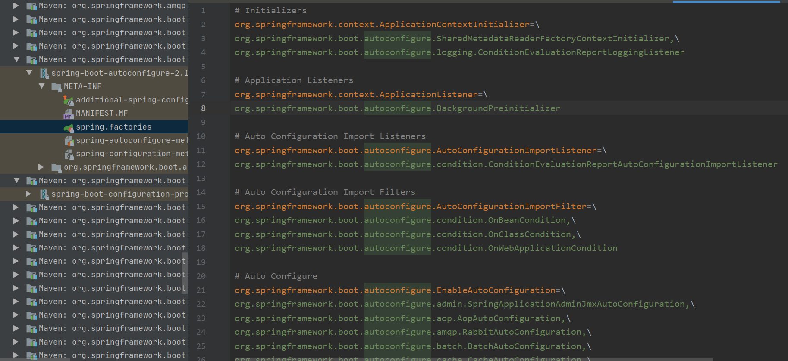

# Spring Boot常见问题

## Spring Boot自动装配原理

SpringBoot运行原理，我们先看一下 SpringBoot 的核心注解 `SpringBootApplication` 。

### @SpringBootApplication



我们发现@SpringBootApplication主要关注的几个注解如下：
**@SpringBootConfiguration**：标记当前类为配置类
**@EnableAutoConfiguration**：开启自动配置
**@ComponentScan**：扫描主类所在的同级包以及下级包里的Bean
**自动配置的核心注解是@EnableAutoConfiguration**

### @EnableAutoConfiguration



最关键的要属**@Import(EnableAutoConfigurationImportSelector.class)**，借助**EnableAutoConfigurationImportSelector**，@EnableAutoConfiguration可以帮助SpringBoot应用将所有符合条件的@Configuration配置都加载到当前SpringBoot创建并使用的IoC容器:通过@Import(AutoConfigurationImportSelector.class)导入的配置功能，AutoConfigurationImportSelector中的方法getCandidateConfigurations，得到待配置的class的类名集合,这个集合就是所有需要进行自动配置的类，而是是否配置的关键在于META-INF/spring.factories文件中是否存在该配置信息。

@Import注解就是给Spring容器中导入一些组件，这里传入了一个组件的选择器:AutoConfigurationImportSelector。

里面有一个selectImports方法，将所有需要导入的组件以全类名的方式返回；这些组件就会被添加到容器中。

```java
public String[] selectImports(AnnotationMetadata annotationMetadata) {
		if (!isEnabled(annotationMetadata)) {
			return NO_IMPORTS;
		}
		AutoConfigurationMetadata autoConfigurationMetadata = AutoConfigurationMetadataLoader
				.loadMetadata(this.beanClassLoader);
		AutoConfigurationEntry autoConfigurationEntry = getAutoConfigurationEntry(
				autoConfigurationMetadata, annotationMetadata);
		return StringUtils.toStringArray(autoConfigurationEntry.getConfigurations());
	}
```

**AutoConfigurationImportSelector**中的方法**getCandidateConfigurations**，得到待配置的class的类名集合,这个集合就是所有需要进行自动配置的类，而是是否配置的关键在于META-INF/spring.factories文件中是否存在该配置信息。

```java
protected List<String> getCandidateConfigurations(AnnotationMetadata metadata,
			AnnotationAttributes attributes) {
		List<String> configurations = SpringFactoriesLoader.loadFactoryNames(
				getSpringFactoriesLoaderFactoryClass(), getBeanClassLoader());
		Assert.notEmpty(configurations,
				"No auto configuration classes found in META-INF/spring.factories. If you "
						+ "are using a custom packaging, make sure that file is correct.");
		return configurations;
	}
```

打开，如下图可以看到所有需要配置的类全路径都在文件中，每行一个配置，多个类名逗号分隔,而\表示忽略换行。



到这里可能面试官会问你:“`spring.factories`中这么多配置，每次启动都要全部加载么？”。

很明显，这是不现实的。

@ConditionalOnXXX 中的所有条件都满足，该类才会生效。

```java
@Configuration
// 检查相关的类：RabbitTemplate 和 Channel是否存在
// 存在才会加载
@ConditionalOnClass({ RabbitTemplate.class, Channel.class })
@EnableConfigurationProperties(RabbitProperties.class)
@Import(RabbitAnnotationDrivenConfiguration.class)
public class RabbitAutoConfiguration {
}

```

`@ConditionalOnBean`：当容器里有指定 Bean 的条件下

`@ConditionalOnMissingBean`：当容器里没有指定 Bean 的情况下

`@ConditionalOnSingleCandidate`：当指定 Bean 在容器中只有一个，或者虽然有多个但是指定首选 Bean

`@ConditionalOnClass`：当类路径下有指定类的条件下

`@ConditionalOnMissingClass`：当类路径下没有指定类的条件下

`@ConditionalOnProperty`：指定的属性是否有指定的值

`@ConditionalOnResource`：类路径是否有指定的值

`@ConditionalOnExpression`：基于 SpEL 表达式作为判断条件

`@ConditionalOnJava`：基于 Java 版本作为判断条件

`@ConditionalOnJndi`：在 JNDI 存在的条件下差在指定的位置

`@ConditionalOnNotWebApplication`：当前项目不是 Web 项目的条件下

`@ConditionalOnWebApplication`：当前项目是 Web 项 目的条件下

